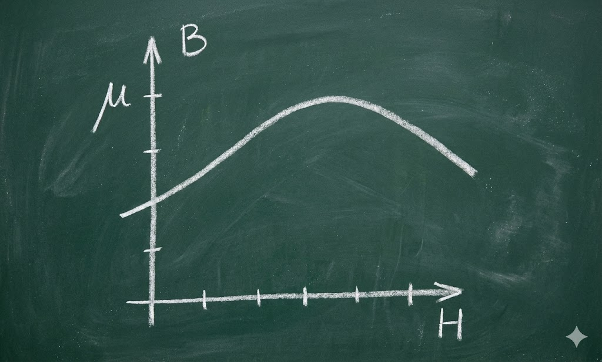
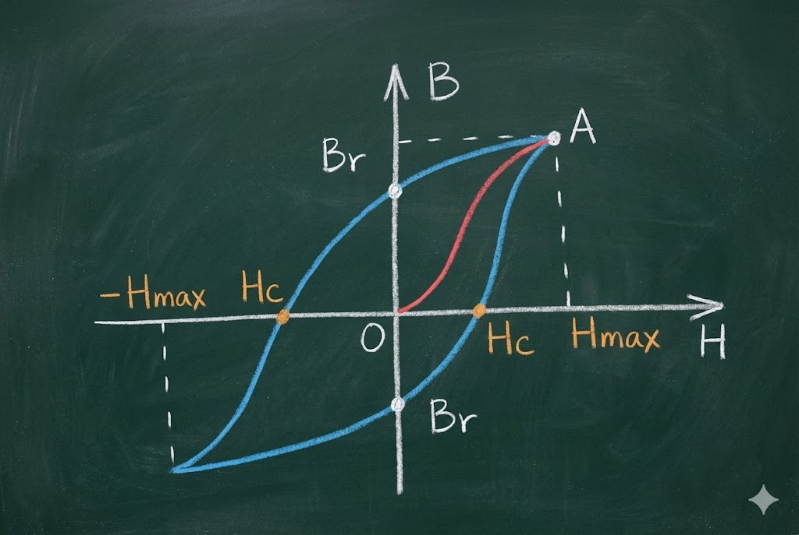
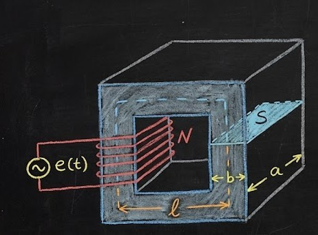
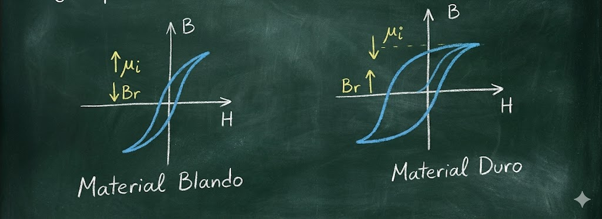
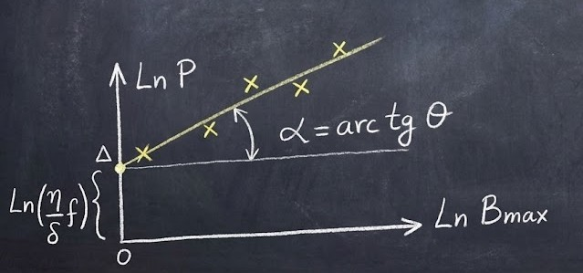

### Solenoide con núcleo de hierro

Para investigar la influencia que tiene la presencia de un material ferromagnético en las proximidades de un circuito eléctrico, estudiaremos como caso particular la presencia del Hierro en las proximidades de una bobina, alterando el campo magnético que se establece en el medio que rodea al circuito, debido a que el material ferromagnético se caracteriza por tener una permeabilidad magnética muy alta y que no es constante:

$$\mu = \frac{B}{H}$$
 

> **Nota sobre el gráfico:** El gráfico pequeño a la izquierda muestra la permeabilidad ($\mu$) en el eje vertical frente a la intensidad del campo ($H$) en el eje horizontal. Muestra cómo $\mu$ sube y luego baja (fenómeno de saturación), confirmando que no es constante.

Elegimos la bobina porque es el elemento de circuito con el que materializamos la formación de un campo magnético intenso, haciendo más notable la evidencia. Y técnicamente, es la bobina con núcleo de hierro el elemento que se usa para la construcción de transformadores, electroimanes, [y] parte de bobinados de máquinas.

Haremos el estudio como si fuera una perturbación con respecto al caso normal, que es la carga inductiva ideal, y observaremos las diferencias que aparecen con la misma para tenerlas en cuenta para modelizarla.

**En el caso de una inductancia con núcleo de aire:**
Cuando le aplicamos una tensión sinusoidal $e(t) = \hat{E} \cdot \sin(\omega t)$, se establece una corriente sinusoidal que genera un flujo alternado $\phi(t) = \phi_{max} \cdot \sin(\omega t)$ que, por la Ley de Faraday y Lenz, se crea en el bobinado una f.e.m. (fuerza electromotriz) que equilibra la tensión aplicada. Esto se muestra en la siguiente ecuación:

$$e(t) = - N \frac{d\phi(t)}{dt}$$

Donde el flujo se define como:

$$\phi(t) = \frac{FMM}{\mathcal{R}} = \frac{N \cdot i(t)}{\frac{l}{\mu \cdot S}}$$

*(Donde $FMM$ es la Fuerza Magnetomotriz y $\mathcal{R}$ es la Reluctancia)*.

Desarrollando la derivada:

$$\frac{d\phi(t)}{dt} = \frac{\mu \cdot S \cdot N}{l} \cdot \frac{di(t)}{dt}$$

> **Nota manuscrita al pie:** "Podemos sacar $\mu$ [de la derivada] porque cuando el núcleo de la bobina es aire, $\mu = cte$ (constante)."

---

$$\mu = \mu_r \cdot \mu_0$$

> **Nota manuscrita superior:**
> $\mu_r \approx \mu_{aire}$ (Permeabilidad relativa)
> $\mu_0 = 4\pi \times 10^{-7} \frac{Hy}{m}$ (Permeabilidad del vacío)

**Entonces:**

$$e(t) = - \frac{\mu_0 \cdot \mu_r \cdot N^2 \cdot S}{l} \cdot \frac{di(t)}{dt} = - L \frac{di(t)}{dt}$$

De esta forma definimos una característica de la bobina con núcleo de aire que depende de las características geométricas de la bobina, de la permeabilidad relativa del medio $\mu_r$ y de la constante $\mu_0$.

Para un circuito magnético compuesto por material magnético con una permeabilidad magnética constante o que contenga un **entrehierro** dominante, la relación entre $\phi$ (flujo) e $i$ (corriente) será lineal y podemos definir la inductancia $L$ como:

$$L = \frac{\lambda}{i}$$

Siendo $\lambda = N \cdot \phi$ el **flujo concatenado** por la bobina de $N$ vueltas.

Como $\phi = \frac{FMM}{\mathcal{R}}$:

$$L = \frac{N \cdot \phi}{i} = \frac{N \cdot FMM}{i \cdot \mathcal{R}} = \frac{N}{i} \cdot \frac{N \cdot i}{\frac{l}{\mu \cdot S}} = \frac{N^2}{\mathcal{R}} = \frac{N^2 \cdot \mu \cdot S}{l}$$

Así, la inductancia es proporcional al cuadrado del número de espiras, a la permeabilidad magnética, al área de la sección transversal y es inversamente proporcional a la longitud del circuito magnético.

Como se observa, no es posible aplicarlo rigurosamente donde las características **no lineales** (alineales) de los circuitos magnéticos dominen el funcionamiento del sistema.

**Cuando tenemos un núcleo ferromagnético, como es el caso del inductor con núcleo de Hierro:**
$\mu$ no es constante, por lo que no podemos sacar a $\mu$ fuera de la derivada y no se puede definir $L$ [como una constante].

---
 >**El final es clave:** La última frase explica el problema principal: La fórmula $L = \frac{N^2 \mu S}{l}$ **solo sirve si $\mu$ es constante** (aire). En el hierro, como $\mu$ cambia según la corriente (por la curva de saturación que vimos en la hoja 1), $L$ deja de ser un número fijo y pasa a ser una función variable.

---

 

### El Ciclo de Histéresis

Otro fenómeno que se produce por la presencia de material ferromagnético es que, cuando se excita al material y analizamos la relación que existe entre $B$ (Inducción) y $H$ (Campo magnético), aparece el **Ciclo de Histéresis**.

**En un material virgen:**
Si se hace crecer el campo $H$ desde cero hasta un valor $H_{max}$, la inducción $B$ sigue la **curva de magnetización inicial** $OA$.

  

Si luego se disminuye el campo $H$ aplicado, el punto representativo del estado en que se encuentra el material no sigue la misma curva que la de crecimiento, sino que lo hace por un camino diferente (que depende del material).

* **Remanencia ($B_r$):** Cuando $H$ se anula, $B$ toma un valor $B_r$ llamado **remanencia** (o inducción remanente).
* **Campo Coercitivo ($H_c$):** Será necesario aplicar un valor de $H$ negativo igual a $H_c$ (campo coercitivo) para anular la inducción $B$.

Si se sigue incrementando el campo $H$ [negativo] hasta alcanzar un máximo negativo $-H_{max}$, que será simétrico al positivo para contemplar el caso que se plantea bajo señales alternadas, observamos que los distintos puntos de $B$ y $H$ recorren el **Ciclo de Histéresis**.

---

### Análisis de la Bobina con Núcleo de Hierro

Analicemos el comportamiento de la bobina con núcleo de Hierro cuando la sometemos a un régimen sinusoidal:

$$e(t) = \hat{E} \cdot \sin(\omega t)$$

Vamos a hacer algunas suposiciones:

**a) Conductor Perfecto (Resistencia Cero):**
Supondremos que el conductor con que se construye el inductor es perfecto, es decir, **no presenta resistencia óhmica**.
Lo que se aproxima a la realidad, ya que la bobina se trata de hacer con material de buena conductividad, porque el objetivo de un **reactor** (inductor) es producir inductancia y la resistencia es un perjuicio.
Por lo tanto, toda la potencia instantánea que entrega la fuente $p(t) = e(t) \cdot i(t)$ se transfiere al material ferromagnético.

**b) Flujo confinado (Sin dispersión):**
Como el material ferromagnético tiene alta permeabilidad, todo el flujo creado por el campo magnético se halla localizado únicamente en el material ferromagnético, es decir, **no hay flujo disperso**.

  

 
* $N =$ Número de espiras.
* $l =$ Longitud del eje magnético (camino medio).
* $S =$ Superficie transversal del núcleo.
* $V =$ Volumen del material ferromagnético ($V = S \cdot l$).

**Ecuaciones fundamentales del circuito:**

1.  **Ley de Faraday (con B):**
    Sabemos que $\phi = B \cdot S$.
    $$e(t) = N \frac{d\phi}{dt} \Rightarrow e(t) = N \cdot S \cdot \frac{dB}{dt}$$

2.  **Ley de Ampère (Campo H):**
    Sabemos que $H(t) = \frac{N \cdot i(t)}{l}$. Despejando la corriente:
    $$i(t) = \frac{H(t) \cdot l}{N}$$

**Cálculo de la Potencia Instantánea:**

La potencia instantánea entregada por el generador al circuito y del circuito al material ferromagnético es:

$$p(t) = e(t) \cdot i(t)$$

Sustituyendo las ecuaciones (1) y (2):

$$p(t) = \left( N \cdot S \cdot \frac{dB}{dt} \right) \cdot \left( \frac{H(t) \cdot l}{N} \right)$$

Las $N$ se cancelan y agrupamos $S \cdot l$:

$$p(t) = (S \cdot l) \cdot H(t) \cdot \frac{dB}{dt}$$

Como el volumen es $V = S \cdot l$:

$$p(t) = V \cdot H(t) \cdot \frac{dB}{dt}$$

**Energía Elemental:**

La energía elemental será $dw = p(t) \cdot dt$. Sustituyendo la potencia:

$$dw = \left( V \cdot H(t) \cdot \frac{dB}{dt} \right) \cdot dt$$

Simplificando el diferencial de tiempo $dt$:

$$dw = V \cdot H(t) \cdot dB$$

**Relación con el Ciclo:**
Cuando aplicamos una tensión alterna, el punto representativo del estado magnético del material recorre el **lazo de histéresis**.
En el tiempo que corresponde a un periodo de la tensión aplicada, es decir, tanto el tiempo en que se cumple un ciclo eléctrico de la tensión.

---
Entonces, la energía por ciclo entregada por el generador al campo magnético es:

$$W_c = V \cdot \oint H(t) \cdot dB = V \cdot (\text{Área del Lazo de Histéresis})$$

Esta energía queda en el núcleo y se va a disipar en forma de calor por el trabajo de Histéresis.

**Cálculo de la Potencia Disipada:**
La energía disipada en un periodo será $f$ veces la disipada en un ciclo de histéresis de periodo $\tau$ (donde $f$ es la frecuencia, $f = 1/T$).

$$P_{hist} = \frac{W}{T} = W_c \cdot f = V \cdot f \cdot (\text{Área del Lazo de Histéresis})$$

**Observaciones importantes:**

1.  Se observa que estas pérdidas crecen con el **Volumen del Hierro ($V$)**, con la **frecuencia ($f$)** de la tensión alterna aplicada, y con el **área del Lazo de Histéresis**.
2.  La forma del Lazo no es solo una característica del material, sino que depende de la **amplitud de la tensión alterna** con que se lo excita; por lo que para cada amplitud habrá que medir el área del lazo respectivo.
3.  Como se observa, las pérdidas son mayores cuanto mayor es el área encerrada por el Ciclo de Histéresis.

**Modificación de Materiales:**
Mediante el agregado de ciertos materiales como el **Silicio (Si)** o las aleaciones, es posible obtener materiales magnéticos con lazos distintos que, en sus formas extremas, se ilustran a continuación:

#### Comparación

* **Material Blando:**
    * Ciclo estrecho (Poca área $\rightarrow$ Pocas pérdidas).
    * Alta permeabilidad inicial ($\mu_i \uparrow$).
    * Baja remanencia ($B_r \downarrow$) y bajo campo coercitivo ($H_c$).
    * *Uso típico: Transformadores, motores.*

* **Material Duro:**
    * Ciclo ancho (Mucha área $\rightarrow$ Altas pérdidas, difícil de desimantar).
    * Baja permeabilidad inicial ($\mu_i \downarrow$).
    * Alta remanencia ($B_r \uparrow$) y alto campo coercitivo ($H_c$).
    * *Uso típico: Imanes permanentes.*

Como vemos, no es fácil evaluar las pérdidas por Histéresis, por lo que no es fácil para los fabricantes dar información del área del Lazo de Histéresis.

**La Ecuación de Steinmetz:**
[Charles] Steinmetz comprobó que el área encerrada por el lazo para materiales ferromagnéticos es una función que se puede expresar como una potencia matemática de la inducción máxima.

$$\text{Area del Lazo de Histéresis} = \eta \cdot B_{max}^\theta$$

Donde $\eta$ y $\theta$ son coeficientes del material.

**Obtención de $B_{max}$:**
$B_{max}$ se puede obtener a partir del valor de cresta de la tensión aplicada $\hat{V}$ a la bobina.
Partiendo de $\hat{V} = \omega \cdot N \cdot \phi_{max}$, se puede llegar a la expresión de la tensión eficaz:

$$V_{ef} = \frac{2\pi \cdot f \cdot N \cdot \phi_{max}}{\sqrt{2}} = 4,44 \cdot f \cdot N \cdot \phi_{max}$$

Sustituyendo $\phi_{max} = S \cdot B_{max}$:

$$V_{ef} = 4,44 \cdot f \cdot N \cdot S \cdot B_{max}$$

**Valores de los coeficientes:**

* **El exponente $\theta$ toma el valor:**
    * $\theta = 1,6$ para $B_{max} = 1 \, Wb/m^2$ (1 Tesla).
    * $\theta = 2$ para $B_{max} = 1,5 \, Wb/m^2$ (hacia la saturación).

* **El coeficiente $\eta$ depende del porcentaje de Silicio (Si) de la aleación:**
    * $\eta = 0,0010$ para $5\% \, Si$.
    * $\eta = 0,0025$ para $1\% \, Si$.

---

>**Nota:**
> * El número **4,44** sale de hacer $\frac{2\pi}{\sqrt{2}} \approx 4,4428$.
> * **Unidades:** El texto usa $Wb/m^2$ (Weber por metro cuadrado). Esta es la definición antigua pero correcta de **Tesla (T)**.
    * $1 \, Wb/m^2 = 1 \, T$.

---

### Cálculo de Pérdidas Específicas

Por lo tanto, la pérdida por Histéresis se puede calcular:

$$P_{his} = V \cdot f \cdot \eta \cdot B_{max}^\theta$$

Definimos las **pérdidas específicas**:

$$p \left[\frac{watts}{kg}\right] = \frac{P_{his}}{V \cdot \rho}$$

Donde:
* $V =$ Volumen del material.
* $\rho =$ Peso específico (en física moderna corresponde a la **densidad** de masa).

**Reemplazando $P_{his}$:**

$$p \left[\frac{watts}{kg}\right] = \frac{V \cdot f \cdot \eta \cdot B_{max}^\theta}{V \cdot \rho} = f \cdot \frac{\eta}{\rho} \cdot B_{max}^\theta = f \cdot K \cdot B_{max}^\theta$$

Donde $K$ es la **constante de pérdidas** que depende de cada sustancia (material).

**Si se toma la inducción magnética en Gauss:**
*(Nota: 1 Tesla = 10,000 Gauss)*

$$p \left[\frac{watts}{kg}\right] = K \cdot f \cdot B_{max}^e \cdot 10^{-8}$$

Como $V \cdot \rho = P_{Fe}$ (Peso o Masa del Hierro):

$$P_{hist} = p \left[\frac{watts}{kg}\right] \cdot P_{Fe}$$

**Las pérdidas por Histéresis específicas las podemos calcular:**

$$\boxed{ p = K \cdot f \cdot B_{max}^\theta \cdot 10^{-8} \quad \left[\frac{watt}{kg}\right] }$$

**Donde:**
* **$K$:** Coeficiente para cada material.
* **$f$:** Frecuencia en Hz.
* **$B$:** Inducción Magnética en Gauss.
* **$\theta$**: Coeficiente exponencial.
    * $1,6$ para $B_{max} < 1$ Tesla.
    * $2$ para $B_{max} > 1$ Tesla.

---

### Linealización de la Ecuación de Steinmetz

Si sacamos logaritmo neperiano a la ecuación de pérdidas específicas $P \left[\frac{watts}{kg}\right]$:

$$\ln P = \ln(K \cdot f) + \theta \cdot \ln B_{max}$$

Esta ecuación tiene la forma de una recta ($y = b + m \cdot x$), donde:
* $y = \ln P$
* Pendiente $m = \theta$
* Ordenada al origen $b = \ln(K \cdot f)$

**Procedimiento Experimental:**
Si realizamos un ensayo de pérdidas a una frecuencia dada y se varía la inducción máxima, y si los diferentes puntos obtenidos permiten ser alineados [en una gráfica log-log], se dice que el material cumple la **aproximación de Steinmetz**.

1.  **Eje Vertical:** $\ln P$
2.  **Eje Horizontal:** $\ln B_{max}$
3.  **Ordenada al origen (Punto A):** El valor donde la recta corta el eje Y corresponde a $\ln(\frac{\eta}{\rho} \cdot f)$.

**Cálculo de Coeficientes:**

Conociendo la frecuencia y el peso específico del material, a partir de la ordenada $OA$ se puede determinar $\eta$ (el coeficiente de Steinmetz).

Por otro lado, la recta obtenida en el gráfico forma un cierto ángulo con la paralela al eje horizontal trazado por $A$. Conociendo este ángulo se puede determinar $\theta$ (el exponente de Steinmetz):

$$\alpha = \arctan \theta \implies \theta = \tan \alpha$$

**Conclusión:**
Obtenidos los dos coeficientes ($\eta$ y $\theta$), se pueden hallar las pérdidas específicas a cualquier frecuencia e Inducción.