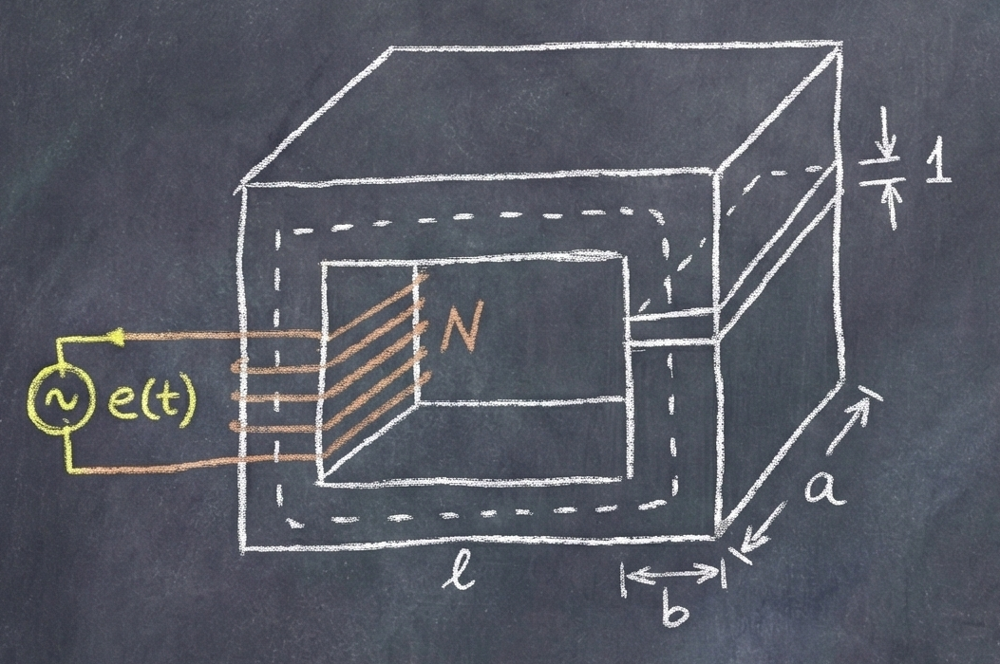
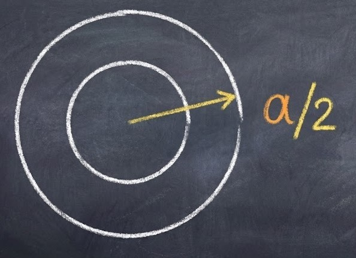
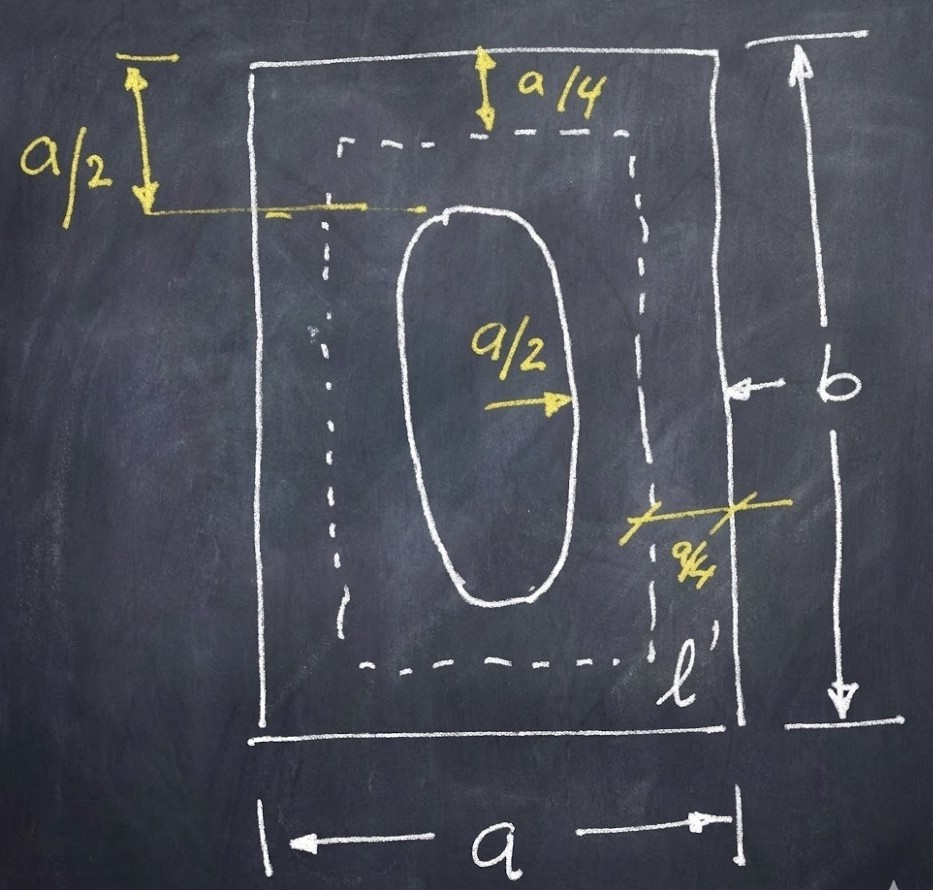
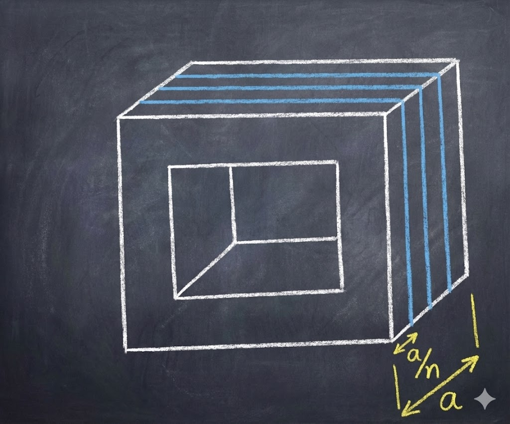
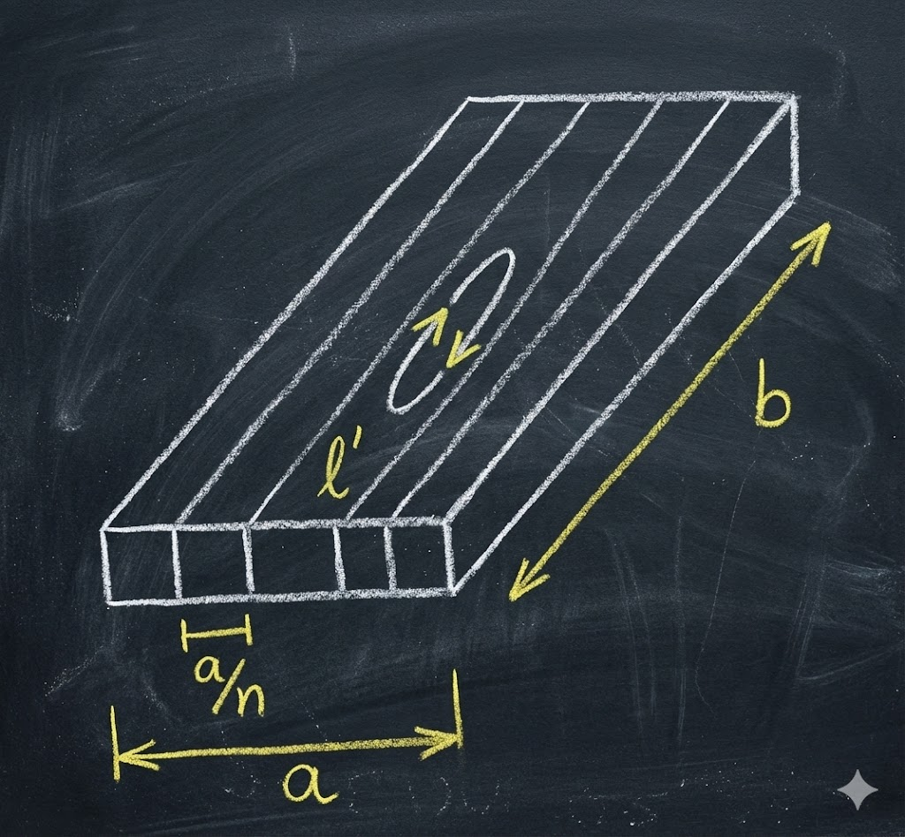
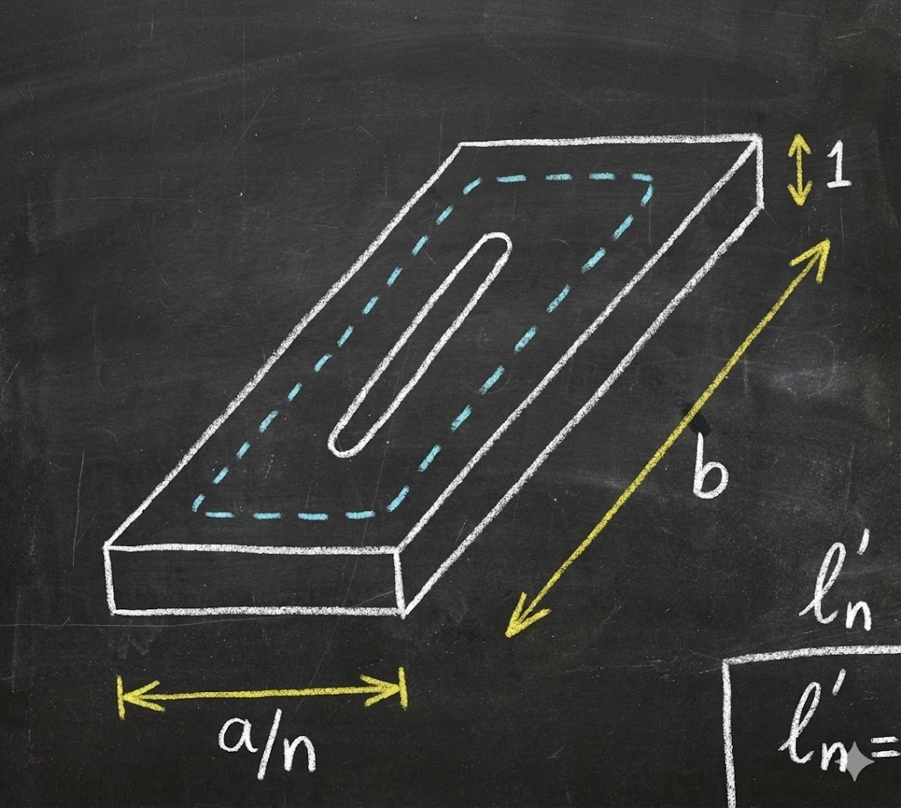

### Corrientes de Foucault

Otro fenómeno que se produce por la presencia del material ferromagnético es la aparición de **Corrientes Parásitas de Eddy o de Foucault**.

Analicemos lo que sucede en el núcleo de material ferromagnético cuando está bajo la acción de un flujo magnético variable en el tiempo.

Imaginemos una pequeña lámina (de este material con que está construido el núcleo) que está bajo la acción de un flujo magnético variable en el tiempo $\Phi(t)$.

La tensión inducida hará circular **corrientes parásitas**.

La intensidad de las mismas es proporcional al valor instantáneo de la tensión y el sentido de circulación obedece a la **Ley de Lenz**, es decir, que son corrientes que se oponen a las variaciones del flujo que las originan.

 
Estas corrientes, al circular por el núcleo, disipan energía por **efecto Joule**, produciendo el calentamiento del núcleo y la elevación de su temperatura.

Este fenómeno, que para visualizarlo mejor hemos considerado en una sola lámina, en realidad ocurre en todos los puntos a lo largo de las secciones transversales del núcleo.

### Reducción de Pérdidas

Estas corrientes circulan en planos normales al desplazamiento del flujo magnético, y para disminuir las pérdidas por **efecto Joule** ($P = R \cdot I^2$), debemos disminuir la intensidad de corriente de las mismas.

Hay dos formas de hacerlo:

#### a) Aumentar la resistividad específica
Una posibilidad es aumentar la resistividad específica ($\rho$) del material ferromagnético:

$$R = \rho \cdot \frac{l}{S}$$

Esta solución tiene limitaciones, porque si bien queremos afectar la propiedad eléctrica del material, **no se debe modificar su propiedad magnética favorable**, es decir, su alta permeabilidad magnética.

El agregado de impurezas, como **Cobalto**, o los **Hierros al Silicio (Si)**...

#### b) Laminar el núcleo
La otra solución es modificar la longitud del camino que recorren las corrientes parásitas.

Como estas circulan por planos normales a la dirección del Flujo magnético, **se lamina el núcleo** de manera que se interrumpan las líneas de corriente, pero no se interrumpan las líneas de Campo magnético.

#### Modelo para el cálculo
A los fines de simplificar el análisis, tomamos como circuito eléctrico por el que circulan las corrientes parásitas una **lámina unitaria** que representamos vista de frente.

En ella imaginamos que se practica una pequeña hendidura para asimilar esa superficie a una **espira**, y calcularemos su resistencia.

Y consideramos que la espira está generada a partir de una espira redonda a la cual se le practica un achatamiento.

 
### Cálculo de Resistencia y Potencia

> El dibujo muestra la sección rectangular de la lámina de ancho $a$ y altura $b$. Se asume una "espira media" (línea punteada) para calcular la longitud del recorrido de la corriente.

Como el espesor de la corona es de valor unitario, la sección es:
$$S = \frac{a}{2} \times 1$$

Por lo tanto, la resistencia de la espira será:
$$R = \rho \cdot \frac{l'}{S}$$

Cálculo de la longitud media $l'$:
$$l' = 2\left(b - 2\frac{a}{4}\right) + 2\left(a - 2\frac{a}{4}\right)$$
$$l' = 2b - 4\frac{a}{4} + 2a - 4\frac{a}{4} = 2b - a + 2a - a = 2b$$

Entonces la resistencia de la espira es:

> **[Fórmula recuadrada]**
> $$R = \rho \cdot \frac{2b}{\frac{a}{2} \times 1} = \rho \cdot 4 \cdot \frac{b}{a}$$

La f.e.m. (fuerza electromotriz) inducida va a ser proporcional a la variación de flujo.
$$\hat{E} = \omega \cdot \Phi_{max}$$

La Potencia disipada en el paralelepípedo unitario que constituye la lámina o espira bajo estudio es:
$$P_1 = \frac{\hat{E}^2}{2R}$$
*(Nota: Se divide por 2 porque $\hat{E}$ es el valor pico. La potencia usa valor eficaz: $V_{ef} = \hat{E}/\sqrt{2}$, por lo que $V_{ef}^2 = \hat{E}^2/2$)*.

La Potencia disipada en todo el núcleo macizo será $l$ veces $P_1$:

$$P_{Fe} = l \cdot P_1 = \frac{\hat{E}^2 \cdot l}{2R} = \frac{4\pi^2 f^2 \Phi_{max}^2 l}{2 \cdot \rho \cdot 4 \frac{b}{a}}$$

 ### Efecto de la Laminación

$$P_{Fe} = \frac{\pi^2 f^2 \Phi_{max}^2 \cdot l}{2 \rho \frac{b}{a}}$$

Vemos que las pérdidas en el núcleo macizo **crecen** con el cuadrado de la frecuencia, el cuadrado del flujo máximo e inversamente proporcional a la resistividad específica del material ferromagnético.

> Enúcleo cúbico dividido en láminas verticales. Se indica el ancho total $a$, y el ancho de una lámina individual como $a/n$ (donde $n$ es la cantidad de láminas).

Se practica la **laminación** para que las líneas de Flujo magnético no encuentren interrupción a su continuidad, pero que en cambio interrumpan las líneas de Corriente que circulan por planos perpendiculares.

Para que esto suceda cada lámina debe estar **aislada eléctricamente entre sí**, lo que puede lograrse mediante un **barniz aislante** o simplemente por la **oxidación de las láminas**.

Para calcular las pérdidas en el núcleo laminado procederemos de la misma manera que en el caso de núcleo macizo.

Al laminar el núcleo, las corrientes circulan por la espira de ancho $a/n$ como se muestra en la Figura.

 

### Cálculo en Núcleo Laminado

Para calcular $R_n$ debemos calcular $l'_n$ y $S_n$.

$$l'_n = 2 \left(b - 2\frac{a}{4n}\right) + 2 \left(\frac{a}{n} - 2\frac{a}{4n}\right)$$
$$l'_n = 2b$$

> **[Nota]:** Al igual que en la hoja anterior, los términos que dependen de $a$ se cancelan geométricamente, quedando la longitud dominada por la altura $b$. El 4n se debe a que la línea media de circulación de la corriente parásita (punteada) es una línea que divide la lámina en dos partes iguales.

$$S_n = \frac{a}{2n} \times 1$$

Entonces:
$$R_n = \rho \cdot \frac{2b}{\frac{a}{2n} \times 1} = \rho \cdot \frac{2b \cdot 2n}{a} = \rho \cdot 4\frac{b}{a} \cdot n$$

Entonces se observa que en la espira laminada la resistencia $R_n$ es $n$ veces más grande que la resistencia para el núcleo macizo.

$$R_n = n \cdot R$$

Asumiendo que hay una distribución uniforme del Flujo, el flujo $\Phi_{max}^n$ de cada lámina será igual al $\Phi_{max}$ que tenemos en el núcleo sin laminar dividido por el número $n$ de láminas. Entonces:

$$\Phi_{max}^n = \frac{\Phi_{max}}{n}$$

El valor de la tensión cresta (pico) que actúa en la espira y que impulsa la corriente parásita debida a una lámina será:

$$\hat{E}_n = \omega \cdot \Phi_{max}^n = \frac{\omega \cdot \Phi_{max}}{n}$$

---

### 🧠 Análisis 

1.  **La Resistencia Aumenta ($R_n = n \cdot R$):**
    Al hacer la lámina más angosta (dividiendo el ancho por $n$), el área de la sección por donde pasa la corriente ($S_n$) se hace $n$ veces más chica. Como la resistencia es inversamente proporcional al área, la resistencia **aumenta** $n$ veces.
    * *Física:* Es más difícil para la corriente circular por un camino tan estrecho.

2.  **La Tensión Disminuye ($\hat{E}_n = E / n$):**
    Como la lámina es pequeña, atrapa menos líneas de campo magnético (solo una fracción $1/n$ del flujo total). Por la Ley de Faraday, menos flujo implica menos tensión inducida.
 

 ---

### Cálculo de Potencia Total y Conclusión

La Potencia por lámina y por unidad de profundidad será:
$$P_1^U = \frac{\hat{E}_n^2}{2 R_n}$$

La potencia unitaria total será (multiplicando por el número de láminas $n$):
$$P_1 = P_1^U \cdot n = \frac{\hat{E}_n^2}{2 R_n} \cdot n$$

La potencia total disipada en el núcleo laminado será ($l$ es la profundidad):
$$P_T = P_1 \cdot l = P_1^U \cdot n \cdot l = \frac{\hat{E}_n^2 \cdot n \cdot l}{2 R_n}$$

Como sabemos que:
1.  $\Phi_{max}^n = \frac{\Phi_{max}}{n}$
2.  $\hat{E}_n = \frac{\hat{E}}{n}$
3.  $R_n = n \cdot R$

Y $l$ es la longitud (profundidad) del núcleo, sustituimos:

$$P_T = \frac{\left(\frac{\hat{E}}{n}\right)^2 \cdot n \cdot l}{2 \cdot (n \cdot R)} = \frac{\frac{\hat{E}^2}{n^2} \cdot n \cdot l}{2 n R} = \frac{\hat{E}^2 \cdot l}{2 n^2 R}$$

Esto se puede reescribir como:
$$P_T = \frac{1}{n^2} \cdot \left( \frac{\hat{E}^2 \cdot l}{2R} \right)$$

$$P_T = \frac{P}{n^2}$$

Donde $P = \frac{\hat{E}^2}{2R} \cdot l$ es la potencia disipada por el **núcleo macizo**.

**Conclusión:**
El efecto de la laminación reduce la potencia disipada proporcionalmente al **cuadrado del número de laminaciones** que se realizan en el núcleo.

Reemplazando $P$ por su valor determinado anteriormente ($P_{macizo}$):

$$P_{Fe} = \frac{\pi^2 f^2 \Phi_{max}^2 \cdot l}{2 \rho \frac{b}{a} \cdot n^2}$$

Si reemplazamos el Flujo por la Inducción ($\Phi_{max} = B_{max} \cdot a \cdot b$):

$$P_{Fe} = \frac{\pi^2 f^2 (B_{max} \cdot a \cdot b)^2 \cdot l}{2 \rho \frac{b}{a} \cdot n^2} = \frac{\pi^2 f^2 B_{max}^2 b^2 a^2 l}{2 \rho \frac{b}{a} n^2}$$

Simplificando los términos geométricos ($\frac{b^2 a^2}{b/a} = b a^3$):

$$P_{Fe} = \frac{\pi^2 f^2 B_{max}^2 b a^3 l}{2 \rho n^2}$$

---

### 💡 Análisis 

1.  **El factor $1/n^2$:** Esta es la clave de la ingeniería eléctrica en transformadores y motores.
    * Si divides el núcleo en 10 chapas ($n=10$), las pérdidas no bajan 10 veces, ¡bajan 100 veces ($10^2$)!
    * Por eso es tan efectivo laminar el núcleo; con láminas muy finas, las pérdidas por Foucault se vuelven casi despreciables.

    ----

### Materiales y Factor de Apilado

Las chapas componentes del circuito magnético se fabrican normalmente de **0,35 mm a 0,50 mm** y para que esta forma constructiva sea eficaz se instala entre chapa y chapa un aislante eléctrico, a saber:

* Hoja de papel delgado pegado a cada chapa.
* Capa de Barniz aislante.
* Capa de Óxido de la misma chapa.

Estos aislantes aumentan el volumen total, entonces para determinar el peso del hierro neto, presente en el volumen dado, se usa el coeficiente de laminado $K_{fe}$ que toma los siguientes valores típicos dependiendo del tipo de aislante:

* **0,85 a 0,88** : Papel pegado.
* **0,88 a 0,90** : Barniz aislante.
* **0,90 a 0,96** : Capa de Óxido.

En la actualidad todos los circuitos magnéticos se construyen con Chapas de Fe (Hierro) en aleación con **Si (Silicio)**. Este último tiene la propiedad de disminuir sensiblemente el área del ciclo de Histéresis del Fe.

El porcentaje de Si incorporado no puede llegar a valores muy altos, debido a que dicho elemento le confiere a la aleación cualidades que dificultan su elaboración mecánica (se vuelve frágil y quebradizo); por esta razón los valores oscilan entre **0,8% hasta 4,5%**.

El **Factor de apilado** o de laminado es la razón entre la longitud del Hierro y la longitud total de la pila de laminaciones aisladas.
   
### Fórmula Final

$$P_{Fe} = \frac{V_{Fe} \cdot \pi^2 \cdot f^2 \cdot B_{max}^2 \cdot a^2}{2 \rho \cdot n^2}$$

Donde $V_{Fe} = a \cdot b \cdot l$ (Volumen del Hierro).

Y definimos el **cuadrado del espesor de la laminación** como:
$$\tau^2 = \frac{a^2}{n^2}$$

Sustituyendo, obtenemos la **fórmula final**:

$$P_{Fe} = \frac{V_{Fe} \cdot \pi^2 \cdot f^2 \cdot B_{max}^2 \cdot \tau^2}{2 \rho}$$

La potencia disipada en el núcleo laminado debido a las **Corrientes de Foucault** es:
* Directamente proporcional al **cuadrado de la frecuencia** ($f^2$).
* Directamente proporcional al **cuadrado de la inducción máxima** ($B_{max}^2$).
* Directamente proporcional al **cuadrado del espesor de la laminación** ($\tau^2$).
* Inversamente proporcional a la **resistividad del material** ($\rho$).

Cuanto mayor es el Volumen de Fe, mayor será la disipación.

Como las pérdidas crecen con el cuadrado de la frecuencia, el núcleo con material ferromagnético (laminado estándar) se utiliza con **frecuencias bajas**.

Las corrientes parásitas al cerrarse crean, de acuerdo con la **Ley de Lenz**, un flujo que se opone al flujo del inductor **debilitándolo**.

Una forma de poder extender el rango de frecuencias es reduciendo al mínimo el término $\tau^2$ y ello se consigue **pulverizando el núcleo**, que es lo que se utiliza en transformadores o bobinas para dicha frecuencia (alta frecuencia).

### 💡 Análisis 

1.  **El símbolo $\tau$ (Espesor):**
    Matemáticamente sale de dividir el ancho total ($a$) por la cantidad de chapas ($n$).
    Esto confirma por qué es tan importante que la chapa sea fina: si reduces el espesor a la mitad, las pérdidas bajan a la cuarta parte (porque está al cuadrado).

2.  **"Pulverizando el núcleo" (Ferritas):**
    Se toma el material magnético, se muele hasta hacerlo polvo y se mezcla con una resina aislante (cerámica). Luego se prensa.
    Cada partícula microscópica de hierro queda aislada de la vecina. Es como si $n$ (número de laminaciones) fuera casi infinito y el espesor $\tau$ fuera microscópico.
    Por eso, estos núcleos se usan en radios, fuentes conmutadas (como la de tu PC) y aplicaciones de **Alta Frecuencia** donde las chapas normales se calentarían demasiado.

----
 

### Cálculo Práctico de Pérdidas

En la práctica, las pérdidas se calculan en forma global partiendo de datos parcialmente determinables y que comercialmente se ha impuesto por su simplicidad.

Comencemos por considerar las pérdidas en el Hierro como suma de ambas (Histéresis + Foucault).

$$P_{Fe} = P_{Hist} + P_{Fouc} = K' \cdot f \cdot B_{max} \cdot V + K'' ( \mathcal{E} \cdot f \cdot B_{max})^2 \cdot V$$

> **[Nota]:** Aquí el autor asume una simplificación matemática, factorizando $B_{max}^2$ y $V$ para llegar a la ecuación siguiente.

$$P_{Fe} = (a \cdot f + b \cdot f^2) \cdot B_{max}^2 \cdot V$$

De esta expresión se desprende que las pérdidas en el Hierro dependen del Volumen, del Cuadrado de la inducción máxima y de una función de la frecuencia de variación del flujo.

Para $f = 50 \text{ Hz}$, $B_{max} = 1 \text{ Wb/m}^2$ y un $V_{Fe}$ que corresponde a $G_{Fe} = 1 \text{ kg}$ de material activo:

$$V_{Fe} = \frac{G_{Fe}}{\gamma_{Fe}}$$

> **[Nota]:** $\gamma_{Fe}$ (gamma) representa el peso específico del material.

Calculamos $P_0$ (Pérdidas unitarias estándar):

$$P_0 = (a \cdot 50 + b \cdot 50^2) \cdot \frac{1}{\gamma_{Fe}}$$

Donde $\gamma_{Fe}$ es el peso específico del material y su inversa el Volumen de la unidad de peso.

Relacionando ambas expresiones para $f=50 \text{ Hz}$:

$$\frac{P_{Fe}}{P_0} = B_{max}^2 \cdot V \cdot \gamma_{Fe}$$

Como el volumen $V_{Fe}$ por el peso específico $\gamma_{Fe}$ da el peso total de Hierro $G_{Fe}$ a considerar, se tiene:

$$\frac{P_{Fe}}{P_0} = B_{max}^2 \cdot G_{Fe}$$

De aquí se tiene la expresión usual de cálculo.
 

$$P_{Fe} = P_0 \cdot B_{max}^2 \cdot G_{Fe}$$

Al valor $P_0$ se lo llama **"Cifra de Pérdidas"** y representa las pérdidas en $[\text{W/kg}]$ de Hierro laminado, trabajando a una inducción máxima de $1 [\text{Wb/m}^2]$ con frecuencia $50 \text{ Hz}$.

Si deseamos generalizarla debemos introducir un factor función de la frecuencia y nos queda:

$$P_{Fe} = P_0 \cdot C \cdot B_{max}^2 \cdot G_{Fe}$$

Donde:
* $C$: Coeficiente función de la frecuencia.
* $B_{max}$: Inducción máxima en $[\text{Wb/m}^2]$ (Teslas).
* $G_{Fe}$: Peso del material activo $[\text{kg}]$.
* $P_{Fe}$: Pérdidas totales en el Hierro $[\text{Watt}]$.

Valores de C:
* $C = 1$ para $f = 50 \text{ Hz}$.
* $C = 1,26$ para $f = 60 \text{ Hz}$.

---

### 💡 Análisis Técnico y Aclaraciones

1.  **La Simplificación del $B^2$:**
    * Recordarás que Steinmetz decía que la histéresis es proporcional a $B^{1.6}$.
    * Sin embargo, en estas fórmulas prácticas (Hoja 17), se asume $B^2$ para todo (tanto Histéresis como Foucault).
    * **¿Por qué?** Porque para las chapas modernas y los rangos de operación industriales (cerca de la saturación), el exponente de Steinmetz se acerca más a 2, lo que permite sacar factor común y simplificar muchísimo la matemática.

2.  **¿Qué es $P_0$ (Cifra de Pérdidas)?**
    * Es un dato que te da el **fabricante de la chapa**. No lo calculas, lo buscas en una tabla.
    * Te dirán, por ejemplo: "Chapa M400-50A tiene 1.1 W/kg". Ese es tu $P_0$.
    * Tú solo tienes que multiplicar ese valor por los kilos de tu transformador y por el cuadrado de la inducción a la que trabajas.

3.  **El factor $C=1,26$ para 60Hz:**
    * Si la frecuencia sube de 50 a 60 Hz (un 20% más), las pérdidas suben.
    * Como las pérdidas de Foucault suben con el cuadrado ($1.2^2 = 1.44$) y las de Histéresis linealmente ($1.2$), el factor combinado resulta ser aproximadamente $1.26$.

 