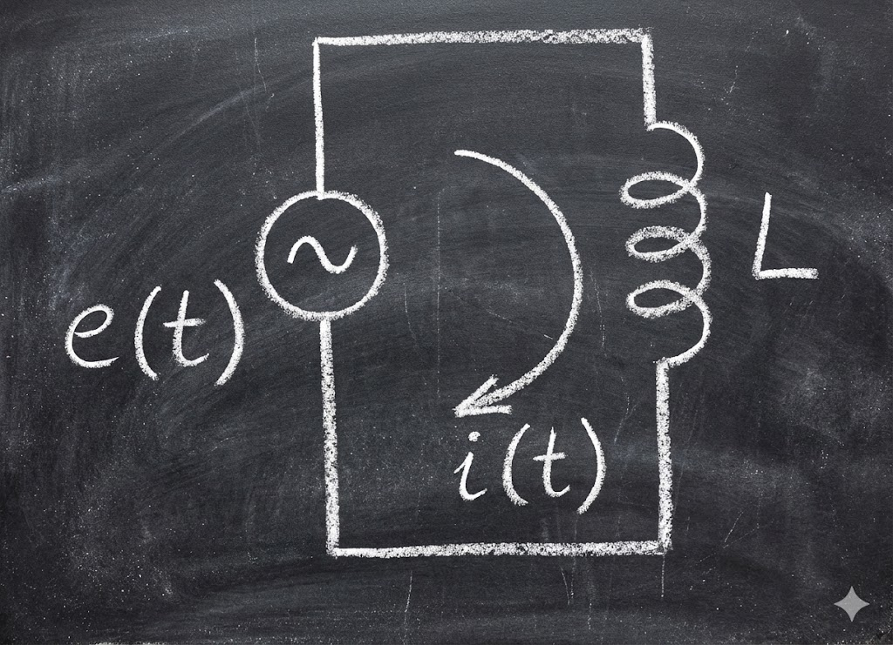
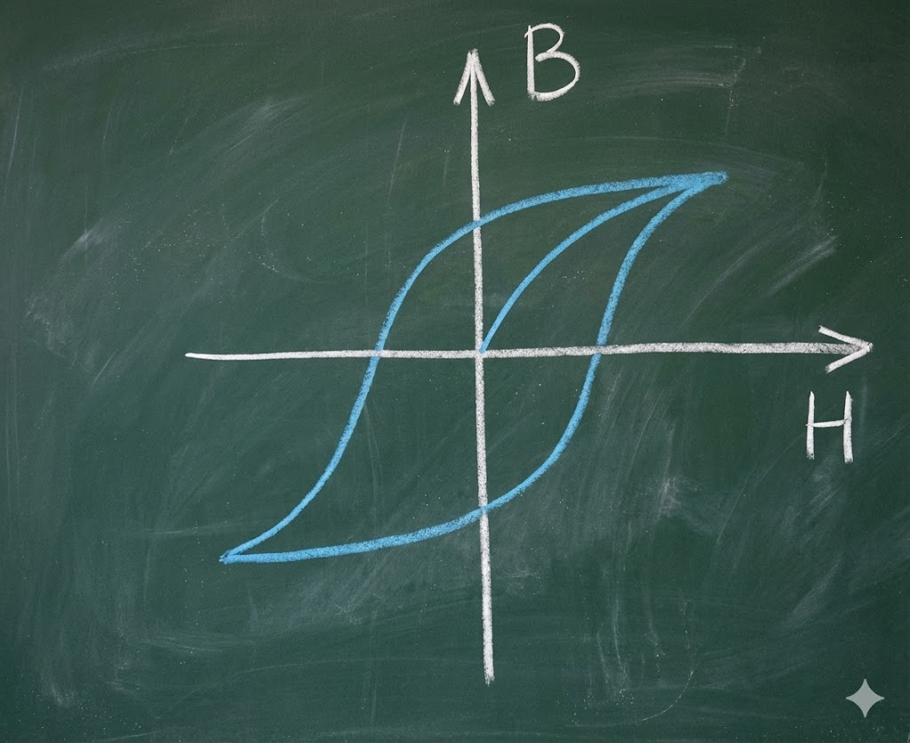
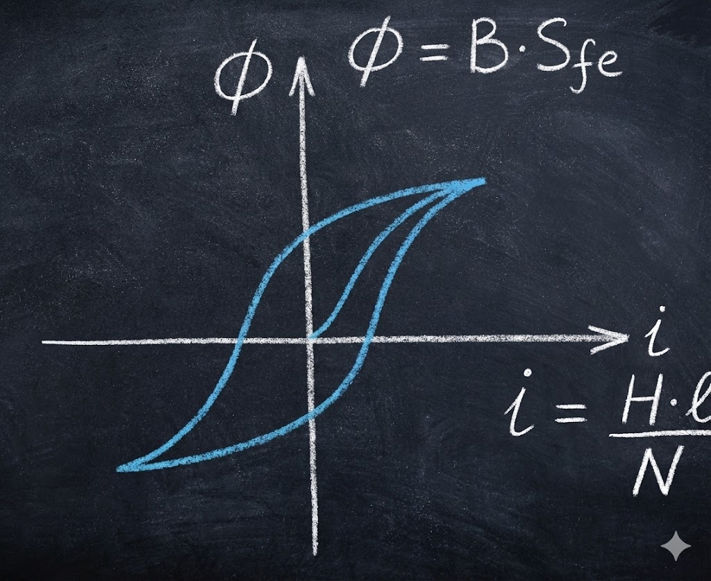
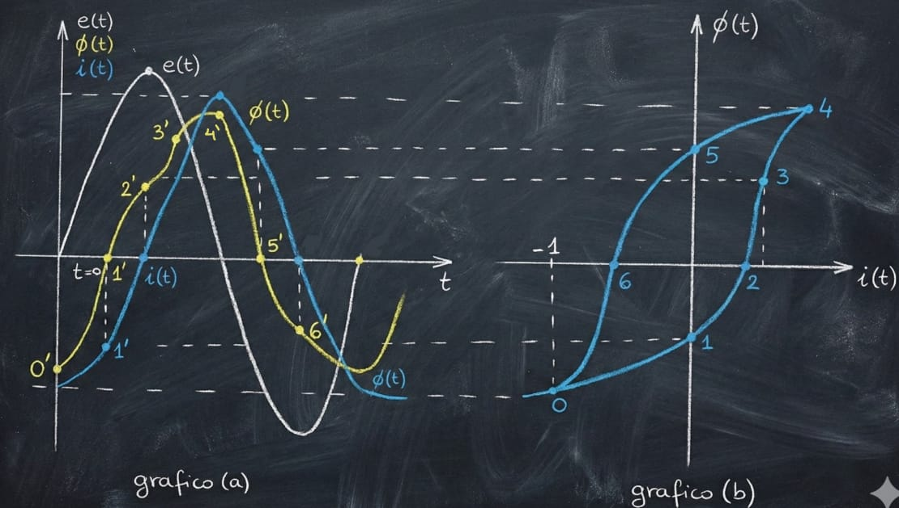
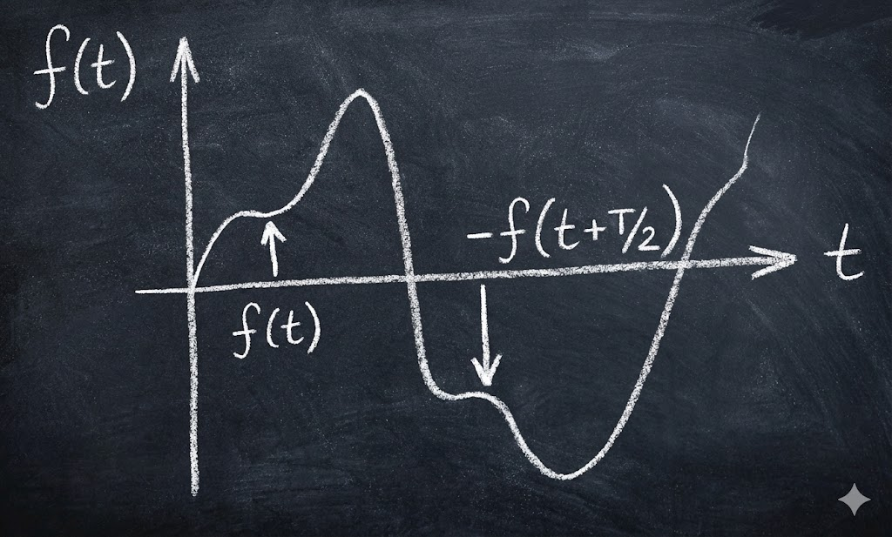
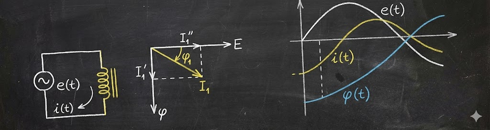
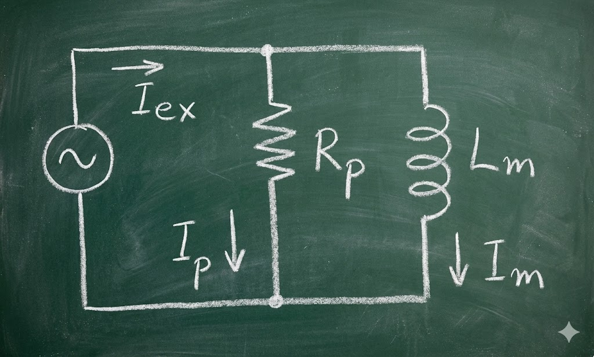
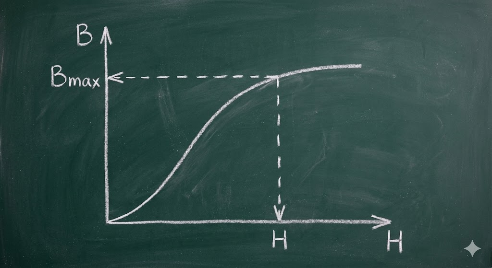
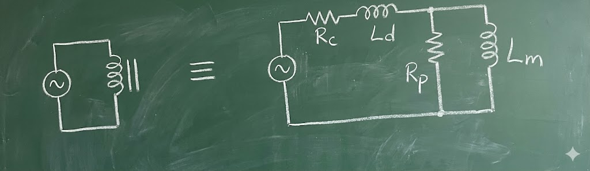

 

El otro fenómeno que se produce por la presencia del material ferromagnético en el núcleo del Inductor es la alteración de la forma de onda de la corriente.

### Forma de Onda de la Corriente

Cuando se alimenta una bobina con núcleo de aire, la corriente que se establece en el circuito, es alterna, Sinusoidal y esta atrasada en 90° con respecto a la tensión.

$$e(t) = L \cdot \frac{di(t)}{dt}$$

Veremos como calcular la corriente que se establece en el circuito cuando la bobina tiene núcleo de Hierro; dado que no podemos definir el Coeficiente $L$.

Para determinar la ley de variación de la corriente $i(t)$ en función del tiempo vamos a partir de la ley de variación de la tensión aplicada en función del tiempo.

Entre la tensión aplicada y el flujo magnético que se establece en el núcleo existe una relación:

$$e(t) = N \cdot \frac{d\Phi}{dt}$$

Si despreciamos la caída de tensión en la resistencia ohmica del cobre tendremos que la tensión $e(t)$ aplicada es equilibrada por la fem inducida en cada una de las espiras, y esto nos permite obtener la ley de variación del Flujo a partir de la ley de variación de la tensión $e(t)$.

Como el Flujo $\Phi(t)$ y la corriente están relacionados, conociendo la ley de variación del Flujo $\Phi(t)$ podemos establecer la ley de variación de la Corriente.

Si en el gráfico de magnetización cambiamos las escalas de ordenadas y abscisas de acuerdo a los coeficientes de proporcionalidad:

$$\Phi = B \cdot S_{fe} \quad \text{y} \quad i = \frac{H \cdot l}{N}$$

---

**Notas sobre la notación:**
* **$S_{fe}$**: Se refiere a la Sección del hierro (núcleo).
* **$l$**: Longitud media del camino magnético.
* **$N$**: Número de espiras.

 --- 

Tendremos otro gráfico en el que aparecen vinculados el flujo $\Phi(t)$ con la corriente $i(t)$.

* Eje Y: $\Phi = B \cdot S_{fe}$
* Eje X: $i = \frac{H \cdot l}{N}$

Entonces para determinar $i(t)$ a partir de $e(t)$ procedemos de la siguiente manera:

### a) Hallamos la ley de variación del flujo $\Phi(t)$ en el tiempo a partir de la tensión $e(t)$

Sabemos que:
$$e(t) = \hat{E} \sin(\omega t)$$
$$e(t) = N \frac{d\Phi(t)}{dt} \quad \therefore \quad d\Phi(t) = \frac{e(t) \cdot dt}{N}$$

Integrando:
$$\Phi(t) = \frac{1}{N} \int e(t) \, dt = \frac{\hat{E}}{N} \int \sin(\omega t) \, dt = -\frac{\hat{E}}{\omega N} \cos(\omega t) = -\Phi_m \cos(\omega t)$$

### b) Por la información gráfica que vincula $\Phi(t)$ con $i(t)$

Para cada punto representativo del valor de $\Phi(t)$ encontramos el valor correspondiente a la $i(t)$.

Entonces ubicaremos las variaciones de abscisa en el gráfico (b) [$\Phi(t) = f(i(t))$] en correspondencia con las variaciones de ordenadas en el gráfico (a) [$i(t) = f(t)$]. Para poder trazar la curva de $i(t)$ se toman varios puntos, obteniéndose mayor exactitud a medida que se incluyen más puntos.

Veremos cómo determinar alguno de ellos:

1.  Para el instante $t=0$, el punto representativo del lazo de Histéresis es el **punto 0**, y el valor que le corresponde a la corriente es el valor de la abscisa del punto 0, que es un valor negativo marcado con **-1** en el gráfico (b).
2.  A ese valor de abscisa lo llevamos al eje de ordenadas en el gráfico (a) y obtenemos el **punto 0'** por el cual va a pasar la curva de variación en el tiempo de la corriente.
3.  El **punto 1** sobre el eje de ordenadas del gráfico (b) corresponde a corriente nula, pero al pasar al gráfico (a) vemos que el flujo tiene un valor negativo representado por la ordenada correspondiente.
4.  Sobre esa ordenada tendremos el **punto 1'** por donde pasa la curva de la corriente.

Uniendo varios puntos obtenemos $i(t)$ y vemos que, si bien es alternada y con la misma periodicidad de $e(t)$, **no es sinusoidalmente pura.**

---

### 💡 Notas y Correcciones Técnicas

* **Contexto:** El texto describe el método de proyección gráfica. Se suele tener el gráfico del flujo sinusoidal en el tiempo (gráfico a) y el ciclo de histéresis (gráfico b). Proyectando los puntos de un gráfico al otro, se "construye" la forma de onda de la corriente, la cual resulta deformada (picuda) debido a la saturación y la histéresis del hierro

---- 

Sobre la base de que una onda es periódica, o sea que su magnitud y sentido se repiten a intervalos regulares de tiempo, y que es continua, puede ser representada por una **Serie de Fourier** formada por términos senoidales y cosenoidales.

**Ecuación General:**

$$f(t) = \sum_{n=0}^{n=\infty} (a_n \cos n\omega t + b_n \sin n\omega t)$$

Donde los términos $a_n$ y $b_n$ representan las amplitudes o valores máximos de los armónicos.

**Análisis de Simetría:**

Por la simetría observada tenemos la condición de **Simetría de Media Onda**:
$$f(t) = -f\left(t + \frac{T}{2}\right)$$

Para que se cumpla esta igualdad, analizamos la sumatoria:
$$f(t) = - \sum_{n=0}^{\infty} \left[ a_n \cos \left\{ n\omega \left(t + \frac{T}{2}\right) \right\} + b_n \sin \left\{ n\omega \left(t + \frac{T}{2}\right) \right\} \right]$$

Analizamos los términos por separado:

**a) El término coseno:**
Planteamos la igualdad: $\cos(n\omega t) = - \cos n\omega \left(t + \frac{T}{2}\right)$

Pero esto **nunca puede suceder para $n$ par** (porque el coseno de un número par de ciclos no invierte su signo).
*Por lo tanto: $a_n = 0$ para $n = \text{par}$.*

**b) El término seno:**
Planteamos la igualdad: $\sin(n\omega t) = - \sin n\omega \left(t + \frac{T}{2}\right)$

Y esto solo se cumple para **$n$ impar**.
*Por lo tanto: $b_n = 0$ para $n = \text{par}$.*

**Conclusión:**

Entonces, si no existe Componente Continua y cuando los semiciclos positivos y negativos de cada ciclo de onda no sinusoidal son simétricos (espejados e invertidos), **los valores pares no existen** y la ecuación solo contendrá los términos **impares** de seno y coseno.

La expresión general es una serie infinita, sin embargo, para ondas con poca deformación se puede obtener una buena aproximación de la ecuación considerando relativamente pocos términos:

$$f(t) = a_1 \cos \omega t + b_1 \sin \omega t + a_3 \cos 3\omega t + b_3 \sin 3\omega t + a_5 \cos 5\omega t + b_5 \sin 5\omega t + \dots$$

 ---

### 💡 Aclaración

Sabemos que la frecuencia angular es $\omega = \frac{2\pi}{T}$. Por lo tanto, el término de desfase es:
$$n\omega \left(\frac{T}{2}\right) = n \left(\frac{2\pi}{T}\right) \left(\frac{T}{2}\right) = n\pi$$

La condición de simetría pide que la función cambie de signo media vuelta después ($f(t) = -f(t+T/2)$).

1.  Si **$n$ es par** (ej. 2, 4...): El desfase es $2\pi, 4\pi...$ (vueltas completas).
    * $\cos(x + 2\pi) = \cos(x)$ (No cambia de signo).
    * Como necesitamos que sea igual a $-\cos(x)$, la única solución es que el coeficiente sea **0**.
2.  Si **$n$ es impar** (ej. 1, 3...): El desfase es $\pi, 3\pi...$ (media vuelta).
    * $\cos(x + \pi) = -\cos(x)$ (Sí cambia de signo).
    * Aquí la igualdad se cumple naturalmente, por lo que los coeficientes impares **sí existen**.

**Resumen:** En electrotecnia, las ondas deformadas por saturación magnética (como en transformadores) suelen tener esta simetría, por lo que **solo contienen armónicos impares (1º, 3º, 5º...)**.

 ---

...[Para la determinación] de los coeficientes se obtiene:

$$a_n = \frac{2}{T} \int_0^T f(t) \cdot \cos(n\omega t) \, dt \quad \text{y} \quad b_n = \frac{2}{T} \int_0^T f(t) \cdot \sin(n\omega t) \, dt$$

Aplicado al caso de la onda de corriente se tiene:

$$i(t) = I_1' \cos \omega t + I_1'' \sin \omega t + I_3' \cos 3\omega t + I_3'' \sin 3\omega t + I_5' \cos 5\omega t + I_5'' \sin 5\omega t + \dots$$

Los dos primeros términos nos dan una onda de corriente sinusoidalmente pura y de la misma periodicidad que la tensión. Por lo tanto, el grado de deformación que representa la onda de corriente estará determinada por la comparación de las amplitudes de los armónicos ($I_3', I_3'', I_5', I_5'' \dots$) con respecto a la fundamental ($I_1', I_1''$).

Teniendo en cuenta que la deformación de la onda de corriente no es significativa con respecto a una onda senoidal, es válido hacer una simplificación de la expresión, para lo cual se tendrán en cuenta solo los dos primeros términos de la expresión y se desprecian los demás términos que constituyen los armónicos.

La justificación de lo planteado obedece a:

1.  **Magnitud:** La amplitud de los armónicos ($I_3', I_3'', I_5', I_5''$) son despreciables frente a la magnitud de la fundamental ($I_1', I_1''$).
2.  **Potencia Activa:** La Potencia activa media transferida a la bobina está determinada por las componentes de tensión y corriente de la **misma frecuencia**, de manera que por más que circulen los armónicos de la corriente, solo los dos primeros términos (los correspondientes a la fundamental) transfieren energía a la carga.

**Expresión de la Potencia (Reconstruida y completada):**

La fórmula al final intenta demostrar la ortogonalidad. La escribo de forma completa para que sea legible:

$$P = \frac{1}{2\pi} \int_0^{2\pi} e(t) \cdot i(t) \, dt$$

Si desarrollamos el producto de las series de tensión y corriente:

$$P = \frac{1}{2\pi} \int_0^{2\pi} \left[ \sum_{n=1}^{\infty} E_n \sin(n\omega t + \theta_n) \right] \cdot \left[ \sum_{m=1}^{\infty} I_m \sin(m\omega t + \phi_m) \right] dt$$

En el manuscrito se muestra expandido:
$$= \frac{1}{2\pi} \int_0^{2\pi} [E_1 \sin(\omega t + \theta_1) + E_2 \sin(2\omega t + \theta_2) + \dots] \times [I_1 \sin(\omega t + \phi_1) + I_2 \sin(2\omega t + \phi_2) + \dots] \, dt$$

---

### 💡 Aclaración Importante

El punto (2) es la clave de la ingeniería eléctrica en estos casos. Se basa en la **Ortogonalidad de las funciones trigonométricas**.

Si multiplicas una tensión de 50 Hz (frecuencia fundamental) por una corriente de 150 Hz (3er armónico) e integras en un periodo, **el resultado es CERO**.

Matemáticamente:
$$\int_0^T \sin(\omega t) \cdot \sin(3\omega t) \, dt = 0$$

**Conclusión práctica:**
Si tu fuente de tensión es ideal (sinusoidal pura, solo tiene $E_1$), no importa cuántos armónicos de corriente genere la bobina ($I_3, I_5...$). Esos armónicos **no producen potencia activa** (Watios), solo "ensucian" la red y generan potencia reactiva/distorsión, pero no realizan trabajo útil. Por eso el apunte justifica usar solo la fundamental para cálculos de potencia activa.

---
 

### Potencia y Componente de Magnetización

**Finalmente (Referencia: Siskind pág. 541 y 575)**

$$P = \frac{E_1 I_1}{2} \cos(\Theta_1 - \phi_1) + \frac{E_2 I_2}{2} \cos(\Theta_2 - \phi_2) + \dots + \frac{E_n I_n}{2} \cos(\Theta_n - \phi_n)$$

Como la tensión solo tiene la Componente fundamental, $E_2, E_3, \dots E_n$ son nulos.

$$P = \frac{E_1 I_1}{2} \cos(\Theta_1 - \phi_1)$$

Por lo tanto la expresión de la corriente queda:
$$i(t) = I_1' \cos \omega t + I_1'' \sin \omega t$$

Del diagrama fasorial se deduce:
$$-I_1' = I_1 \sin \phi_1 \quad \Rightarrow \quad I_1' = -I_1 \sin \phi_1$$
$$I_1'' = I_1 \cos \phi_1$$
$$I_1 = \sqrt{I_1'^2 + I_1''^2}$$
$$\phi_1 = \text{tg}^{-1} \frac{I_1'}{I_1''}$$

Reemplazando los valores de $I_1'$ e $I_1''$ en la expresión de la corriente resulta:
$$i(t) = -I_1 \sin \phi_1 \cdot \cos \omega t + I_1 \cos \phi_1 \cdot \sin \omega t$$
$$i(t) = I_1 (\cos \phi_1 \sin \omega t - \sin \phi_1 \cos \omega t)$$
Aplicando la identidad trigonométrica $\sin(A-B)$:
$$i(t) = I_1 (\sin(\omega t - \phi_1))$$

**Entonces:**
$$i(t) = I_1 \sin(\omega t - \phi_1)$$

**Interpretación Física:**

Al aplicar una tensión alterna a un circuito con una bobina con núcleo de aire, la corriente atrasa 90° y esa corriente representa una energía puramente reactiva, cuya misión es crear el campo magnético.

Por esta razón a la componente $I_1'$ de la corriente $I_1$ de una bobina con núcleo de hierro se la denomina **componente de magnetización** de la corriente $Im$.

---

### 💡 Aclaraciones
2.  **Descomposición de la Corriente ($I_1$):**
    * La fórmula $i(t) = I_1 \sin(\omega t - \phi_1)$ nos dice que vamos a tratar a la corriente deformada como si fuera una sinusoide perfecta, pero desfasada un ángulo $\phi_1$.
    * Este vector $I_1$ se divide en dos:
        * **$I_1''$ (Componente en fase con la tensión):** Representa las pérdidas de energía (calor en el hierro por histéresis y Foucault).
        * **$I_1'$ (Componente en cuadratura/90°):** Es la que el texto llama **Componente de Magnetización**. Es la encargada de crear el flujo magnético $\Phi$.
 
 ---

 
 ### Circuito Equivalente y Ecuación de la FEM

...[En] la bobina con núcleo de hierro tenemos además otra componente de Corriente $I_1''$ que está en fase con la tensión y es la que transfiere energía activa del generador a la carga en forma de calor o en pérdidas, por ello se la denomina **Componente de pérdida $I_p$**.

La suma fasorial de esta con la componente de magnetización nos determina la Corriente $I_1$, que es la que realmente toma la bobina con núcleo de hierro para excitarse ($I_{ex}$).

**El Circuito Equivalente**

El reactor analizado es en realidad un complejo equipo constituido por parámetros distribuidos, es decir que toda la resistencia y la inductancia están mezclados en todo su largo con el núcleo de hierro. Sin embargo, este puede ser representado por un **circuito de parámetros concentrados** $R_p$ y $L_m$ conectados en paralelo:

* **$R_p$**: Representa las pérdidas por Histéresis y por corrientes parásitas que se producen en el núcleo.
* **$L_m$**: La inductancia correspondiente al Flujo.

* Rama Resistiva: Corriente $I_p$ (Pérdidas).
* Rama Inductiva: Corriente $I_m$ (Magnetización).
* Corriente Total: $I_{ex}$ (Excitación).

La rama inductiva ideal toma una corriente que está 90° en retraso con respecto a la tensión aplicada.

$$I_m = \frac{E}{j\omega L_m} \quad \text{y} \quad L_m = \frac{E}{\omega I_m}$$

El valor de $E$ es conocido; y a $I_m$ lo podemos determinar en base a la **Curva de magnetización**.

**Deducción de la Fuerza Electromotriz (FEM)**

La tensión aplicada es:
$$\hat{E} = N \omega \Phi_{max} = \omega \cdot S_{fe} \cdot B_{max} \cdot N$$

Pasando a valores eficaces ($E_{ef} = \hat{E} / \sqrt{2}$) y sabiendo que $\omega = 2\pi f$:

$$E_{ef} = \frac{2\pi}{\sqrt{2}} \cdot f \cdot N \cdot S_{fe} \cdot B_{max} \cdot 10^{-8}$$

$$E_{ef} = 4,44 \cdot f \cdot S_{fe} \cdot B_{max} \cdot N \cdot 10^{-8}$$

*(Nota al margen: $B_{max}$ en Gauss)*

Teniendo como datos la tensión aplicada a la bobina, la frecuencia, el número de espiras y la Sección del Hierro, calculamos $B_{max}$, la inducción a la que va a trabajar el material.

### Cálculo de Parámetros de la Rama Paralelo

Entrando en el gráfico con $B_{max}$ encontramos el $H$ correspondiente.

$$H = \frac{N \cdot I_m}{l} \quad \therefore \quad I_m = \frac{H \cdot l}{N}$$

Y sustituyendo en la expresión de $L_m$ tendremos:

$$L_m = \frac{E}{\omega \cdot I_m}$$

A través de la resistencia $R_p$ circulará una corriente que está en fase con la tensión.

$$I_p = \frac{E}{R_p}$$

El resistor $R_p$ disipa una potencia igual a las pérdidas totales en el Hierro. Se lo conecta en paralelo con $L_m$ porque la pérdida depende solo del Flujo en el hierro (y por ende de la tensión).
El valor de $R_p$ es correcto solo para una tensión aplicada determinada; para otras tensiones las pérdidas no tendrán el mismo valor.

Si la tensión de alimentación se eleva a un valor suficientemente alto para que provoque la **saturación del núcleo**, entonces $L_m$ dejará de ser constante. Es muy importante tener siempre presente estas consideraciones al momento de usar los circuitos equivalentes.

La resistencia $R_p$ tiene en cuenta las pérdidas que se producen en el núcleo debido a las corrientes parásitas de Foucault y las debidas al fenómeno de Histéresis.
Por lo tanto:
$$R_p = \frac{R_f \cdot R_H}{R_f + R_H} \quad \text{(Paralelo)}$$

**Pérdidas por Histéresis ($P_{Hist}$):**
$$P_H = \frac{\hat{E}^2}{2 R_H} \quad \Rightarrow \quad R_H = \frac{\hat{E}^2}{2 P_H}$$

**Pérdidas por Foucault ($P_{Fouc}$):**
$$P_F = \frac{\hat{E}^2}{2 R_F} \quad \Rightarrow \quad R_F = \frac{\hat{E}^2}{2 P_F}$$

*(Nota: $\hat{E}$ representa el valor pico de la tensión. Recordando que $V_{rms} = \hat{E}/\sqrt{2}$, estas fórmulas son equivalentes a la clásica $P = V_{rms}^2 / R$)*

Entonces, en lugar de considerar las pérdidas por Histéresis $R_H$ y las por Foucault $R_F$ como dos resistencias en paralelo, podemos representar a las mismas mediante una sola $R_p$ que tenga en cuenta ambas pérdidas.

La corriente que entrega el generador será:
$$I_{ex} = \overline{I}_m + \overline{I}_p$$

Además debemos tener en cuenta las pérdidas que se producen en el **Cobre del bobinado** al ser recorrido por la corriente a través de un resistor concentrado $R_c$, y las pérdidas debidas al **Flujo disperso** que materializamos con una inductancia $L_d$ que se conecta en serie porque las tensiones producidas en los terminales debido a las variaciones de ambos Flujos se suman.

Por lo que el **Circuito Equivalente** para una bobina con núcleo de Hierro será:

* **Rama Serie:**
    * $R_c$: Resistencia óhmica del bobinado (Cobre).
    * $L_d$: Inductancia de dispersión (Flujo que no circula por el núcleo).
* **Rama Paralelo (Excitación):**
    * $R_p$: Resistencia de pérdidas en el hierro (Simula calentamiento del núcleo).
    * $L_m$: Inductancia magnetizante (Crea el flujo útil).

---

 