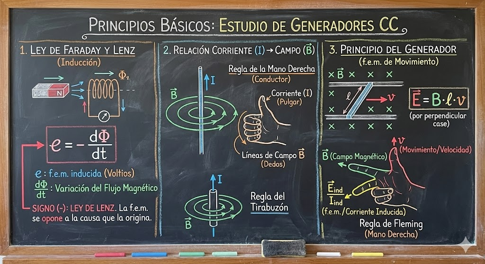
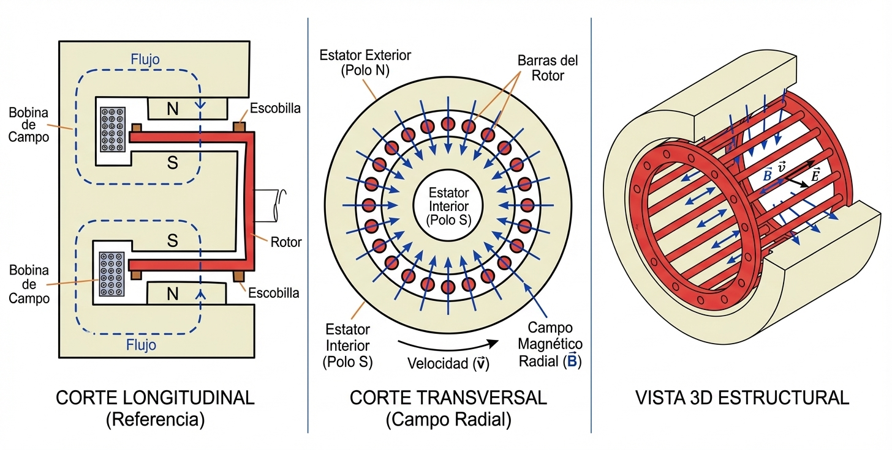
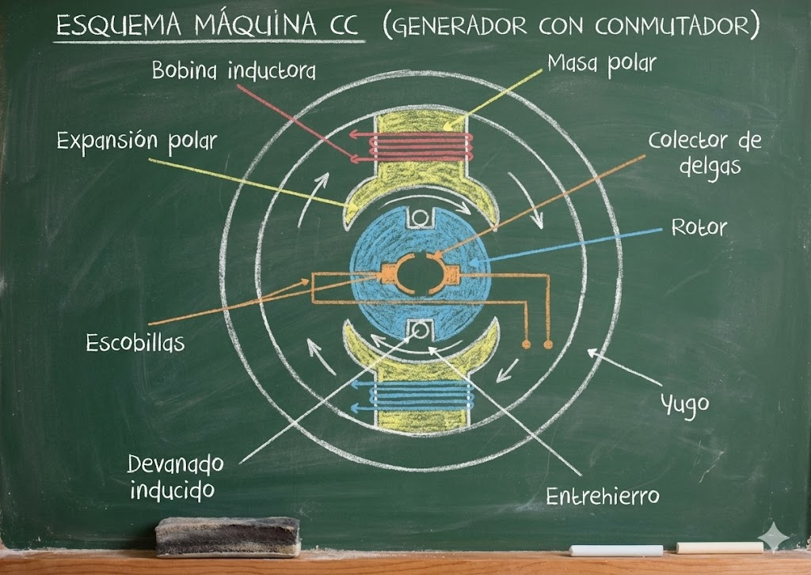
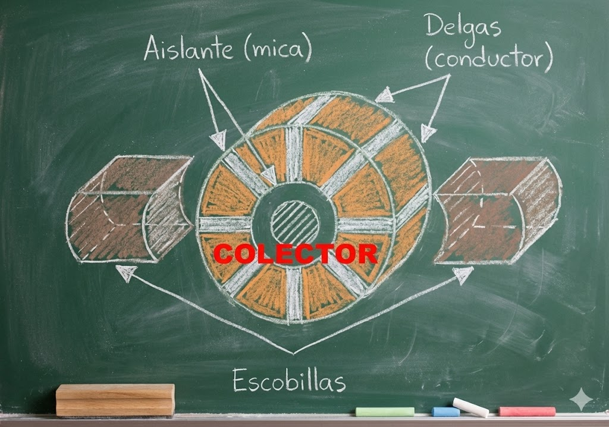
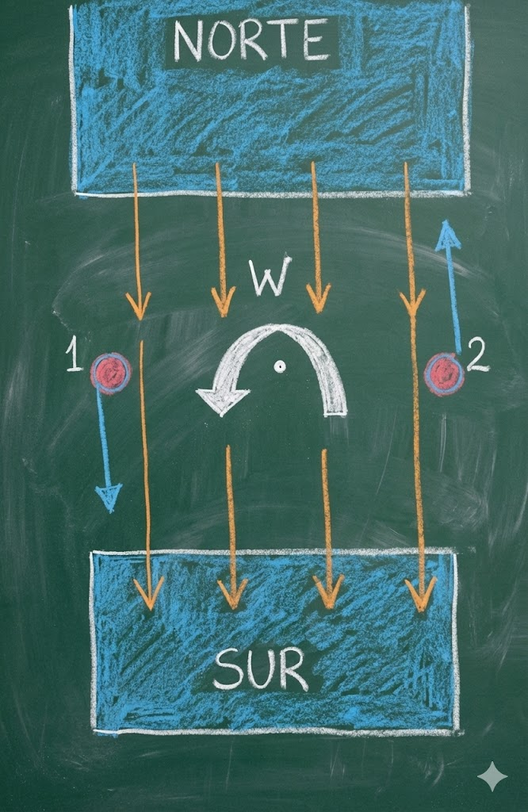
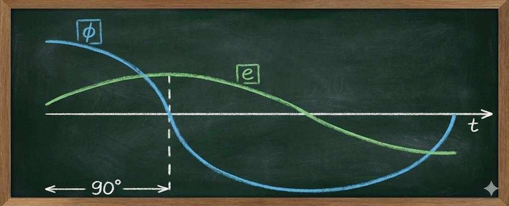
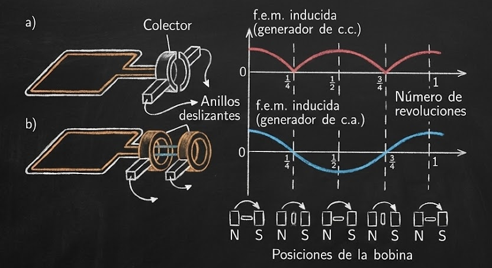
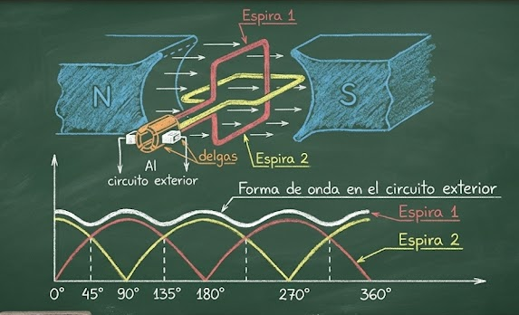

# Generadores de CC

1.  **Directamente (Generadores Homopolares):** Producen CC de forma nativa. Son raros (menos del 5% de las máquinas) y se usan para aplicaciones muy específicas. **Este es el foco principal de tus apuntes.**
2.  **Indirectamente (Con conmutador):** Generan corriente alterna internamente y usan un dispositivo mecánico (conmutador) para "rectificarla" y que salga como continua. Estas son las más comunes (dinamos clásicas).

---

## Generador Homopolar
Imagina un "tambor" que gira dentro de un campo magnético. A diferencia de los generadores normales que tienen bobinas complejas, este tiene una estructura muy simple. Sus partes principales son:

* **Estator (Parte fija - color crema/amarillo):** Crea el campo magnético. Tiene una forma especial para que el polo Norte sea un tubo externo y el polo Sur un cilindro interno. Esto crea un campo magnético **radial** (como los rayos de una bicicleta, yendo desde afuera hacia el centro).
* **Rotor (Parte móvil - color rojo):** Es como una jaula. Tiene dos anillos en los extremos unidos por barras conductoras (cables gruesos).
* **Escobillas (Brushes):** Son los contactos que rozan contra los anillos giratorios para sacar la electricidad hacia afuera.

### El Principio Físico: ¿Por qué genera electricidad?
Esto ocurre por la Ley de Faraday y la fuerza de Lorentz. Lo podemos resumir con la siguiente fórmula:

$$E = l \cdot (\vec{v} \times \vec{B})$$

Lo explicamos simple:
1.  Tienes un campo magnético ($B$) que va en dirección radial (hacia el centro).
2.  Tienes conductores (las barras rojas) que tienen una longitud ($l$).
3.  Haces girar el rotor, por lo que las barras tienen velocidad ($v$).

**La Regla de Oro:** Cuando mueves un conductor perpendicularmente a un campo magnético, se induce un voltaje.
* En esta máquina, el campo es **radial**, el movimiento es **tangencial** y la barra es **longitudinal**. Los tres son perpendiculares entre sí (90 grados), lo cual es ideal para generar voltaje constante.

    --- 

Transformamos la fórmula vectorial en algo escalar para calcular el voltaje generado ($E$):

$$E = l \cdot v \cdot B \cdot \sin(\theta) = l  \cdot ( \omega \cdot r) \cdot B \cdot 1$$

Donde:
* $l$: Largo de la barra conductora.
* $B$: Intensidad del campo magnético.
* $\omega$ (omega): Velocidad de giro (qué tan rápido da vueltas).
* $r$: Radio del rotor.
* $\theta$: Ángulo entre el campo magnético y la barra conductora (90 grados).

*(Nota que $\omega \cdot r$ es simplemente la velocidad tangencial $v$ en metros por segundo).*

---

### Características 

**A. Todo está en Paralelo:**
El rotor tiene muchas barras (conductores). Todas ellas están conectadas a los mismos anillos. Esto significa que **todas están en paralelo**.
* **Voltaje:** El voltaje total es igual al de una sola barra (no se suman los voltajes).
* **Corriente:** La corriente total se divide entre todas las barras. Si la máquina entrega mucha corriente ($I$), por cada barra solo pasa una fracción ($I/n$).

**B. El Problema: Voltaje Muy Bajo**
El apunte pone un ejemplo numérico muy claro:
* Largo ($l$) = 1 metro.
* Campo ($B$) = 1 Tesla (que es un campo fuerte, $10^4$ Gauss).
* Velocidad ($\omega \cdot r$) = 10 m/s.

El resultado es: **$E = 10 \text{ Volts}$**.
¡Es muy poco! Incluso con una máquina grande de 1 metro de largo.

**C. La Solución/Ventaja:**
Aunque el voltaje es bajo, como las barras son gruesas y están en paralelo, esta máquina puede soportar **corrientes gigantescas**

---
¡Excelente material! Estás estudiando los fundamentos de las **Máquinas Eléctricas**, específicamente el **Generador de Corriente Continua (CC)**.

Las imágenes que subiste explican la anatomía de la máquina y la física detrás de cómo se genera la electricidad. Para entenderlo bien, vamos a desglosar la información en tres pilares fundamentales: las **Partes Físicas**, el **Principio Físico (Inducción)** y el **Secreto de la Corriente Continua (Conmutación)**.

Aquí tienes la explicación estructurada de tus documentos:

---

# Generador con conmutador 

Estps constituyen la mayoría de las maquinas generadoras de corriente continua. Son esencialmente generadores de tensiones alternadas que se rectifican mecánicamente, por medio de un conmutador.

  Las partes principales son:

* **El Estator (La parte fija - "Inductor"):**
    * **Función:** Su trabajo es crear el campo magnético. Suministra el flujo magnético que luego genera la FEM.
    * **Tipos:** Puede ser un imán permanente (en máquinas pequeñas) o un electroimán (bobinas de cobre enrolladas en hierro). En la figura se muestra como una bobina inductora.

* **El Rotor (La parte móvil - "Inducido" o "Armadura"):**
    * **Función:** Es la pieza que gira dentro del estator. Aquí es donde se genera la tensión alterna.
    * **Composición:** Tiene enrollados de cable (bobinas/devanados). Al girar, estos cables cortan las líneas del campo magnético del estator y generan la tensión (F.E.M.).

* **El Conmutador / Colector (El rectificador mecánico):**
    * **Esta es la pieza más importante para entender la CC.** Son láminas de cobre (llamadas **delgas**) pegadas al eje del rotor pero aisladas entre sí (generalmente con mica).
    * **Función:** Actúa como un interruptor automático que gira. Su misión es asegurar que la electricidad salga siempre con la misma polaridad (positivo y negativo fijos), aunque dentro del rotor se genere corriente alterna.

* **Las Escobillas:**
    * Son los contactos fijos que "rozan" contra el conmutador giratorio para sacar la electricidad hacia afuera.
    * **El dilema del material:**
        * Se hacen de una mezcla de **Grafito** y **Cobre**.
        * *Más Grafito:* Lubrica mejor y desgasta menos el colector, pero conduce peor la electricidad (mayor caída de tensión $\Delta U$).
        * *Más Cobre:* Conduce muy bien, pero es más duro y daña (raya) el colector.
        * *Conclusión:* Es preferible cambiar escobillas (barato) que cambiar el colector (caro), por eso se busca un equilibrio.

---

## El Principio de Funcionamiento 

El principio fundamental es la **Ley de Faraday**. Si mueves un cable dentro de un campo magnético, se induce un voltaje.

Imaginemos una espira (conductor en forma de bucle) que gira dentro de un campo magnético uniforme creado por imanes permanentes (Norte y Sur).

Conductor 2 saliente al plano y conductor 1 (corriente positiva respecto a 2) entrante al plano.

* **El Movimiento:** La espira gira a una velocidad angular constante ($\omega$). 
* **La Inducción:** Al girar, la espira corta las líneas de campo magnético.
    * El **Flujo Magnético ($\Phi$)** es máximo cuando la espira está horizontal (perpendicular al campo). Fórmula: $\Phi(t) = \Phi_{max} \cdot \cos(\omega t)$.
    * La **Tensión Inducida ($e$)** es máxima cuando el flujo es cero (espira vertical, cortando líneas a máxima velocidad). Fórmula: 
    $e(t) = \Phi \cdot \omega \cdot \sin(\omega t) = E_{max} \cdot \sin(\omega t)$ (variacion del flujo con respecto al tiempo)
* **Resultado Inicial:** En los bordes de la bobina se genera una **FEM inducida**. La polaridad cambia cíclicamente (positivo a negativo) mientras la espira da la vuelta.

 
### Salida de Corriente Alterna vs. Continua
La forma en que extraemos esa electricidad determina si es AC o DC:

* **Anillos Rozantes (Generador de C.A.):** Si usamos dos anillos completos (uno para cada extremo de la bobina), la salida es una onda senoidal pura (alterna), tal como se produce internamente.
* **El Conmutador / Anillo Partido (Generador de C.C.):** Para obtener corriente continua, se sustituyen los anillos compĺetos por un **colector de delgas** (dos semianillos de 180° aislados entre sí).
    * **La Rectificación Mecánica:** Las escobillas (contactos fijos) están colocadas de tal forma que cambian de delga justo en el momento en que la tensión es cero (cuando la espira pasa por la vertical).
    * **Efecto:** Cada vez que la corriente interna de la bobina intenta invertir su polaridad, el conmutador invierte las conexiones hacia el exterior.
    * **Resultado:** Obtenemos una onda de **una sola polaridad** (pulsante), conocida como onda rectificada.

#### 3. Mejora de la Señal: De Pulsante a Continua Constante
Una sola espira con conmutador produce una corriente continua "a saltos" (pulsante). Para solucionar esto y obtener una línea casi recta (señal constante), se añaden más elementos:

* **Segunda Espira (a 90°):**
    * Se agrega una segunda bobina desfasada 90° respecto a la primera.
    * El colector ahora tiene **4 delgas** (segmentos de 90°).
    * **Efecto:** Cuando la tensión de la primera espira empieza a bajar, la segunda espira está en su punto máximo. Las escobillas siempre recogen la señal de la espira que tiene mayor tensión en ese momento.
    * **Gráfica:** La caída de tensión entre picos se reduce drásticamente (menor "rizado").

* **Múltiples Espiras (a 45° o menos):**
    * Si seguimos agregando espiras (ej. a 45° con 8 delgas), los "valles" entre los picos de tensión se llenan cada vez más.
    * **Conclusión:** Al aumentar el número de bobinas y delgas en el colector, la onda resultante se acerca cada vez más a una línea recta horizontal.

---
## Inconvenientes Constructivos
### 1. El Entrehierro Excesivo

En el modelo teórico ideal (una espira girando en el aire entre dos imanes), nos encontramos con una limitación física grave:

1.  **El obstáculo (El Aire):** El espacio entre los polos Norte y Sur está lleno de aire. El aire tiene una **reluctancia magnética muy alta** (es decir, se opone mucho al paso del campo magnético).
2.  **La consecuencia:** Para lograr que un flujo magnético decente atraviese todo ese aire y llegue a la espira, necesitaríamos imanes gigantescos o bobinas inductoras con una cantidad inmensa de energía (muchos "amperes-vuelta").
3.  **Resultado ineficiente:** Las tensiones generadas serían muy débiles porque gran parte del campo magnético se dispersaría ("se pierde") antes de ser cortado por la espira.

**La Solución Constructiva:** El Núcleo Ferromagnético

Para resolver esto, la ingeniería eléctrica introduce el **Rotor (o Inducido)** con núcleo de hierro.

En lugar de dejar la espira hueca girando en el aire, se enrollan los cables sobre un cilindro macizo (generalmente laminado) de material **ferromagnético** (hierro/acero).

Esto hace que:
1.  **Canalización del Flujo:** El material ferromagnético atrae y conduce las líneas de campo mucho mejor que el aire.
2.  **Reducción del Entrehierro:** Al colocar este cilindro de hierro entre los polos, el espacio real de aire se reduce al mínimo indispensable (apenas unos milímetros) para permitir que el rotor gire sin raspar.
3.  **Resultado:**
    * La resistencia al paso del flujo (reluctancia) baja drásticamente.
    * Se aprovecha casi toda la energía magnética de los polos.
    * Las líneas de campo cruzan el pequeño espacio de aire de forma radial (perpendicular a la superficie).

### 2. El Inconveniente de las Espiras Aisladas

**El Problema:**
En el modelo teórico básico, cada espira actuaba como un circuito independiente. Esto es ineficiente porque cada espira solo aporta energía durante un breve momento.

**La Solución Conceptual: El Anillo de Gramme**
Para solucionar esto, se ideó conectar todas las espiras en serie, formando un **bobinado continuo** (una espira empieza donde termina la anterior).
* **Construcción:** Se usa un núcleo ferromagnético en forma de anillo y se enrolla el cable alrededor.
* **Conexión al colector:** De cada unión entre dos espiras sale una conexión hacia una delga del colector.
* **Resultado Eléctrico:** Al girar, el bobinado se divide eléctricamente en **dos ramas en paralelo** (una bajo el polo Norte y otra bajo el Sur).
    * La tensión total es la suma de las tensiones de las espiras de *una sola rama*.
    * **Fórmula:** $E = (N/2) \cdot l \cdot B \cdot \omega \cdot r$ (Donde $N$ es el número total de conductores).

**Ubicación de las Escobillas (Zona Neutra):**
Las escobillas no se colocan al azar. Se ubican en la **zona neutra** (donde el campo magnético es nulo).
* Es el punto donde las corrientes de ambas ramas convergen (para la escobilla positiva) o divergen (para la negativa).
* Esto asegura que la conmutación ocurra sin chispas excesivas y sumando correctamente las tensiones.

---

**Solución definitiva:**

Aunque el Anillo de Gramme resolvió la continuidad, introdujo un defecto fatal de diseño:

**El Defecto (Desperdicio de Cobre):** 
* Los conductores que van por el **interior** del anillo **NO cortan líneas de campo magnético** , ya que estan blindados por el núcleo de hierro.
* **Consecuencia:** No generan tensión (FEM). Son "peso muerto" que solo añade resistencia eléctrica y gasta material sin aportar energía.

**La Solución: El Rotor de Tambor (Diseño Actual)**
Para aprovechar ese cobre desperdiciado, se modificó la geometría:
1.  **Traslado del Conductor:** En lugar de pasar el cable por dentro del anillo, se lleva por la parte exterior diametralmente opuesta (a 180° en una máquina de 2 polos).
2.  **Doble Efecto:** Ahora, ambos lados de la espira (ida y vuelta) están en la superficie exterior y cortan líneas de campo.
    * Mientras un lado corta líneas bajo el polo Norte, el otro lado corta líneas bajo el polo Sur.
    * Las tensiones se suman en lugar de anularse.
3.  **Rotores Ranurados:** Constructivamente, esto se logra con rotores de acero laminado con **ranuras** externas, donde se colocan los conductores en dos capas (bovina de ida y bobina de vuelta).

Este principio no solo aplica a máquinas de dos polos (N-S).
* En máquinas grandes (ej. tetrapolares: N-S-N-S), el recorrido de la bobina ya no es de 180°, sino de **90°** (o el ángulo que corresponda a un paso polar), para asegurar que los lados de la bobina siempre estén bajo polos opuestos y sumen tensión.

---
**En resumen:** Pasamos de espiras aisladas a un anillo continuo (Gramme) para suavizar la corriente, y luego evolucionamos al **rotor de tambor** para aprovechar todo el cobre, logrando que ambos lados de la bobina generen electricidad activamente.