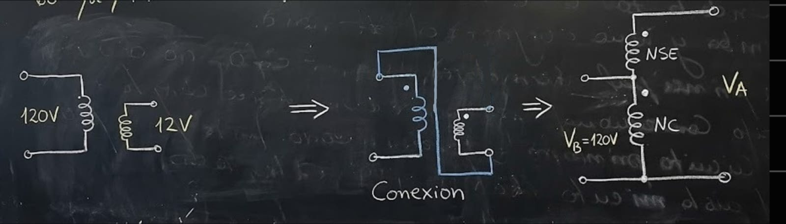

### **Ejemplo de Aplicación: Autotransformador Elevador**

**Enunciado:**
Se conecta un trafo convencional de 2 bobinados de **120/12 V** y **100 VA** para conformar un autotransformador elevador.
Si se aplica **120 V** al primario, se pide determinar:

a) ¿Cuál es el voltaje secundario del autotransformador?
b) ¿Cuál es la capacidad máxima en VA en este modo de operación?
c) Calcule el incremento en la potencia nominal.

---

### **Solución**

#### **a) Voltaje Secundario ($V_A$)**

El trafo se usa como elevador. Usando la fórmula de relación de voltajes (sumando el voltaje serie al común):

$$
V_A = \frac{N_{SE} + N_c}{N_c} \cdot V_B
$$

Sustituyendo los voltajes nominales (que son proporcionales a las vueltas $N$):

$$
V_A = \frac{12 + 120}{120} \cdot 120\,V = 132\,V
$$

#### **b) Capacidad Máxima ($S_{ES}$) en este modo**

El valor máximo que soporta cualquiera de los devanados es la potencia nominal original (**100 VA**).

Para encontrar la corriente máxima permitida de salida, nos fijamos en el devanado serie (el de 12V), ya que toda la corriente de salida debe pasar por él.

* Voltaje del devanado serie: $U_{SE} = 12\,V$
* Potencia del devanado: $S_{nom} = 100\,VA$

Calculamos la corriente máxima en serie ($I_{SE_{max}}$):

$$
I_{SE_{max}} = \frac{S_{max}}{U_{SE}} = \frac{100\,VA}{12\,V} = 8,33\,A
$$

Como en la conexión de autotransformador la corriente de salida ($I_A$) es igual a la corriente serie ($I_{SE}$):
$$I_{SE} = I_A$$

Y como ya calculamos que el voltaje de salida es $V_A = 132\,V$, la potencia de salida ($S_{sal}$ o $S_{ES}$) es:

$$
S_{sal} = V_A \cdot I_A = 132\,V \times 8,33\,A = 1100\,VA
$$

#### **c) Incremento de Potencia**

Calculamos la relación entre la potencia que maneja ahora ($S_{ES}$) y la potencia original del transformador ($S_D$):

$$
\frac{S_{ES}}{S_D} = \frac{1100\,VA}{100\,VA} = 11
$$

---

### **Interpretación del Resultado**

Este ejercicio demuestra la "magia" del autotransformador:
* Tienes un equipo físico diseñado para **100 VA**.
* Al conectarlo como autotransformador, logras alimentar una carga de **1100 VA**.
* **La ganancia es de 11 veces.**

Esto ocurre porque solo 100 VA se transmiten magnéticamente (transforman), mientras que los otros 1000 VA pasan conductivamente directo de la red a la carga.
 