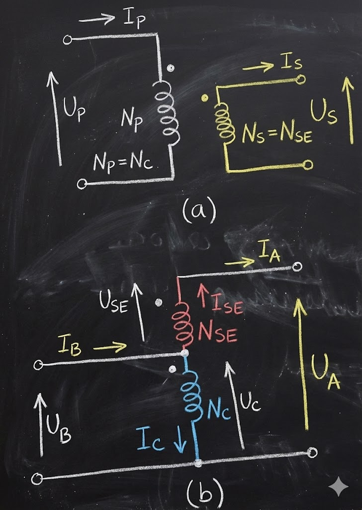

# **Autotransformador**

Hay ciertas ocasiones en las que se requiere cambiar los niveles de voltaje en una pequeña cantidad. Como por ejemplo, aumentar el voltaje de **220 a 230 V** o de **13,2 a 13,8 kV**, como consecuencia de la caída de voltaje que se produce en un sistema de potencia localizado lejos de los generadores.

En estas circunstancias, es un desperdicio (además del costo que conlleva) elaborar un transformador ("trafo") con 2 devanados dimensionados para suministrar casi el mismo voltaje. En su lugar, se utiliza un transformador de propósito especial llamado **autotransformador**.

#### **Análisis de las Figuras**

**En la Figura (a)** se ilustra un transformador convencional de 2 devanados:
* Con $N_p$ y $N_s$ como número de vueltas en los devanados primario y secundario, respectivamente.

En esencia, es posible obtener el mismo efecto de transformación sobre los voltajes, corrientes e impedancias cuando estos devanados se conectan en forma aditiva, como se muestra en la **Figura (b)**.

**En la Figura (b)** (Configuración de Autotransformador):

Ahora la relación entre el voltaje del primer devanado y el voltaje del segundo devanado está dada por la relación de vueltas del trafo. Sin embargo, el voltaje de salida es la suma del voltaje en ambos devanados.

#### **Definiciones y Terminología**

En este caso:
1.  **Devanado Común:** El primer devanado se llama "común" debido a que su voltaje aparece en ambos lados del trafo.
    * $N_c$: Número de vueltas del devanado común (equivalente al $N_p$ original).
    * $U_c$: Voltaje sobre el devanado común.
    * $I_c$: Corriente que atraviesa el devanado común.
2.  **Devanado Serie:** El devanado más pequeño se llama "serie" porque se conecta en serie con el común.
    * $N_{se}$: Número de vueltas del devanado serie (equivalente al $N_s$ original).
    * $U_{se}$: Voltaje en la bobina serie.
    * $I_{se}$: Corriente que atraviesa la bobina serie.

Por otra parte, llamamos $U_B$ e $I_B$ al voltaje y la corriente del lado de baja tensión respectivamente, y $U_A$ e $I_A$ los valores correspondientes al lado de alta tensión.

El lado primario (por el cual entra la potencia) puede ser cualquiera de los 2 extremos.

---

Los voltajes y las corrientes están relacionados de acuerdo a la conexión convencional:

#### **1. Relaciones Básicas (Transformador Ideal)**

Despreciando la corriente de magnetización, tenemos:

$$
(1) \quad \frac{U_c}{U_{SE}} = \frac{N_c}{N_{SE}} = K
$$

$$
(2) \quad \frac{I_c}{I_{SE}} = \frac{N_{SE}}{N_c} = \frac{1}{K} \quad \Rightarrow \quad N_c \cdot I_c = N_{SE} \cdot I_{SE}
$$

#### **2. Relaciones entre Bobinas y Terminales**

Los voltajes en las bobinas están relacionados con los voltajes terminales de la siguiente manera:

* **Lado de Baja Tensión ($B$):**
    $$U_B = U_c$$
* **Lado de Alta Tensión ($A$):**
    $$U_A = U_c + U_{SE}$$

Y las corrientes (aplicando la ley de nodos):
* $$I_B = I_c + I_{SE}$$
* $$I_A = I_{SE}$$

---

### **Relación de Voltajes**

Veamos ahora la relación de voltaje entre los terminales de un autotransformador.

Partimos de la ecuación del lado de alta tensión:
$$U_A = U_c + U_{SE}$$

De la ecuación $(1)$, despejamos $U_{SE}$:
$$U_{SE} = \frac{N_{SE}}{N_c} \cdot U_c = \frac{U_c}{K}$$

Sustituimos $U_{SE}$ en la ecuación de $U_A$:
$$U_A = U_c + \frac{N_{SE}}{N_c} U_c = U_c \left( 1 + \frac{1}{K} \right)$$

Como sabemos que $U_B = U_c$, reemplazamos:
$$U_A = U_B + \frac{N_{SE}}{N_c} U_B = U_B \left( 1 + \frac{N_{SE}}{N_c} \right)$$

Operando la fracción:
$$U_A = U_B \left( \frac{N_c + N_{SE}}{N_c} \right)$$

De donde obtenemos la fórmula final de la relación de transformación:

$$
\boxed{ \frac{U_B}{U_A} = \frac{N_c}{N_{SE} + N_c} }
$$

---
 

### **Relación de Corrientes**

La relación de corrientes entre los lados del autotransformador la podemos encontrar teniendo en cuenta la siguiente relación (basada en la ley de nodos):

$$
I_B = I_c + I_{SE}
$$

De la ecuación (2) sabemos que:
$$
I_c = \frac{N_{SE}}{N_c} I_{SE}
$$

Sustituyendo esto en la primera ecuación:
$$
I_B = \frac{N_{SE}}{N_c} I_{SE} + I_{SE}
$$

Como sabemos que la corriente de salida es la misma que la serie ($I_A = I_{SE}$), reemplazamos:
$$
I_B = \frac{N_{SE}}{N_c} I_A + I_A = I_A \left( \frac{N_{SE}}{N_c} + 1 \right) = I_A \left( \frac{N_{SE} + N_c}{N_c} \right)
$$

Obteniendo la relación final de corrientes:

$$
\boxed{ \frac{I_B}{I_A} = \frac{N_{SE} + N_c}{N_c} }
$$

---

### **Análisis de Potencia**

Es interesante notar que **no toda la potencia** que se transfiere del primario al secundario en el autotransformador pasa a través de los devanados (por inducción magnética).

Por lo tanto, si un transformador convencional se conecta como autotransformador, **puede manejar mucha más potencia** que aquella para la que fue concebido originalmente.

#### **Demostración**

La potencia aparente de entrada al transformador está dada por:
$$S_{ent} = U_B \cdot I_B$$

Y la potencia aparente de salida por:
$$S_{sal} = U_A \cdot I_A$$

Es fácil demostrar que $S_{ent} = S_{sal} = S_{ES}$, donde $S_{ES}$ es la potencia de entrada y salida del TRAFO (Potencia Pasante).

Si tomamos la ecuación de salida y sustituimos las relaciones de voltaje y corriente halladas anteriormente:

$$
S_{sal} = U_A \cdot I_A
$$

Sustituyendo $U_A$ e $I_A$ en función de $U_B$ e $I_B$:
$$
S_{sal} = \left( U_B \frac{N_c + N_{SE}}{N_c} \right) \cdot \left( I_B \frac{N_c}{N_{SE} + N_c} \right)
$$

Al simplificar los términos entre paréntesis (se cancelan mutuamente), llegamos a:
$$
S_{sal} = U_B \cdot I_B = S_{ent}
$$

#### **Potencia en los Devanados**

La **Potencia de Devanado ($S_D$)**, que es la potencia que manejan físicamente las bobinas (voltaje en la bobina por corriente en la bobina) (es menor a la potencia de entrada/salida del trafo).
 
$$
S_D = U_c \cdot I_c = U_{SE} \cdot I_{SE}
$$

 

Sabiendo que $U_c = U_B$ (voltaje de baja) y que por ley de nodos $I_c = I_B - I_A$:

$$S_D = U_B (I_B - I_A) = U_B \cdot I_B - U_B \cdot I_A$$

Sustituimos $I_A$ usando la relación de corrientes hallada anteriormente ($I_A = I_B \frac{N_c}{N_{SE} + N_c}$):

$$S_D = U_B \cdot I_B - U_B \cdot I_B \left( \frac{N_c}{N_{SE} + N_c} \right)$$

Sacamos factor común $U_B \cdot I_B$:

$$S_D = U_B \cdot I_B \left( 1 - \frac{N_c}{N_{SE} + N_c} \right)$$

Resolvemos el paréntesis buscando denominador común:

$$S_D = U_B \cdot I_B \left( \frac{N_{SE} + N_c - N_c}{N_{SE} + N_c} \right)$$

$$S_D = U_B \cdot I_B \left( \frac{N_{SE}}{N_{SE} + N_c} \right)$$

Como sabemos que la **Potencia de Entrada/Salida ($S_{ES}$)** es $S_{ES} = U_B \cdot I_B$, llegamos a la relación final:

$$
S_D = S_{ES} \left( \frac{N_{SE}}{N_{SE} + N_c} \right)
$$

Y reordenando para ver el factor de ganancia:

$$
\boxed{ \frac{S_{ES}}{S_D} = \frac{N_{SE} + N_c}{N_{SE}} }
$$

---

### **Nota Técnica**

Esta hoja contiene el concepto más importante del autotransformador: la diferencia entre la **Potencia Pasante** ($S_{ES}$) y la **Potencia Tipificada o de Devanado** ($S_D$).

* **$S_{ES}$ (Entrada/Salida):** Es la potencia total que alimenta la carga. Parte de ella se transmite eléctricamente (conducción directa) y otra parte magnéticamente.
* **$S_D$ (Devanado):** Es solo la parte que se transforma magnéticamente. Como el autotransformador transmite mucha energía por conducción directa (sin pasar por el núcleo magnético), el tamaño físico del equipo ($S_D$) es mucho menor que la potencia que es capaz de entregar ($S_{ES}$).

---

### **Interpretación de la Ventaja**

Esta ecuación muestra la ventaja en el manejo de la potencia aparente que un autotransformador tiene sobre un transformador convencional.

* **$S_{ES}$:** Es la potencia aparente que ingresa al primario y sale por el secundario (la que ve la carga).
* **$S_D$:** Es la potencia aparente que realmente pasa a través de los devanados del transformador (por inducción electromagnética).

> **Nota:** El resto de la potencia ($S_{ES} - S_D$) pasa del primario al secundario directamente por conducción eléctrica ("potencia conducida"), sin ser acoplada magnéticamente por los devanados.

**Nótese que mientras más pequeño es el devanado en serie ($N_{SE}$), más grande es la ventaja.**

De este análisis se desprende que:
1.  Un trafo conectado en la **conexión convencional** necesita devanados que soporten toda la potencia $S_{ES}$.
2.  Si se lo conecta como **autotransformador** para manejar la misma potencia, requiere que sus bobinados manejen solo:
    $$S_D = \frac{N_{SE}}{N_{SE} + N_c} S_{ES}$$
    Que es una potencia inferior, lo que permite construir autotransformadores **más pequeños y de menor costo**.

---

### **Advertencia de Seguridad (Aislamiento)**

Por lo general, **no es conveniente** conectar simplemente un transformador con 2 devanados (convencional) como autotransformador (como lo mostramos en la teoría) de forma indiscriminada.

Esto es debido a que el **aislamiento** del lado de bajo voltaje de un trafo ordinario no es lo suficientemente bueno como para soportar todo el voltaje de salida (o el potencial respecto a tierra) que se presenta en la conexión como autotransformador.

 
En los transformadores que se construyen de manera específica como autotransformador, el aislamiento del devanado en serie es tan bueno como el de la bobina común.

#### **Aplicaciones**
1.  **Sistemas de Potencia:** Los autotransformadores se utilizan en los sistemas de potencia cuando se necesitan transformar 2 voltajes con niveles muy cercanos (por ejemplo, interconectar redes de 132 kV y 220 kV).
2.  **Transformadores Variables (Variac):** También se utilizan como transformadores variables donde la toma de bajo voltaje se desplaza hacia arriba y hacia abajo en el devanado.

#### **Desventajas**
La principal desventaja es que, a diferencia de un trafo convencional, hay una **conexión física directa** entre el circuito primario y el secundario, por lo que se **pierde el aislamiento eléctrico** (aislamiento galvánico) entre ambos lados.

#### **Ventajas Técnicas**
Comparados con el trafo convencional, los autotransformadores presentan:
* Reactancias de dispersión menores.
* Pérdidas mínimas.
* Corriente de excitación más pequeña.
* Además de un costo menor.

