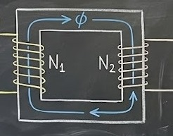
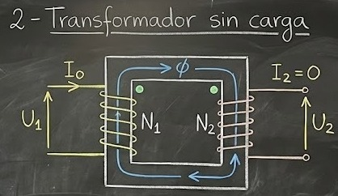
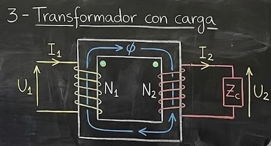

# Transformadores

Las técnicas modernas requieren la disponibilidad de distintos niveles de tensión aplicables en las distintas áreas como: Transmisión de Potencias, Comunicaciones, Electromedicina, Señalización, Computación, etc.

Esto puede lograrse merced al **transformador**, que es un aparato estático de inducción destinado a transformar un sistema primario de tensiones y corrientes alternas en otro sistema de intensidades de corriente y tensiones diferente.

El transformador permite elevar o disminuir las tensiones alternas a voluntad, adaptando un aparato o instalación a las condiciones óptimas de funcionamiento.

Una definición general lo describe como un aparato formado por dos o más circuitos eléctricos acoplados por un circuito magnético en común; es decir, se requieren al menos dos devanados vinculados por la existencia de un flujo magnético con variación temporal.

Esto se podría lograr a través del aire, pero dicho acoplamiento se hace más efectivo si se utiliza como transporte del flujo un núcleo de hierro u otro material ferromagnético, como muestra la figura.

Uno de estos arrollamientos, conocido como **primario**, se conecta a la fuente de alimentación y recibe de ella la energía eléctrica. El segundo bobinado, denominado **secundario**, entrega la energía eléctrica recibida a la carga.

Cuando se conecta la Fuente al circuito primario, la corriente que circula por el mismo genera una **F.M. Motriz** (Fuerza Magnetomotriz) que crea líneas de campo magnético que atraviesan las espiras del circuito secundario, e inducen sobre las mismas una tensión que hará circular una corriente a través de la impedancia de carga que conectamos en el circuito secundario.

---

### Página 2

El concepto de transformador no implica la presencia de un núcleo ferromagnético; el objeto de este es influir a través de su alta permeabilidad $\mu$ (mu) para que el flujo magnético $\phi$ que se origina quede prácticamente localizado dentro de la región del espacio ocupado por el núcleo, obteniendo así un flujo más intenso.

Un transformador construido con núcleo ferromagnético se lo denomina **transformador con núcleo de hierro**.
La mayoría de los transformadores que operan a frecuencias industriales ($50\text{Hz}$, $60\text{Hz}$) son de este tipo, y es el que vamos a estudiar en esta materia.

En un **Transformador Real**, en el proceso de transferencia de la energía desde la fuente a la carga, una parte de la energía se pierde; por lo tanto, la energía que llega a la carga es menor de la que entrega el generador.

Comenzaremos el estudio con un **Transformador Ideal** donde no existen estas pérdidas internas en la máquina; pero para que esto se justifique, el caso real no debe apartarse demasiado del ideal.

## Condiciones de un Transformador Ideal

Analicemos la hipótesis que establece las condiciones que debe cumplir el transformador para que se lo considere Ideal.

**1° Condición:**
La resistencia de los arrollamientos de los bobinados debe ser nula.
* Resistencia del Primario: $R_1 = 0$
* Resistencia del Secundario: $R_2 = 0$

**2° Condición:**
**Flujo de Dispersión Nulo.**
Todo el flujo $\phi$ creado por la F.M.M. (Fuerza Magnetomotriz) debe quedar confinado al núcleo del circuito magnético para que todas las líneas de campo concatenen ambos bobinados; es decir, el acoplamiento entre los bobinados debe ser perfecto.

**3º Condición:**
**Pérdidas por Histéresis Nulas.**

**4º Condición:**
**Pérdidas por Corrientes Parásitas Nulas.**

**5º Condición:**
**Permeabilidad** $\mu = \infty \Rightarrow \text{Reluctancia } (\mathcal{R}) = 0$.

## Funcionamiento Sin Carga (Secundario Abierto)

Al aplicar la tensión variable en el tiempo $u_1(t)$ al bobinado primario comenzará a circular por el mismo una corriente infinita, ya que por las suposiciones anteriores no habrá resistencia para limitarla.
Esta corriente $i_1(t)$ produce una FMM (Fuerza Magnetomotriz).

$$u_1(t) = \sqrt{2} U_1 \sin(\omega t)$$

$FMM = N \cdot i_1(t)$ que genera el flujo $\phi(t)$. Como el Núcleo Ferromagnético tiene $\mathcal{R}=0$ (Reluctancia cero), todo el flujo está confinado a circular por el núcleo. Este, al atravesar las espiras del bobinado primario, induce una f.e.m. $e_1(t)$ que por la Ley de Faraday y de Lenz:

$$e_1(t) = - \frac{d\lambda(t)}{dt} = - N_1 \frac{d\phi(t)}{dt}$$

*Donde $\lambda(t) = \text{flujo concatenado} = N_1 \cdot \phi(t)$*

El sentido de esta f.e.m. inducida es el de oponerse a la causa que le dio origen, es decir, a la Tensión de alimentación $u_1(t)$. Por lo tanto:

$$u_1(t) + e_1(t) = 0 \quad \text{entonces} \quad u_1(t) = -e_1(t)$$

$$\boxed{u_1(t) = N_1 \frac{d\phi(t)}{dt}}$$

Resultando entonces nula la corriente $i_1(t)$ que pudo ser necesaria al comienzo para producir el $\phi(t)$.

El valor de la f.e.m. inducida instantánea no es práctico, por lo que se ha de recurrir al **Valor Eficaz** $E_1$ que puede obtenerse a partir de los valores máximos utilizando la conocida expresión:

$$E_{1max} = \sqrt{2} E_1 = \omega \cdot N_1 \cdot \phi_{max}$$

De donde:

$$E_1 = \frac{E_{1max}}{\sqrt{2}} = \frac{2\pi f N_1 \phi_{max}}{\sqrt{2}} = \sqrt{2}\pi f N_1 \phi_{max}$$

*(Nota: $\sqrt{2} \cdot \pi \approx 4,44$)*

Como $U_1 = -E_1$ (valores eficaces):

$$\boxed{U_1 = 4,44 \cdot f \cdot N_1 \cdot \phi_{max}}$$

El flujo $\phi(t)$ va a continuar actuando solo en razón a la 5º Suposición e induce en el devanado secundario una f.e.m. $e_2(t)$.

$$e_2(t) = - N_2 \frac{d\phi(t)}{dt} \quad \text{pero} \quad e_2(t) = u_2(t)$$

Por las suposiciones establecidas, entonces resulta utilizando valores eficaces:

$$u_2(t) = -N_2 \frac{d\phi(t)}{dt}$$

$$\boxed{E_2 = U_2 = 4,44 \cdot f \cdot N_2 \cdot \phi_{max}}$$

Entonces:

$$\frac{U_1}{U_2} = -\frac{N_1}{N_2} = -K \quad \text{y} \quad \frac{E_1}{E_2} = \frac{N_1}{N_2} = K$$

Donde $K$ es la **relación de espiras** o relación de transformación. De esta manera, un transformador ideal varía los voltajes en proporción directa con el número de vueltas. Tomando valores absolutos se tiene:

$$\boxed{\frac{U_1}{U_2} = \frac{E_1}{E_2} = \frac{N_1}{N_2} = K} \quad \text{o} \quad U_1 = -K U_2$$

* Si $N_1 > N_2$ resulta $U_1 > U_2$ y $K > 1$: La máquina opera como **Reductor de Tensión**.
* Si $N_1 < N_2$ resulta $U_1 < U_2$ y $K < 1$: La máquina opera como **Elevador de Tensión**.
* Si $N_1 = N_2$ resulta $U_1 = U_2$ y $K = 1$: El Trafo opera como **Separador de línea**, aislando el circuito de salida de la entrada.

La expresión anterior se aplica de igual manera para valores máximos, eficaces o instantáneos.

## Funcionamiento Con Carga (Secundario Cargado)
Supongamos ahora que se conecta una **impedancia de carga** ($Z_c$) a través de los terminales secundarios del Transformador. De modo que la tensión inducida secundaria produzca una corriente de carga $i_2 = \frac{U_2}{Z_c}$ que modifica el estado electromagnético actual.

> **Nota:** La corriente secundaria $i_2$ se define como positiva hacia afuera del devanado y esta produce una F.M.M. (Fuerza Magnetomotriz) que genera un flujo opuesto al producido por la corriente primaria.

Usaremos el **Principio de Superposición** para considerar los procesos físicos relacionados con el problema.
Este principio afirma que en los sistemas lineales (donde los efectos son proporcionales a las causas), el efecto resultante de la acción simultánea de un cierto número de causas estará dada por la suma de los efectos producidos por cada una de dichas causas actuando independientemente.

Imaginemos que persiste sin alteraciones el flujo original inducido, las mismas tensiones que antes en los arrollamientos primario y secundario.
Al circular la corriente $i_2$ por el bobinado secundario, crea una F.M.M. y por consiguiente se producirá un **segundo flujo superpuesto** en dirección opuesta en cada instante al flujo primario (**Ley de Lenz**).

El segundo flujo (provocado por la corriente secundaria), inducirá una tensión en cada arrollamiento, superpuesta a la tensión anteriormente inducida y las 2 tensiones superpuestas tendrán direcciones opuestas en cada instante.
Evidentemente, el efecto en el primer arrollamiento será cancelar la tensión inducida por la primera componente de flujo.

*(Nota al margen en el original: En realidad el flujo provocado por la corriente secundaria no cancela toda la tensión inducida debido a que el flujo de dispersión del secundario no concatena al arrollamiento primario porque se cierra por el aire).*

--- 
La tensión inducida en el arrollamiento primario por la primera componente de flujo es igual en cada instante al suministro de tensión.

$$U_{1max} = \omega N_1 \phi_{max}$$

Como la tensión inducida estará prácticamente cancelada, la tensión aplicada que carece de opuesto, enviará corriente aun toda a través del arrollamiento primario y el valor de esta corriente será tal que el incremento en F.M.M. restablecerá el flujo principal aproximadamente a su valor original.

> **Importante:**
> El flujo $\phi_{max} = \frac{U_{1max}}{\omega N_1}$ **no puede disminuir** porque tendría que disminuir $U_{1max}$, lo que es imposible porque la tensión la impone la fuente.

En consecuencia, el arrollamiento primario tendrá que reaccionar en forma tal de originar una F.M.M. igual y opuesta a la que quiere poner el secundario.

Durante el funcionamiento, el flujo principal es prácticamente constante:

$$\phi_{max} = \frac{U_{1max}}{\omega N_1} = \frac{U_1}{4,44 f N_1}$$

*(Donde $U_1$ es valor eficaz)*

Dado que la tensión y la frecuencia son constantes.

La tensión inducida primaria difiere de la tensión aplicada solamente en las caídas de la resistencia primaria y de la reactancia de dispersión, las cuales son generalmente muy pequeñas.
Por lo tanto, la corriente magnetizante de un Trafo que produce este flujo casi constante es aproximadamente constante.

Cuando la corriente de carga circula en el arrollamiento secundario, la F.M.M. que produce es cancelada por una F.M.M. igual y opuesta en el primer arrollamiento, producida por un incremento de la corriente primaria ($i_1'$).

$$\phi_1 = - \phi_2$$

$$\frac{FMM_1}{\mathcal{R}} = - \frac{FMM_2}{\mathcal{R}}$$

*(Siendo $\mathcal{R}$ la reluctancia)*

$$N_1 \cdot i_1' = - N_2 \cdot i_2$$

$$\frac{i_1'}{i_2} = \frac{N_2}{N_1} = \frac{1}{K}$$

Despejando $i_1'$:

$$\boxed{i_1' = - \frac{i_2}{K}}$$

---

### Resumen conceptual de esta parte
Esta sección explica el **mecanismo de reacción del primario**.
1.  Si conectas una carga al secundario, circula corriente $I_2$.
2.  Esa $I_2$ intenta crear un flujo contrario y bajar el flujo del núcleo.
3.  Pero el flujo **no puede bajar** porque está fijado por la tensión de la fuente ($V_1$).
4.  Entonces, el primario "pide" más corriente a la fuente ($I_1'$) para compensar exactamente el efecto desmagnetizante del secundario. 

--- 

### Relaciones de Potencia e Impedancia 

También se advierte que, a partir de las ecuaciones anteriores, la potencia instantánea recibida por el devanado primario es equivalente a la potencia instantánea entregada por el secundario en un transformador ideal, porque no se considera ningún tipo de pérdida ni dispersión.

$$v_1 \cdot i_1 = v_2 \cdot i_2$$

En forma **fasorial** las ecuaciones se expresan de la siguiente forma:

**Tensiones:**
$$\hat{V}_1 = \frac{N_1}{N_2} \hat{V}_2 \quad \text{o} \quad V_1 = \frac{N_1}{N_2} V_2 \quad \text{(Valores RMS)}$$

Y despejando $V_2$:
$$\hat{V}_2 = \frac{N_2}{N_1} \hat{V}_1 \quad \text{o} \quad \boxed{V_2 = \frac{N_2}{N_1} V_1 = \frac{V_1}{K}}$$

**Corrientes:**
$$\hat{I}_1 = \frac{N_2}{N_1} \hat{I}_2 \quad \text{o} \quad I_1 = \frac{N_2}{N_1} I_2$$

Y despejando $I_2$:
$$\hat{I}_2 = \frac{N_1}{N_2} \hat{I}_1 \quad \text{o} \quad \boxed{I_2 = \frac{N_1}{N_2} I_1 = K \cdot I_1}$$

**De estas ecuaciones:**

Si analizamos la impedancia vista desde el primario ($\hat{V}_1 / \hat{I}_1$):

$$\frac{\hat{V}_1}{\hat{I}_1} = \left( \frac{N_1}{N_2} \right)^2 \frac{\hat{V}_2}{\hat{I}_2}$$

Pero sabemos que la impedancia de carga es $Z_2 = \frac{\hat{V}_2}{\hat{I}_2}$.

Por lo tanto:

$$\boxed{Z_1 = \left( \frac{N_1}{N_2} \right)^2 \cdot Z_2}$$

---

El hecho de que circule $i_2$ cuando se conecta una carga, condiciona al circuito primario para que reaccione con una corriente $i_1'$.

La corriente primaria y secundaria están en relación inversa al número de espiras.
El signo negativo indica que al circular las corrientes se crean flujos opuestos.

**La relación de impedancias entre los bornes primarios y secundarios:**

$$Z_1 = \frac{E_1}{I_1} \quad ; \quad Z_2 = \frac{E_2}{I_2}$$

$$\frac{Z_1}{Z_2} = \frac{E_1}{E_2} \cdot \frac{I_2}{I_1} = \left( \frac{N_1}{N_2} \right)^2 = K^2$$

Es decir, la impedancia a los bornes de entrada y salida están en relación directa a los cuadrados de los números de espiras.

$$\boxed{Z_1 = \left( \frac{N_1}{N_2} \right)^2 \cdot Z_2 = K^2 \cdot Z_2}$$

De esto se deduce que el Trafo se puede utilizar como **transformador de corrientes, tensiones e impedancias.**

Las flechas en la figura muestran las direcciones positivas de tensiones y corrientes. Cuando ocurre que simultáneamente una tensión y una corriente en uno de los pares de terminales tienen el mismo signo, indica que la potencia circula hacia adentro del arrollamiento (carga).
Y cuando tienen signos opuestos, la potencia circula hacia afuera del arrollamiento (fuente).

En los momentos que la corriente primaria circula en dirección positiva, la secundaria circula en dirección negativa y viceversa, porque evidentemente cuando la potencia circula hacia adentro en uno de los arrollamientos, circula hacia afuera en el otro.

---

### Notas de estudio:
1.  **Reflexión de Impedancia ($Z_1 = K^2 Z_2$):** Esta es una de las fórmulas más importantes en audio y electrónica de potencia. Significa que si tienes un parlante de 8 Ohms ($Z_2$) y usas un trafo con relación $K=10$, la fuente "verá" una resistencia de $10^2 \times 8 = 800$ Ohms. El trafo "engaña" a la fuente haciéndole creer que la carga es diferente.
2.  **Dirección de Potencia:** El último párrafo explica el principio de conservación de la energía. Si el primario absorbe potencia (entra energía), el secundario debe entregarla (sale energía), por eso las corrientes tienen sentidos "opuestos" magnéticamente hablando.