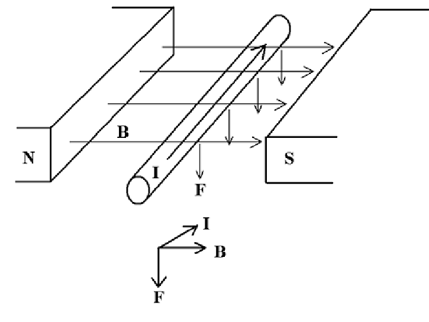
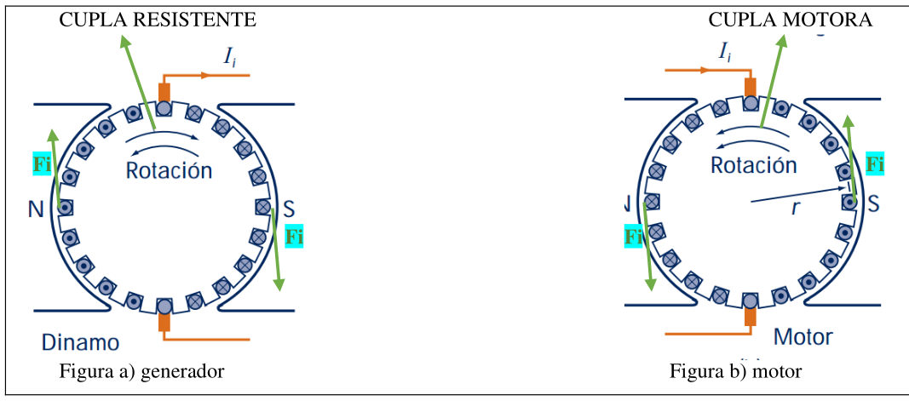
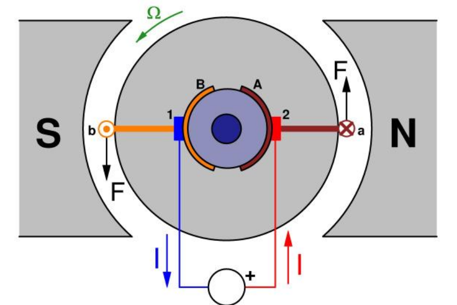
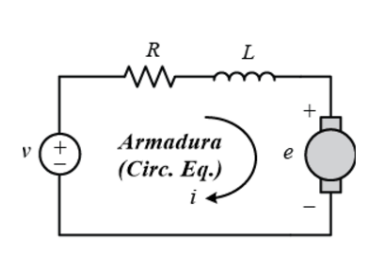

# Guía de Estudio: Motores de Corriente Continua (CC)

## 1. Principio Físico Fundamental: Fuerza de Lorentz
Todo el funcionamiento se basa en la interacción entre una corriente eléctrica y un campo magnético.

Si tenemos un conductor de longitud $L$ por el que circula una corriente $I$, y este se encuentra inmerso en un campo magnético $B$, aparecerá una fuerza física sobre el conductor.

**La Ecuación Vectorial:**
$$\vec{F} = L \cdot (\vec{I} \times \vec{B})$$

**La Ecuación Escalar (Magnitud):**
$$F = L \cdot I \cdot B \cdot \sin(\alpha)$$

* **$F$:** Fuerza en Newtons [N].
* **$L$:** Longitud activa del conductor [m].
* **$I$:** Intensidad de corriente [A].
* **$B$:** Densidad de flujo magnético [T].
* **$\alpha$:** Ángulo entre el vector corriente y el vector campo magnético. (La fuerza es máxima cuando son perpendiculares, $\sin(90^\circ)=1$).

**Determinación del sentido (Regla de la Mano Izquierda):**
Para saber hacia dónde se moverá el conductor (sentido de la fuerza $F$):
1.  **Índice:** Apunta en dirección del Flujo Magnético ($B$, de Norte a Sur).
2.  **Medio:** Apunta en dirección de la Corriente ($I$).
3.  **Pulgar:** Indicará el sentido de la Fuerza resultante ($F$).

---

## 2. Reversibilidad de la Máquina: Generador vs. Motor
**Concepto Clave:** Constructivamente, un motor de CC y un generador de CC (dinamo) son idénticos. La diferencia radica en el flujo de energía.

El sistema consta de:
* **Estator (Inductor):** Crea el campo magnético fijo (Polos N y S).
* **Rotor (Inducido):** Parte giratoria donde están los conductores y se genera la fuerza o la FEM.

### A. Funcionamiento como Generador (Dinamo)
* **Entrada:** Energía Mecánica (Cupla Motora $C_m$ externa mueve el eje).
* **Proceso:** Al girar los conductores en el campo, se induce una FEM y circula corriente.
* **Reacción:** Esa corriente inducida crea una fuerza propia que se opone al movimiento (Cupla Resistente).
* **Salida:** Energía Eléctrica.

### B. Funcionamiento como Motor
* **Entrada:** Energía Eléctrica (inyectamos corriente desde una fuente externa).
* **Proceso:** La corriente en el campo magnético genera una fuerza lateral (Fuerza de Lorentz explicada arriba).
* **Resultado:** Estas fuerzas crean un par de giro o **Cupla Motora**.
* **Salida:** Energía Mecánica.

---

### Análisis del cambio de estado (Ejemplo de la Red)

**Situación:** Varios generadores están en paralelo alimentando una red.
1.  **Falla:** A uno de los generadores se le rompe el eje de transmisión (pierde la entrada mecánica).
2.  **Consecuencia Inmediata:** Deja de generar energía eléctrica.
3.  **Inversión:** Su voltaje baja y ahora la red le "empuja" corriente a él (la corriente $I$ cambia de sentido, entra en lugar de salir).
4.  **Resultado Motor:** Al invertirse el sentido de la corriente ($I$), se invierte el sentido de la fuerza ($F$).
    * Antes la fuerza frenaba el giro (Cupla resistente de generador).
    * Ahora la fuerza favorece el giro (Cupla motora).
    * La máquina sigue girando en el mismo sentido, pero ahora consumiendo electricidad para vencer su propio rozamiento y ventilación. Se ha convertido en un motor.

---

## 3. Ecuación de Tensión y la FCEM
Este es el punto más importante para el cálculo de ingeniería.

Cuando el motor gira, sus conductores cortan líneas de campo. Por ley de Faraday, ¡esto induce una tensión!
Esta tensión inducida se opone a la tensión que le estamos aplicando (Ley de Lenz), por eso se llama **Fuerza Contra-Electromotriz (FCEM)**.

**El Balance de Energía:**
La energía eléctrica que entra se transforma en:
1.  Calor en las resistencias (pérdidas).
2.  Caída de tensión en las escobillas.
3.  Trabajo mecánico (representado eléctricamente por la FCEM).

**La Ecuación del Circuito del Inducido:**
$$V = E_{\text{fcem}} + (R_i \cdot I) + 2U_e$$

Donde:
* **$V$:** Tensión total aplicada al motor (Fuente).
* **$E_{\text{fcem}}$:** Fuerza Contra-Electromotriz generada por el giro.
    * Nota: $E_{\text{fcem}} = k \cdot \Phi \cdot n$ (depende de la velocidad $n$ y el flujo $\Phi$).
* **$R_i \cdot I$:** Caída de tensión óhmica en el bobinado interno.
* **$2U_e$:** Caída de tensión en las escobillas (carbones). *Nota: En tus apuntes aparece como "2 Ue", que significa 2 veces la tensión de escobilla (positivo + negativo).*

---
### Autorregulación

* Si aumentamos la carga mecánica (frenamos el eje), el motor tiende a bajar de velocidad.
* Al bajar la velocidad, baja la FCEM.
* Al bajar la FCEM, entra más corriente ($I$).
* Al aumentar $I$, aumenta la Fuerza y por tanto aumenta la Cupla para compensar la carga.

---

## 4. Cupla Motora (Torque)
La **Cupla Motora ($C_m$)** (o Torque) es el esfuerzo de giro total.
Es la sumatoria de todas las fuerzas individuales que aparecen en cada uno de los conductores del rotor multiplicadas por el radio del rotor .
 
  

Observa el diagrama de corte transversal del motor:
* Tienes un **Estator** (Polos Norte y Sur) que crea un campo magnético estático.
* Tienes un **Rotor** (el círculo central) con conductores.
* **La clave:** Nota que en la mitad izquierda los conductores tienen un punto (corriente sale hacia ti) y en la derecha una cruz (corriente entra).
* Al aplicar la regla de la mano izquierda, se generan fuerzas tangenciales (flechas $F$).
* Como estas fuerzas actúan a una distancia del centro (radio), se crea un momento de torsión.
 ---

### Deducción de la cupla motora  
Primero, definimos qué tenemos dentro de la máquina:
* $Z$: Número total de conductores en el rotor.
* $I$: Corriente total que entra al motor (desde la fuente).
* $d$: Número de ramas en paralelo (circuitos en derivación) del bobinado interno.
* $I_i$: Corriente que circula por **un solo** conductor. (Nota: $I_i = I / d$).
* $B$: Inducción magnética (fuerza del campo).
* $r$: Radio del rotor (inducido)
* $L$: Longitud de cada conductor.

### Paso a paso: De un conductor al total
**1. Fuerza en un solo conductor:**
Usamos la ley de Lorentz (asumiendo ángulo de 90° entre conductor y campo, $\sin 90 = 1$):
$$F_{individual} = L \cdot I_i \cdot B$$

**2. Cupla (Torque) de un solo conductor ($C_{mi}$):**
El torque es Fuerza por Distancia (radio $r$):
$$C_{mi} = F \cdot r = L \cdot I_i \cdot B \cdot r$$

**3. Cupla Total ($C_m$):**
Multiplicamos la cupla de uno por la cantidad total de conductores ($Z$):
$$C_m = Z \cdot (L \cdot I_i \cdot B \cdot r)$$

### Sustitución de B
En ingeniería no solemos medir $B$ (Teslas) directamente en cada punto, es más fácil hablar del **Flujo por polo ($\Phi$)**.

Hacemos una sustitución geométrica. Asumimos que el Flujo Total es el campo $B$ multiplicado por el Área ($S$).
* Área lateral del rotor: $2 \pi \cdot r \cdot L$
* Área por cada polo (aprox): $S = \frac{2 \pi \cdot r \cdot L}{P}$ (donde $P$ son los pares de polos o número de polos según la convención del apunte).

Despejando $B$:
$$B = \frac{\Phi}{S} = \frac{\Phi \cdot P}{2 \pi \cdot r \cdot L}$$

### Fórmula Final
Si sustituimos esa $B$ en la ecuación de la Cupla Total y reemplazamos $I_i$ por $I/d$:

$$C_m = \left( \frac{P \cdot Z}{2\pi \cdot d} \right) \cdot \Phi \cdot I$$

Todo lo que está entre paréntesis son datos de construcción (el motor ya viene fabricado así, no cambian). Por eso se agrupan en una constante llamada **$K_2$**.

$$C_m = K_2 \cdot \Phi \cdot I$$

> **Conclusión crucial:** La fuerza de giro (Cupla) depende linealmente de dos cosas:
> 1. Qué tan fuerte es el imán (Flujo $\Phi$).
> 2. Cuánta corriente le inyectamos ($I$).

---

## Modelo de Circuito y Velocidad (Modelo Matemático)
Ahora analizamos la máquina como si fuera un circuito eléctrico (Ley de Kirchhoff).

### A. Ecuación de Voltaje (Malla de entrada)
Mirando el circuito:
$$V = E_{CEM} + (I \cdot R_i) + 2U_e$$

* **$V$:** Tensión que tú le aplicas al enchufe.
* **$E_{CEM}$:** La tensión interna que genera el motor al girar (se opone a la entrada).
* **$I \cdot R_i$:** Lo que se pierde en calor dentro de los cobres del rotor.
* **$2U_e$:** Lo que se pierde en el contacto de los carbones (escobillas).

### B. Ecuación de la Velocidad
Sabemos por física que la FCEM ($E_{CEM}$) depende de la velocidad de giro ($n$):
$$E_{CEM} = K_1 \cdot \Phi \cdot n$$

Si combinamos las dos ecuaciones anteriores y despejamos $n$ (velocidad), obtenemos la **Ecuación de Regulación de Velocidad**:

$$n = \frac{V - (I \cdot R_i) - 2U_e}{K_1 \cdot \Phi}$$

### C. Interpretación para Control
Esta fórmula final te dice cómo puedes cambiar la velocidad del motor:
1.  **Variando la tensión $V$:** Si subes el voltaje, sube la velocidad ($n$).
2.  **Variando el Flujo $\Phi$:** Si bajas el flujo (debilitamiento de campo), la velocidad **sube** (¡cuidado, esto es inversamente proporcional!).
3.  **Resistencia $R_i$:** Si pones una resistencia en serie (aumentas $R$ total), la velocidad baja.

---

### Resumen de Fórmulas  

| Concepto | Fórmula | Significado |
| :--- | :--- | :--- |
| **Fuerza Indiv.** | $F = L \cdot I_i \cdot B$ | Fuerza en un cable |
| **Cupla Total** | $C_m = K \cdot \Phi \cdot I$ | A más corriente, más fuerza |
| **Voltaje** | $V = E_{CEM} + I R_i + 2U_e$ | Ley de Kirchhoff del motor |
| **Velocidad** | $n = \frac{V - I R_{tot}}{K \Phi}$ | Cómo controlar las RPM | 

---

 

# Dinámica y Regulación del Motor CC

Para entender estas hojas, debemos tener presentes las dos ecuaciones maestras que vimos antes:
1.  **Cupla:** $C_m = K_2 \cdot \Phi \cdot I$ (La fuerza depende de la corriente).
2.  **Corriente (Ley de Ohm):** $I = \frac{V - E_{CEM}}{R_i}$ (La corriente depende de la diferencia entre la tensión de red y la contra-electromotriz).

---

## 1. El Proceso de Arranque (Fase Transitoria) 
Esta sección explica qué ocurre en el instante $t=0$ cuando conectas el motor. Es un momento crítico en ingeniería porque el motor sufre su máximo estrés eléctrico.

**Paso a paso del fenómeno:**

1.  **Estado Inicial:** El motor está quieto ($n = 0$).
2.  **Consecuencia en la FCEM:** Como la velocidad es cero, la Fuerza Contra-Electromotriz es nula ($E_{CEM} = 0$), porque no se cortan líneas de campo.
3.  **El Pico de Corriente:** Mirando la ecuación de voltaje (Despreciando escobillas).

    $$ V \approx I \cdot R_i $$ 
        

    $$ I_{arranque} = \frac{V}{R_i}$$ 
    > **Nota de Ingeniería:** Como la resistencia interna $R_i$ es bajísima (puros cables de cobre), la corriente de arranque tiende a ser **gigante** (5 a 7 veces la corriente nominal).
4.  **El Pico de Torque:** Como la corriente es gigante ($I \uparrow \uparrow$), la Cupla Motora también es gigante ($C_m \uparrow \uparrow$).
5.  **Aceleración:** Esta fuerza bruta vence la inercia y el rozamiento, y el rotor empieza a acelerar rápidamente.
6.  **Estabilización:** A medida que gana velocidad ($n \uparrow$), aparece la $E_{CEM}$. Esto hace que la corriente baje gradualmente hasta estabilizarse en el valor necesario para mantener el giro.

---

## 2. El Equilibrio Dinámico (Autorregulación) 
 

El **Equilibrio** se define cuando la Cupla del Motor iguala a la Cupla Resistente (la carga): $C_m = C_r$, aqui el n es constante. 

### Caso A: Aumento de Carga (Frenado del eje)
Imagina que el motor mueve una cinta transportadora y de repente le ponen mucho peso (Aumenta $C_r$).

1.  **Desequilibrio:** $C_r > C_m$. El motor no tiene fuerza suficiente momentáneamente.
2.  **Reacción:** El motor pierde velocidad ($n \downarrow$).
3.  **Efecto Eléctrico:** Al bajar la velocidad, baja la FCEM ($E_{CEM} \downarrow$).
4.  **Entrada de Energía:** Como baja la "contrapresión" ($E_{CEM}$), entra más corriente de la red ($I \uparrow$).
    * Recordar: $I = (V - E_{CEM}) / R$.
5.  **Resultado Mecánico:** Al subir la corriente, sube la Cupla Motora ($C_m \uparrow$).
6.  **Nuevo Equilibrio:** La cupla sube hasta igualar nuevamente a la carga.
    * **Resultado final:** El motor gira un poco más lento, pero con más fuerza.

### Caso B: Disminución de Carga (Liberación del eje)
Imagina que se rompe la correa de transmisión y el motor queda libre (Disminuye $C_r$).

1.  **Desequilibrio:** $C_m > C_r$. Al motor le sobra fuerza.
2.  **Reacción:** El motor se acelera ($n \uparrow$).
3.  **Efecto Eléctrico:** Al subir velocidad, sube la FCEM ($E_{CEM} \uparrow$).
4.  **Entrada de Energía:** La $E_{CEM}$ se acerca al valor de $V$, por lo que la corriente disminuye ($I \downarrow$).
5.  **Resultado Mecánico:** Al bajar la corriente, baja la Cupla Motora ($C_m \downarrow$).
6.  **Nuevo Equilibrio:** La fuerza del motor baja hasta igualar el simple rozamiento.

---
