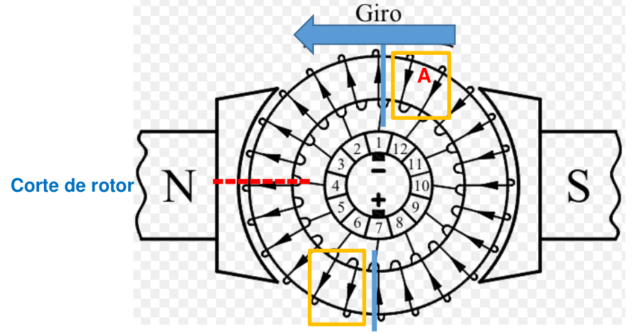
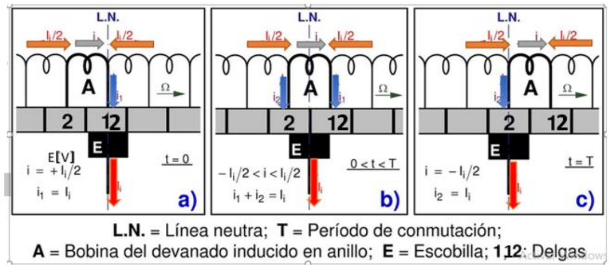
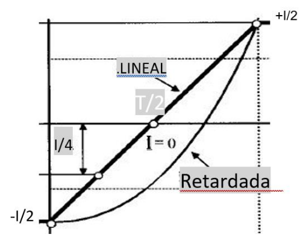
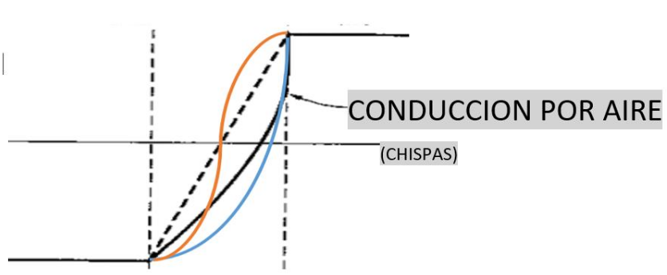
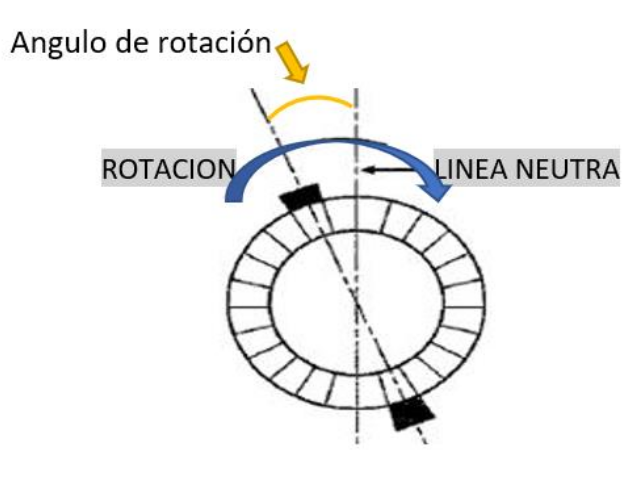
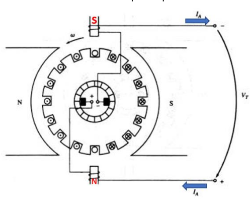

# La Conmutación en Máquinas de CC

## 1. ¿Qué es la Conmutación? 
**Definición:** Es el conjunto de fenómenos que ocurren cuando una bobina del inducido pasa de una rama del circuito a otra.
Durante este brevísimo tiempo, la corriente en esa bobina debe **invertir totalmente su sentido** (pasar de $+I$ a $-I$).

* **El Desafío:** Si la máquina gira a 3000 RPM, este cambio de dirección debe ocurrir en milisegundos.
* **El Mecanismo:** Ocurre cuando las delgas (contactos de cobre del colector) pasan por debajo de la escobilla (carbón). La escobilla "cortocircuita" momentáneamente la bobina para permitir el cambio.

---

## 2. El Proceso Paso a Paso (Página 7)

Para entenderlo, analizamos una "Bobina A" en el rotor (usando el modelo de anillo de Gramme para simplificar).

Definimos $T$ como el **Periodo de Conmutación** (tiempo que tarda una delga en pasar por la escobilla).

* **Instante $t = 0$ (Inicio):**
    * La corriente llega por la izquierda ($I/2$) y por la derecha ($I/2$).
    * La escobilla está solo sobre la Delga 1.
    * La Bobina A conduce la corriente completa en sentido positivo.

* **Instante $0 < t < T$ (Cortocircuito):**
    * La escobilla pisa la Delga 1 y la Delga 2 al mismo tiempo.
    * **¡La Bobina A está en cortocircuito!**
    * La corriente externa ($I$) entra directamente a las ramas sin pasar por A.
    * La corriente *dentro* de la bobina A debe empezar a caer y cambiar de signo.

* **Instante $t = T$ (Final):**
    * La escobilla está solo sobre la Delga 2.
    * La Bobina A ahora pertenece a la rama izquierda.
    * Su corriente debe ser totalmente inversa ($-I$).

---

## 3. Conmutación Ideal vs. Real (Páginas 8 y 9)

### A. El Caso Ideal: Conmutación Lineal
Si todo fuera perfecto, la corriente cambiaría en línea recta de $+I/2$ a $-I/2$ a medida que la escobilla avanza.

**¿Por qué es ideal?** (Análisis de Densidad de Corriente)
* A medida que la escobilla abandona la Delga 1, el área de contacto disminuye.
* Si la corriente disminuye proporcionalmente al área, la **Densidad de Corriente ($J = I/Area$) se mantiene constante**.
* **Resultado:** No hay calentamiento excesivo en el borde de salida.

### B. El Problema Real: Conmutación Retardada
En la vida real, tenemos dos efectos que nos provocan al retraso: 

1. **Autoinducción:** la corriente **no quiere cambiar** debido a la **autoinducción** (linea negra).

La bobina es un inductor ($L$). Según la Ley de Lenz, cualquier cambio de corriente genera una tensión opuesta que intenta mantener la corriente como estaba.

$$V_L = -L \cdot \frac{di}{dt}$$

Esto hace que la curva de corriente se "retrase" (ver gráfico de líneas curvas).
* En el tiempo $t = T/2$ (mitad del camino), la corriente no ha llegado a cero, sigue siendo positiva.
* Al llegar al final ($t = T$), la corriente aún no se ha invertido completamente.

2. **Efecto de la fem de movimiento:** (linea naranja) [ ya que tenemos un campo magnético generado por la reacción del inducido, lo que genera un campo entrante sobre la bobina A, generando una tensión que impulsa una corriente del mismo sentido positivo, lo cual hace que se sume al efecto inductivo y en conjunto nos llevan a una característica aún más atrasada]

### C. La Consecuencia Fatal: El Chisporroteo 

Si la conmutación está retardada:
1.  Queda muy poca superficie de contacto en la Delga 1 (la escobilla ya se va).
2.  Pero todavía hay mucha corriente tratando de pasar por ahí en un lapso de tiempo muy corto.
3.  **Resultado:** Al sapararse la delga de la escobilla, el aire se ioniza y salta un **ARCO ELÉCTRICO (Chispa)** entre la delga y la escobilla para completar el cambio de corriente a la fuerza.

**Daños:**
* Pérdida de energía.
* Destrucción de las delgas y escobillas (picaduras).
* Calentamiento excesivo que daña los aislantes.

---

## 4. Soluciones: Métodos de Mejora de la Conmutación

¿Cómo arreglamos este retraso causado por la autoinducción ($L$) y la fem de Armadura? Necesitamos "ayudar" a la corriente a darse la vuelta para que se invierta su sentido. Tenemos dos soluciones:

En ambos métodos el objetivo es el mismo: **Generar una FEM auxiliar** en la bobina que está conmutando para anular la tensión de autoinducción ($L \cdot di/dt$) y la reacción del inducido. 

### Solución A: Corrimiento de Escobillas 
Este método es mecánico. Consiste en mover físicamente el punto donde las escobillas tocan el colector.

### El Principio Físico
Originalmente, las escobillas están en la "Línea Neutra Geométrica" (donde no hay campo magnético).
* Si movemos las escobillas un poco, metemos la bobina bajo el borde del campo magnético del polo principal.
* Este campo induce una pequeña tensión (FEM) en la bobina.
* Si elegimos la dirección correcta, esa FEM empuja la corriente en el sentido que queremos, cancelando el retraso (efecto $L/R$).

  

 

### La Regla de Dirección (Importante)
El texto aclara la diferencia entre generador y motor:
* **Generador:** Las escobillas se mueven en el **mismo sentido** de giro.
* **Motor:** Las escobillas se mueven en **sentido opuesto** al giro (hacia atrás).
    * *Por qué:* Buscamos el campo del polo que "dejamos atrás" para que nos ayude a frenar y revertir la corriente.

### El problema de mover escobillas:
1.  La perturbación (Reacción de Inducido) depende de cuánta corriente ($I$) consume el motor.
2.  Si el motor trabaja con poca carga, necesitas un ángulo pequeño. Si trabaja a plena carga, necesitas un ángulo grande.
3.   Tendrías que estar moviendo la palanca de las escobillas cada vez que cambia la carga. Esto es inviable en la industria moderna.

---

### Solución B: Polos de Conmutación o Interpolos 
Este es el método de ingeniería estándar. En lugar de mover las escobillas, instalamos "mini polos" estrechos en la zona neutra.

### Principio de funcionamiento
* Se colocan físicamente en el estator, justo en el medio entre los polos principales Norte y Sur.
* Son mucho más delgados que los polos principales.
 

 

Generan un campo magnético local ("Campo de conmutación") que induce la tensión necesaria para anular la autoinducción y la reacción de inducido en la bobina que pasa por ahí.

Es mejor que mover escobillas porque es **Conexión en Serie**.
* Los bobinados de estos polos se conectan en **SERIE con el inducido (rotor)**.
* **Lógica de control:**
    * Si la carga aumenta $\rightarrow$ La corriente del rotor sube.
    * Al subir la corriente, el problema de conmutación crece.
    * PERO, como esa misma corriente pasa por el polo de conmutación, su campo magnético corrector también crece proporcionalmente.
* **Resultado:** La corrección se ajusta sola automáticamente. No importa si el motor va en vacío o a plena carga, el campo corrector siempre es el exacto necesario.

### Polaridad:
 La polaridad del polo de conmutación debe ser **igual a la del polo principal ANTERIOR** (en sentido contrario al giro).
    * *Ejemplo:* Si el motor gira horario y pasas un polo Norte principal, el siguiente interpolo debe ser Norte.

### Desventaja Menor: Aumento del flujo disperso
  Al agregar polos de conmutación en el espacio de aire entre polos principales, es más fácil que algunas líneas de campo se "escapen" por ahí en lugar de cruzar al rotor.

---

### Resumen Comparativo para tu Hoja

| Característica | Corrimiento de Escobillas | Polos de Conmutación (Interpolos) |
| :--- | :--- | :--- |
| **Método** | Mecánico (mover carbones) | Eléctrico (bobinas auxiliares) |
| **Ajuste** | Manual (fijo para una corriente) | **Automático** (proporcional a la corriente) |
| **Conexión** | N/A | **En Serie** con el inducido |
| **Eficacia** | Mala en cargas variables | Excelente en toda condición |
| **Uso actual** | Obsoleto / Juguetes pequeños | Estándar en motores industriales |
