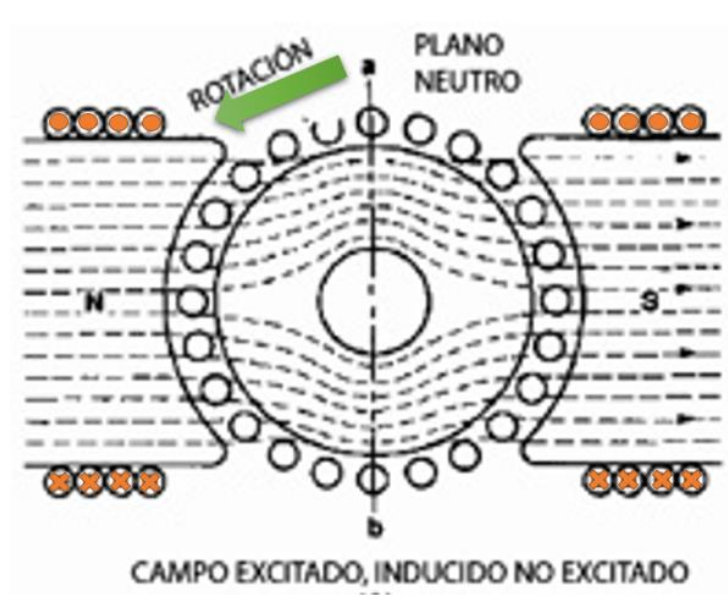
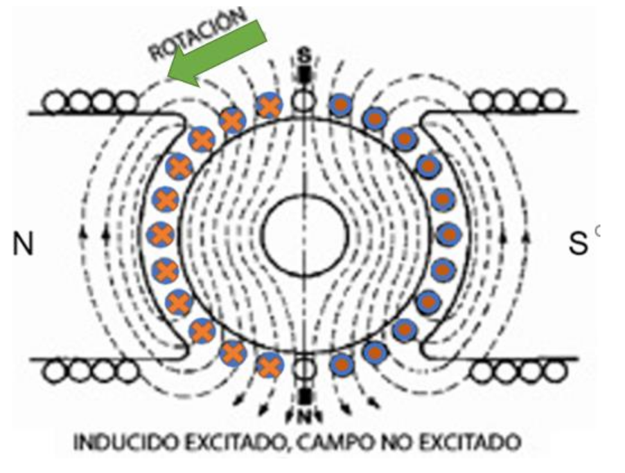
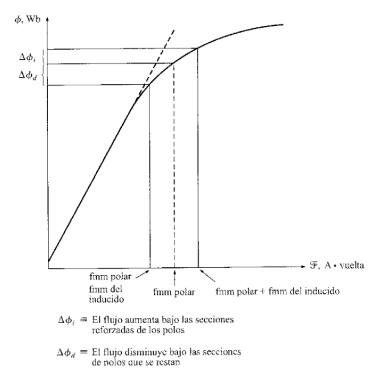
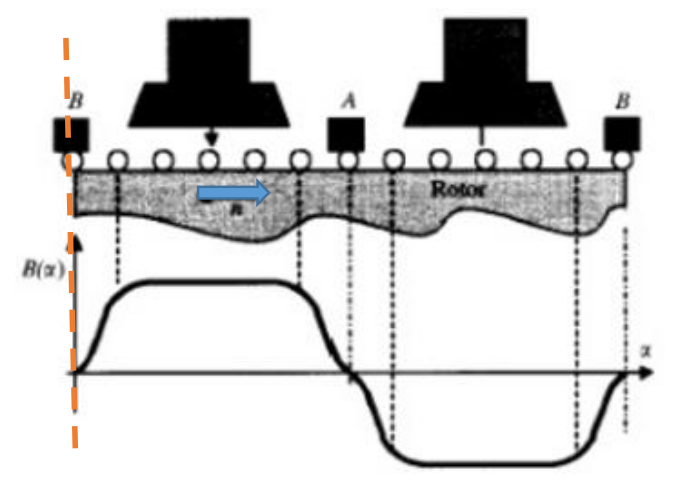
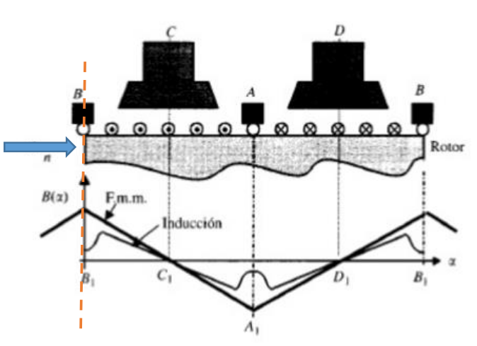
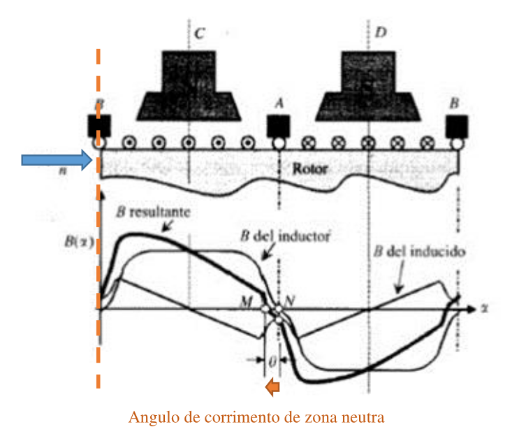
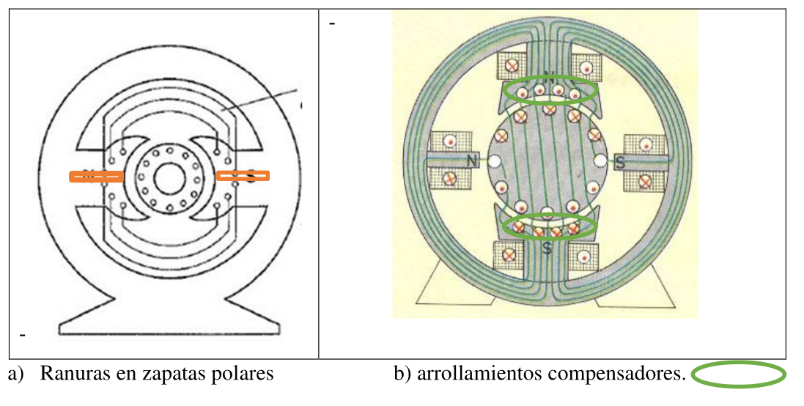

# Reacción del Inducido 

## 1. Definición del Fenómeno 
Es el efecto perturbador que provoca el campo magnético generado por el propio rotor (inducido) sobre el campo magnético principal (estator).

En una máquina ideal, solo querríamos el campo del estator. En la realidad, en cuanto circula corriente por el rotor para trabajar, este se convierte en un electroimán y "molesta" al campo principal.

---

## 2. Análisis de los Campos por Separado (Principio de Superposición)
Para entender el caos final, primero miramos los "actores" por separado:

### A. Campo del Inductor (Estator) - Solo
* **Estado:** Máquina en vacío (sin carga).
* **Forma:** Líneas de campo uniformes y paralelas que van de Norte a Sur.
* **Zona Neutra:** Coincide exactamente con la mitad geométrica entre los polos.

### B. Campo del Inducido (Rotor) - Solo
* **Estado:** Imaginamos que el estator está apagado pero inyectamos corriente al rotor.
* **Forma:** Es un campo **Transversal**.
    * Si aplicas la regla de la mano derecha a los conductores del dibujo (círculos con puntos y cruces), verás que se forman bucles de campo perpendiculares al eje polar principal.
* **Efecto:** Este campo tiene su máxima intensidad justo en la zona donde el campo principal debería ser cero (la zona neutra).

 
---

## 3. Superposición de los Campos: distorsión del campo 

Cuando la máquina trabaja, ambos campos existen simultáneamente. Se suman vectorialmente.

**¿Qué ocurre en los extremos de los polos?**
Observa las elipses:

1.  **Puntas de Polo "Salientes" (Naranjas):**
    * Aquí, el sentido del campo del estator y el del rotor **coinciden**.
    * **Resultado:** Se suman. El campo se refuerza y concentra.
2.  **Puntas de Polo "Entrantes" (Celestes):**
    * Aquí, los sentidos son **opuestos**.
    * **Resultado:** Se restan. El campo se debilita.

**Consecuencia Inmediata:**
El campo magnético ya no es uniforme. Se ha "retorcido" o distorsionado en la dirección del giro (en el caso de generadores).

---

## 4. El Desplazamiento de la Línea Neutra
Debido a esta distorsión, el punto donde el campo es verdaderamente cero ya no está en el centro geométrico.

* **Zona Neutra Geométrica (ZNG):** El centro físico exacto entre polos.
* **Zona Neutra Magnética (ZNM):** El nuevo punto donde el campo es nulo.

> **Importante para examen:** La ZNM se desplaza en el sentido de giro (para generadores) o en sentido contrario (para motores). Las escobillas siempre deben colocarse en la **ZNM** para evitar chispas, lo que obliga a moverlas si cambia la carga.

---

## 5. El Problema de la Saturación (Página 14)

Podrías pensar: *"Bueno, si en un lado sumo 10 y en el otro resto 10, el flujo total es el mismo, ¿no?"*.
**La respuesta es NO.** Y la culpa es del material ferromagnético.

El hierro se satura. Analicemos la gráfica:

1.  **Lado Reforzado (Derecha - Naranja):**
    * Intentamos aumentar el flujo ($\Delta \Phi_1$).
    * Como el hierro ya está trabajando cerca del "codo" de saturación, aunque aumentemos mucho la fuerza magnetomotriz, el flujo sube muy poco. El hierro "ya no puede más".
2.  **Lado Debilitado (Izquierda - Celeste):**
    * Intentamos disminuir el flujo ($\Delta \Phi_2$).
    * Aquí trabajamos en la zona lineal. La reducción es directa y proporcional. El flujo cae drásticamente.

**Conclusión :**
$$|\text{Pérdida de flujo en lado débil}| > |\text{Ganancia de flujo en lado fuerte}|$$

**Resultado Final:**
La reacción del inducido produce que el flujo total por polo disminuya al aumentar la carga (corriente).
* Menos flujo total $\implies$ Menor voltaje generado (en dinamos) o Mayor velocidad (en motores, recuerda que $n \propto 1/\Phi$).
 
 

El dibujo de onda cuadrada (ideal) se convierte en una onda distorsionada "con cuernos" (real):
* Un pico alto (zona saturada).
* Un valle profundo (zona debilitada).
* El área total bajo la curva (flujo total) es menor que la original.
 
---

Vimos que los campos se deformaban. Aquí vemos matemáticamente *por qué* y *dónde*.

#### A. La Relación FMM vs. Flujo 

El gráfico muestra una línea triangular (Fmm) y una línea curva suave (Inducción o Flujo).
* **FMM (Fuerza Magnetomotriz):** Es la "fuerza" magnética que empuja el flujo. Es proporcional a la corriente ($N \cdot I$). Como el bobinado está distribuido uniformemente, la FMM crece linealmente hasta el centro del polo.
* **El efecto del Entrehierro (La "Resistencia" Magnética):**
    * Debajo de la zapata polar (el hierro), el entrehierro es pequeño (aire mínimo). Aquí el Flujo sigue fielmente a la FMM.
    * **En la zona interpolar (entre polos):** El entrehierro es enorme. Aunque haya FMM, la **Reluctancia** (resistencia magnética del aire) es altísima.
    * **Dato clave del apunte:** "Se requiere la misma FMM para atravesar **1 mm de aire** que **10 metros (10,000 mm) de hierro**".
    * **Conclusión:** Por eso la curva de inducción (línea fina) se desploma en el medio, creando esa forma de "silla de montar".

#### B. La Gráfica Resultante 

Aquí sumamos todo:
1.  **Línea Fina:** Campo del Inductor (Estator) solo.
2.  **Línea Punteada:** Campo del Inducido (Rotor) solo.
3.  **Línea Gruesa:** Campo Resultante.

**Observación Crítica:** Fíjate dónde la línea gruesa cruza el eje horizontal (cero).
* Ya no es en el centro geométrico (línea punteada vertical naranja).
* Se ha movido a la derecha un ángulo $\theta$.
* **Esto confirma gráficamente el Desplazamiento de la Línea Neutra.**

---

### 2. Consecuencias Finales 

1.  **Reducción del Flujo Total:** Debido a la saturación del hierro (explicada en la Parte 1), la máquina pierde "potencia magnética" neta.
    * *Efecto:* Afecta la velocidad ($n$) y el par motor ($Cupla$).
2.  **Chisporroteo:** Al moverse la zona neutra un ángulo $\theta$, si las escobillas se quedan quietas, conmutarán bajo tensión, generando arcos eléctricos.

---

### 3. Soluciones Constructivas (Las Correcciones)
¿Cómo evitamos esto en motores grandes o de alto rendimiento? Hay dos métodos principales:

#### Método A: Ranurado de la Zapata Polar (Solución Pasiva)
* **¿Qué es?:** Se hacen cortes longitudinales (ranuras) en el hierro de los polos principales (ver figura *a*).
* **Principio Físico:** El flujo del estator va "de arriba a abajo", así que las ranuras no le molestan (viaja paralelo a ellas). Pero el flujo de reacción de inducido intenta ir "de izquierda a derecha" (transversal).
* **Efecto:** Las ranuras actúan como barreras de aire (alta reluctancia) para el flujo transversal del inducido. Es como ponerle obstáculos al campo "malo" sin molestar al "bueno".

#### Método B: Arrollamientos Compensadores (Solución Activa / "La Mejor")
Es la solución de gama alta para máquinas industriales potentes.

* **¿Qué es?:** Se incrustan cables de cobre directamente en la cara de los polos principales (ver figura *b*, círculos verdes).
* **Conexión:** Se conectan **en serie** con el rotor (inducido).
* **Sentido:** La corriente circula en **sentido contrario** a la del rotor que tienen justo enfrente.

**El Proceso de Cancelación:**
1.  El rotor crea un campo transversal hacia la izquierda.
2.  El arrollamiento compensador crea un campo transversal hacia la derecha.
3.  Como están en serie, si la corriente del rotor sube, la del compensador también sube.
4.  **Resultado:** Los campos se anulan mutuamente casi a la perfección ($Campor_{rotor} - Campo_{comp} \approx 0$).

**La única desventaja:**
Al agregar más bobinas en serie, agregas resistencia eléctrica ($R_{com}$). Esto aumenta las pérdidas por calor ($I^2 \cdot R$), bajando ligeramente el rendimiento energético, pero salvando la máquina magnéticamente.

---
 