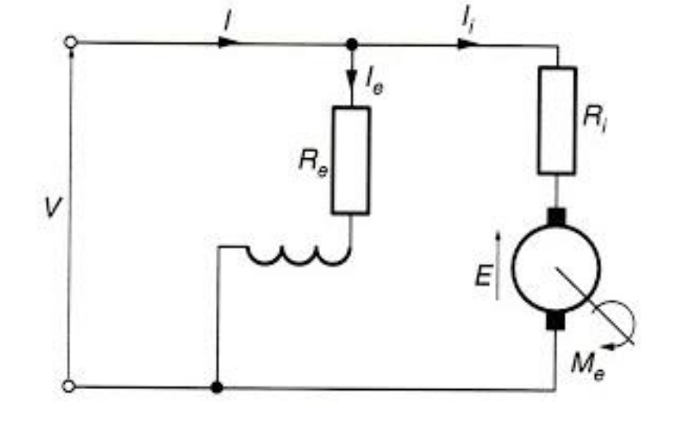
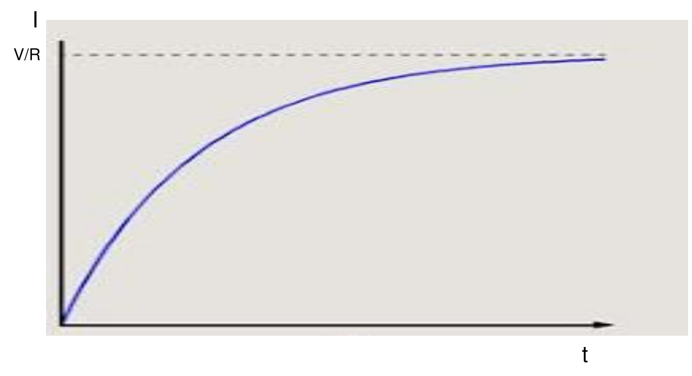
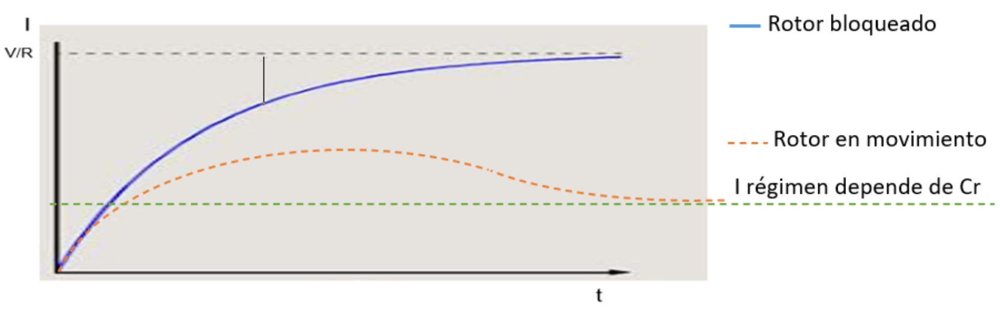

 
# Guía de Estudio: Análisis Transitorio y Arranque del Motor Shunt

**Las Ecuaciones Maestras (Repaso):**
1. Fuerza Contra-Electromotriz: $E_{CEM} = K_1 \cdot \Phi \cdot n$
2. Cupla Motor: $C_m = K_2 \cdot \Phi \cdot I$
3. Voltaje: $V = E_{CEM} + I_i \cdot R_i + 2U_e$
4.  **Velocidad:** $n = \frac{V - I_i \cdot R_i - 2U_e}{K_1 \cdot \Phi}$ 

## 1. El Modelo: Motor con Excitación en Derivación (Shunt) 

Primero, definimos la máquina que estamos analizando.
* **Conexión:** La tension se aplica en forma conjunta a los dos circuitos: el de excitacion y el del rotor.

 

##   El Transitorio R-L 

Antes de que el motor empiece a girar, se comporta simplemente como un circuito pasivo con una Resistencia ($R$) y una Inductancia ($L$).

Al conectar el interruptor, la corriente no sube instantáneamente a su máximo debido a la autoinducción de las bobinas (la $L$ se opone al cambio).

**La Ecuación del Transitorio:**
$$I(t) = \frac{V}{R} \cdot \left( 1 - e^{-t/\tau} \right)$$

La constante de tiempo eléctrica de un circuito RL es:
$$\tau = \frac{L}{R} \quad \text{(Segundos)}$$
 

---

## 3. Dinámica del Arranque: Rotor Bloqueado vs. Movimiento 
En nuestro caso en ambos circuitos tenemos por su propia naturaleza la componente inductiva
(L), será preponderante y por lo tanto la constante de tiempo será grande y la pendiente en el
origen no será demasiado empinada.

### Circuito de excitacion:

 Para el circuito de excitacion tendremos una corriente que será:

$$I_e(t) = \frac{V}{R_e} \cdot \left( 1 - e^{-t/(L_e/R_e)} \right)$$

----
### Circuito del rotor (INDUCIDO):
En el circuito del rotor (INDUCIDO), inicialmente suponemos que el rotor está frenado y en este caso tendremos una curva similar:

### A. La Curva Azul (Rotor Bloqueado / Frenado)
Si trabas el eje y le das tensión:
1.  La corriente sube exponencialmente (curva de carga $RL$).
2.  Llega a su valor máximo limitado solo por la resistencia óhmica: $I_{max} = V / R_i$.
3.  **Peligro:** Como $R_i$ es muy pequeña, esta corriente es **gigantesca**. Quemaría el motor en segundos.

### B. La Curva Naranja (Rotor en Movimiento - La Realidad)
Si el eje está libre, pasa esto:
1.  **Inicio ($t=0$):** La corriente intenta subir siguiendo la curva azul. Sube muy rápido.
2.  **Movimiento:** La cupla de arranque hace girar el rotor.
3.  **Aparición de la FCEM:** Al ganar velocidad ($n$), aparece la Fuerza Contra-Electromotriz ($E_{CEM}$).
4.  **Caída de Corriente:** Recuerda que $I = (V - E_{CEM}) / R$. A medida que $E_{CEM}$ crece, la corriente se ve obligada a bajar.
5.  **Régimen (Línea Verde):** La corriente baja hasta quedarse en el valor justo necesario para vencer la carga ($I_{regimen}$).
 
### Pico de arranque 
Una caracteristica importante es el pico de corriente que se puede producir en el arranque y que puede llegar a superar los valores admisibles para el motor. 

* **Motores Pequeños (< 2 HP):** Tienen suficiente resistencia interna y poca inercia. Soportan el chispazo. Arrancan directo.
* **Motores Grandes:** Ese pico inicial puede ser 10 o 20 veces la corriente nominal.
    * Destruye las delgas del colector.
    * Dispara las protecciones (fusibles/térmicas).
    * Produce un golpe mecánico (torsión) que puede romper el eje.

### Solución: Reóstato de Arranque 

Para evitar ese pico destructivo, insertamos una resistencia extra ($R_A$) en serie con el inducido **solo durante el arranque**.

### Análisis del Gráfico "Dientes de Sierra" (Paso a Paso)

Este gráfico naranja es pregunta fija de examen. Explica la secuencia de arranque controlado:

1.  **Instante $t=0$ (Inicio):**
    * Conectamos toda la resistencia ($R_i + R_{a1}$).
    * La corriente sube, pero choca contra un techo bajo. No dejamos que supere la línea verde punteada ($I_{admisible}$).
    * El motor empieza a girar lento.

2.  **Intervalo $0 \to t_1$ (Aceleración 1):**
    * El motor gana velocidad. La FCEM aumenta. La corriente cae naturalmente (la curva baja).

3.  **Instante $t_1$ (Conmutación):**
    * La corriente ha bajado mucho, el motor tiene poca fuerza para seguir acelerando.
    * **Acción:** Quitamos parte de la resistencia (pasamos a $R_{a2}$).
    * **Efecto:** La corriente pega un salto repentino hacia arriba (pico vertical), recuperando fuerza, pero sin superar el límite admisible.

4.  **Instante $t_2$ (Régimen):**
    * El motor ya tiene velocidad alta. La FCEM es grande.
    * **Acción:** Quitamos toda la resistencia externa ($R_a = 0$). Dejamos solo la propia del motor ($R_i$).
    * El motor queda conectado directo a la red, trabajando en su punto de equilibrio natural.

### Resumen del proceso
Utilizamos resistencias escalonadas para mantener la corriente "encajonada" entre un valor máximo (para no quemar nada) y un valor mínimo (para no perder fuerza de aceleración).

--

Esta es la **Parte 2: Régimen Permanente y Control**.
Aquí dejamos de lado el arranque (transitorio) y analizamos cómo se comporta el motor cuando ya está trabajando y cómo podemos nosotros, como ingenieros, manipular su velocidad.

He organizado el contenido en tres bloques lógicos: **Comportamiento Natural**, **Control por Campo** y **Control por Inducido**.

---
 

## 1. Característica Externa
Aquí analizamos cómo reacciona el motor ante la carga si no tocamos nada.

### A. Ecuación de la Cupla (Torque)
$$C_m = K_2 \cdot \Phi \cdot I$$
* **Análisis:** En un motor Shunt (derivación), la tensión de alimentación es constante, por lo que el Flujo ($\Phi$) es constante.
* **Resultado Gráfico:** La relación Cupla-Corriente es una **línea recta**.
    * **Recta Naranja ($C_m$):** Es la cupla electromagnética total generada internamente.
    * **Recta Azul ($C_{ext}$):** Es la cupla útil en el eje. Es menor que la naranja porque hay que restar las pérdidas por rozamiento y ventilación ($C_{perd}$).
    * **Conclusión:** Si necesitas el doble de fuerza, el motor pedirá el doble de corriente. Linealidad pura.

### B. Ecuación de la Velocidad
$$n = \frac{V - 2Ue -I_i \cdot R_i}{K_1 \cdot \Phi}$$
* **Análisis:** Al aumentar la carga, aumenta la corriente $I_i$. Esto hace crecer la caída de tensión interna ($I_i \cdot R_i$). Como este término resta en el numerador, la velocidad baja.
* **La Clave de Ingeniería:** El término $I_i \cdot R_i$ es muy pequeño (solo representa el 2% al 5% del voltaje total).
* **Resultado Gráfico:** La curva de velocidad cae muy poquito al aumentar la carga. Es casi horizontal.
* **Definición:** Por esto, al Motor Shunt se le considera un **Motor de Velocidad Constante**. Es ideal para tornos, fresadoras o cintas transportadoras que no deben frenarse al recibir peso.

---

## 2. Control de Velocidad: Método 1 (Debilitamiento de Campo) 

**Objetivo:** Queremos que el motor gire **más rápido** que su velocidad nominal.

### El Proceso Físico
1.  **Acción:** Colocamos un reóstato ($R_{exc}$ o $R_c$) en serie con el bobinado de campo (el inductor).
2.  **Efecto Eléctrico:** Al aumentar esta resistencia, disminuye la corriente de excitación ($I_{exc}$).
3.  **Efecto Magnético:** Menos corriente genera menos Flujo magnético ($\Phi \downarrow$).
4.  **Resultado Mecánico:** Mirando la fórmula de velocidad ($n \propto 1/\Phi$): **Si el flujo baja, la velocidad SUBE.**

### Características del Método
* **Gráfico:** Las rectas de velocidad se desplazan hacia arriba de forma paralela.
* **Ventaja:** Es muy eficiente (pocas pérdidas de calor porque la corriente de campo es pequeña).
* **Limitación:** Solo sirve para subir la velocidad. Cuidado: Si cortas el campo totalmente ($\Phi \approx 0$), la velocidad tiende a infinito y el motor se embala (se destruye).

---

## 3. Control de Velocidad: Método 2 (Resistencia de Armadura) 

**Objetivo:** Queremos que el motor gire **más lento** que su velocidad nominal.

### El Proceso Físico
1.  **Acción:** Colocamos un reóstato grande ($R_A$) en serie con el rotor (inducido).
2.  **Efecto Eléctrico:** Ahora la tensión que llega realmente al motor no es $V$, sino $V - I \cdot (R_i + R_A)$.
3.  **Resultado Mecánico:** Le estamos "robando" tensión al rotor. A menos tensión efectiva, **la velocidad BAJA.**

### Características del Método
* **Gráfico:** Las rectas ya no son paralelas. Se "caen" o inclinan hacia abajo drásticamente.
    * A mayor corriente (carga), más cae la velocidad.
* **El Factor de Regulación ($R_v$):**
    $$R_v = \frac{n_{vacio} - n_{trabajo}}{n_{trabajo}} \cdot 100$$
    Este método tiene **mala regulación**. Significa que la velocidad se vuelve inestable ante cambios de carga (si quitas carga, el motor se acelera mucho; si pones carga, se frena mucho).
* **La Gran Desventaja (Importante):** Es un método ineficiente.
    * La resistencia externa disipa muchísima energía en forma de calor ($P = I^2 \cdot R_A$).
    * Estás tirando energía para frenar el motor.

---

### Resumen Comparativo 

| Característica | Regulación por Campo (Pág. 21) | Regulación por Inducido (Pág. 22) |
| :--- | :--- | :--- |
| **Variable tocada** | Flujo $\Phi$ (bajándolo) | Tensión de inducido (bajándola) |
| **Elemento** | Resistencia en Excitación | Resistencia en Rotor |
| **Efecto en Velocidad** | **Aumenta** ($n > n_{nom}$) | **Disminuye** ($n < n_{nom}$) |
| **Estabilidad** | Buena (Rectas paralelas) | Mala (Rectas inclinadas) |
| **Eficiencia** | Alta (Pérdidas bajas) | Muy Baja (Mucha pérdida de calor) |

 
-----

 

# Motores Serie y Compuesto

## 1. El Motor Serie (Página 23)
**Concepto Circuital:**
A diferencia del Shunt, aquí **toda** la corriente que entra al motor pasa tanto por el inductor (campo) como por el inducido (rotor).
$$I_{total} = I_{inductor} = I_{inducido} = I$$

### A. El Comportamiento del Flujo
Esta es la diferencia clave.
* En el Shunt, el flujo $\Phi$ era constante (dependía de $V$).
* En el Serie, el flujo $\Phi$ lo crea la propia corriente de carga $I$.
* **Ecuación:** $\Phi = K_3 \cdot I$ (dentro de la zona lineal, sin saturación).

### B. La Cupla Motora (Torque) - La Parábola
Sustituyendo el flujo en la ecuación general:
$$C_m = K_2 \cdot \Phi \cdot I \quad \to \quad C_m = K_2 \cdot (K_3 \cdot I) \cdot I$$
$$C_m = K_4 \cdot I^2$$

* **Interpretación Física:** La Cupla crece con el **cuadrado** de la corriente.
* **Ventaja Ingenieril:** Tiene un **Par de Arranque Brutal**. Si duplicas la corriente, cuadriplicas la fuerza. Por eso se usa en trenes, tranvías, grúas y motores de arranque de autos.
* **Gráfico (Izquierda pág 23):** Es una parábola perfecta (Curva Azul en pág 25).

### C. La Velocidad - La Hipérbola
Sustituyendo el flujo en la ecuación de velocidad:
$$n = \frac{V - (Caidas)}{K \cdot \Phi} \approx \frac{V}{K \cdot I}$$
*(Despreciando $R_i$ y escobillas para simplificar)*.

* **Interpretación Física:** La velocidad es **inversamente proporcional** a la corriente (y por tanto, a la carga).
* **Gráfico (Derecha pág 23):** Es una hipérbola equilátera.
    * Mucha carga (Mucha $I$) $\to$ Velocidad baja (mucha fuerza).
    * Poca carga (Poca $I$) $\to$ Velocidad altísima.

---

## 2. El Peligro del "Embalamiento" (Página 24 arriba)
Este es el concepto de seguridad más importante de los motores de CC.

**¿Qué pasa si el Motor Serie trabaja en vacío (sin carga)?**
1.  La carga mecánica es cero $\to$ La corriente $I$ tiende a cero.
2.  Como $\Phi$ depende de $I$, el flujo $\Phi$ tiende a cero.
3.  Mirando la fórmula: $n = V / (K \cdot 0) \to \infty$.

> **¡PELIGRO!** El motor se acelera indefinidamente hasta que la fuerza centrífuga destruye el rotor (los bobinados salen volando). Esto se llama **embalamiento**.
> **Regla de Oro:** **NUNCA** se debe arrancar ni operar un motor serie en vacío o acoplado con correas (si la correa se corta, el motor explota). Siempre debe tener carga fija (engranajes).

---

## 3. El Motor Compuesto (Compound) (Página 24 abajo)
Es la solución de ingeniería para tener lo mejor de los dos mundos.

**Construcción:**
Tiene **dos** bobinados en el estator:
1.  Uno en **Serie** (pocas vueltas, cable grueso).
2.  Uno en **Derivación/Paralelo** (muchas vueltas, cable fino).

**Funcionamiento:**
$$Flujo_{Total} = Flujo_{Shunt} \pm Flujo_{Serie}$$

* **Característica (Ver Gráficos Pág 25):**
    * **Curva Verde (Compuesto):** Observa que está entre la Azul (Serie) y la Naranja (Shunt).
    * **En Vacío:** No se embala, porque el bobinado Shunt mantiene un flujo mínimo constante, limitando la velocidad máxima (seguridad).
    * **En Carga:** El bobinado Serie aporta fuerza extra, dando más torque que un Shunt normal, pero sin ser tan agresivo como el Serie puro.

---

## 4. Comparativa de Curvas (Página 25 Superior)
Este gráfico resume todo el capítulo de motores:

| Tipo de Motor | Color Curva | Comportamiento Velocidad ($n$) | Comportamiento Cupla ($Cm$) | Uso Típico |
| :--- | :--- | :--- | :--- | :--- |
| **Derivación (Shunt)** | Naranja | Constante (Cae muy poco) | Lineal ($I$) | Tornos, Máquinas Herramienta |
| **Serie** | Azul | Muy variable (Peligro en vacío) | Parabólica ($I^2$) - Muy fuerte | Tracción (Trenes), Grúas |
| **Compuesto** | Verde | Intermedia (Cae moderadamente) | Intermedia | Prensas, Cizallas (Cargas pulsantes) |

---

## 5. Deducción General de la Fórmula (Página 25 Abajo)
Aquí el apunte vuelve a la base física para cerrar el tema, demostrando de dónde sale $C_m = K \cdot \Phi \cdot I$.

Usa la ley de Lorentz: $F = L \cdot I \cdot B$.

1.  **Fuerza:** $F = L \cdot I_i \cdot B \cdot 10^{-8}$
    * *Nota:* El factor $10^{-8}$ aparece por trabajar en unidades CGS y convertir a un sistema práctico (relacionado con Maxwells y Webers), típico en textos clásicos. En el SI moderno no se suele poner.
2.  **Cupla de un conductor ($C_{mi}$):** F $\cdot$ r (Fuerza por radio).
3.  **Cupla Total ($C_m$):** Multiplicar por $Z$ (número de conductores total).
4.  **Sustitución de B:** Recuerda que $B$ (densidad) es proporcional al Flujo Total ($\Phi$) dividido por el área.

$$ C_m =  Z \cdot C_{mi} = Z \cdot (L \cdot I_i \cdot B \cdot 10^{-8} \cdot r)$$

Si d es la cantidad de circuitos en derivacion:

$$I_i = I / d$$

Entonces:

$$ C_m =  \frac{Z}{d} \cdot (L \cdot I \cdot B \cdot 10^{-8} \cdot r)$$
 
 ---

Habitualmente no tenemos como dato la densidad magnética ($B$), por lo tanto expresaremos la cupla en función del Flujo Total ($\Phi$).

1.  **Área Total:** La superficie lateral del rotor es un cilindro: $Area = 2\pi \cdot r \cdot l$.
2.  **Área por Polo:** Si dividimos esa área por el número de polos ($P$), tenemos la superficie activa por polo.
3.  **Relación $\Phi$ vs $B$:**
    $$\Phi = B \cdot S = B \cdot \frac{2\pi \cdot r \cdot l}{P}$$
    *(Nota: El apunte asume distribución uniforme para simplificar).*

$$C_m =  \frac{Z}{d} \cdot \frac{(L \cdot I \cdot \Phi \cdot P \cdot 10^{-8} \cdot r)}{2\cdot \pi \cdot r \cdot L}$$

**Resultado Final:**
Al agrupar todas las constantes constructivas ($Z$, $P$, $d$, etc.) en una sola constante $K_2$, volvemos a la fórmula que hemos usado todo el tiempo:  

$$C_m = \frac{Z}{d} \cdot \frac{I \cdot \Phi \cdot P \cdot 10^{-8}}{2\cdot \pi} = K_2  \cdot I \cdot \Phi$$
### La Potencia Mecánica ($P_m$)

*Objetivo:* Demostrar que la potencia eléctrica interna ($E \cdot I$) es exactamente igual a la potencia mecánica desarrollada. Es el principio de conservación de energía.

Sabemos por física mecánica que:
$$Potencia = Torque \times Velocidad\_Angular$$
$$P_m = C_m \cdot \omega$$

Donde $\omega$ (omega) es la velocidad en radianes/segundo: $\omega = \frac{n \cdot 2\pi}{60}$.

Si sustituimos la fórmula de la Cupla ($C_m$) y la de la velocidad ($n$) en la ecuación de potencia, llegamos a una identidad preciosa:

$$P_m = E \cdot I$$

> **Interpretación de Ingeniería:** Esta ecuación nos dice que la **Fuerza Contra-Electromotriz ($E$)** multiplicada por la **Corriente ($I$)** representa la potencia eléctrica que se ha transformado exitosamente en potencia mecánica bruta dentro del motor.

---

## 2. El Balance Energético (Diagrama de Flujo - Pág. 27 Arriba)
Aquí vemos "dónde se pierde el dinero". Es el **Diagrama de Sankey** del motor.

1.  **Potencia de Entrada ($P_{ent} = V \cdot I$):** Es la energía eléctrica total que absorbe el motor de la red.
2.  **Pérdidas Eléctricas (Joule):**
    * Al pasar corriente por los cobres (Inducido + Excitación) y escobillas, se genera calor.
    $$P_{jou} = I^2 \cdot R + 2Ue \cdot I$$
3.  **Pérdidas en el Hierro:** 
    Calor generado en el núcleo por histéresis y corrientes parásitas (Foucault).
    $$ P_{Fe} = P_{Hist} + P_{Fouc} $$

4.  **Potencia Convertida ($P = E \cdot I$):**
    * Es lo que queda después de restar las pérdidas del cobre. Es la "Potencia Electromagnética" generada en el entrehierro.
    5.  **Pérdidas Rotacionales:**
        * **Rozamiento y Ventilación:** Energía perdida en los cojinetes (rulemanes) y en mover el ventilador del motor.
    6.  **Potencia de Salida ($P_{sal} = Cm \cdot \omega$):** Es la potencia útil que realmente tienes disponible en el eje para mover la carga.

**Rendimiento ($\eta$):**
$$\eta = \frac{P_{salida}}{P_{entrada}} < 1$$

---

## 3. El Motor Universal (Motor de "Ambas Corrientes")
*(Referencia: Pág. 27 abajo y Pág. 28)*

Este es el motor que tienen los electrodomésticos (taladros, licuadoras, aspiradoras). Se llama "Universal" porque funciona tanto con CC como con CA.

**¿Qué es?**
Es básicamente un **Motor de Corriente Continua SERIE** diseñado para funcionar en Corriente Alterna.

### ¿Por qué funciona en Alterna? (Análisis de Pág. 28)
Uno pensaría que si le metes corriente alterna (que cambia de positivo a negativo 50 veces por segundo), el motor giraría a la derecha, luego a la izquierda, y al final solo vibraría. **Pero no.** Gira siempre para el mismo lado.

**El Principio de la Doble Inversión:**
La fórmula de la fuerza es: $\vec{F} = \vec{I} \times \vec{B}$.

1.  **Semiciclo Positivo (Imagen Superior):**
    * Corriente ($I$) es Positiva (+).
    * El Campo ($B$) generado por esa corriente es Norte-Sur (Positivo).
    * Fuerza = $(+) \times (+) = (+)$ (Gira horario).

2.  **Semiciclo Negativo (Imagen Inferior):**
    * La corriente se invierte ($-I$).
    * **¡OJO!** Como es un motor SERIE, la corriente que pasa por el inductor TAMBIÉN se invierte. Por lo tanto, el Polo Norte se vuelve Sur y viceversa (Campo $-B$).
    * Fuerza = $(-I) \times (-B) = (+)$ (Matemáticamente: menos por menos es más).

**Conclusión:**
Como se invierten la corriente y el campo **simultáneamente**, el sentido del torque se mantiene constante.

### Características Técnicas (Para el examen)
* **Velocidad:** Suelen girar muy rápido (10,000 a 30,000 RPM), mucho más que un motor de inducción normal.
* **Construcción:** Tienen que tener **todo** el núcleo magnético laminado (chapitas), no solo el rotor, sino también el estator.
    * *¿Por qué?* Porque al trabajar con Alterna, si el estator fuera de hierro macizo, se calentaría muchísimo por corrientes de Foucault.

 