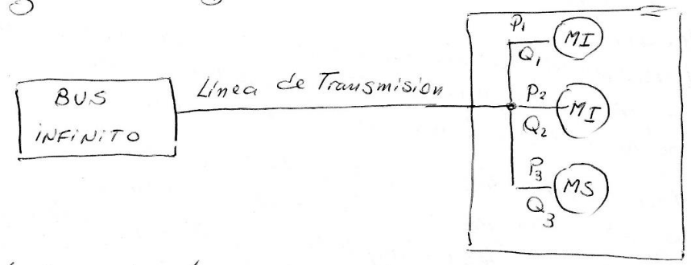
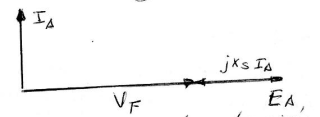
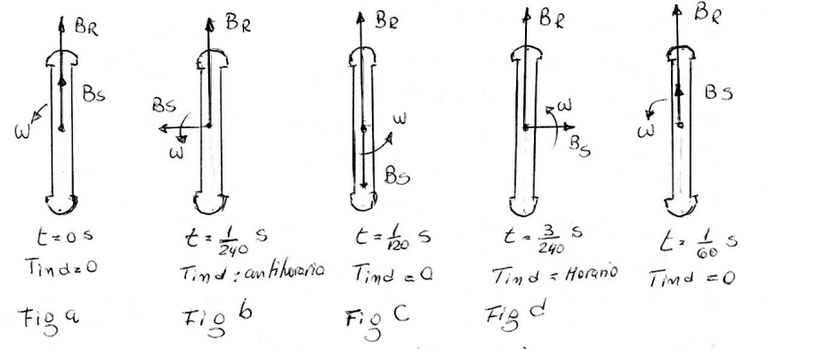
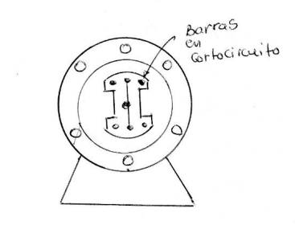
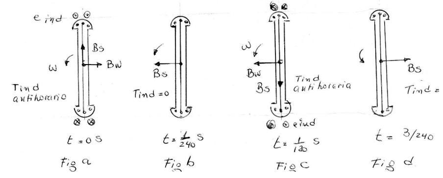

## Motores Síncronos y Corrección del Factor de Potencia

En un sistema de potencia, las cargas (como por ejemplo una Planta Industrial) se alimentan de un bus infinito que constituye la fuente de energía a través de una Línea de Transmisión.

**Ejemplo de configuración de carga:**
En el ejemplo, la carga está constituida por:
* Dos **Motores de Inducción (MI)** que operan con un FP en retraso.
* Un **Motor Síncrono (MS)** que opera con un FP en adelanto.

**Problema del bajo Factor de Potencia:**
La conexión de cargas inductivas, constituidas por los Motores de Inducción, produce un FP bajo en retraso. Esto genera pérdidas en las líneas de transmisión, y mientras más bajo es el FP, mayores son las pérdidas:
$$P_{perd} = 3 \cdot R_L \cdot I_L^2$$

**Solución con Motor Síncrono:**
Puede ser útil entonces tener una carga en adelanto (Motor Síncrono sobreexcitado) conectado al sistema por las siguientes razones:

1.  Una carga en adelanto puede **suministrar cierta potencia reactiva $Q$** a las cargas en retraso, en lugar de que estas tengan que venir del generador. Entonces, debido a que la Potencia Reactiva no tiene que viajar a través de las Líneas de Transmisión de alta resistencia, se reduce la corriente en la línea de transmisión.  Al reducirse la corriente, **se reducen las pérdidas**.

2.  Debido a que las líneas de Transmisión transportan menos corrientes, se puede reducir el dimensionamiento del Sistema de Potencia y así **reducir el coste del mismo**.

3.  Si se requiere un motor síncrono para operar con un FP en adelanto, este debe girar **Sobreexcitado**.
    Este modo de operación incrementa el par máximo del motor y **reduce la posibilidad de exceder el par máximo** (mejora la estabilidad).

---

### Capacitor o Condensador Síncrono

Un motor síncrono se puede utilizar para corregir el Factor de Potencia (FP) en las instalaciones.

Para que actúe como un capacitor, debe operar **en Vacío y Sobreexcitado**.

**Análisis Fasorial**

En la siguiente figura se muestra el diagrama fasorial para esta Condición de Trabajo.
 
  

Como no entrega potencia a la Carga (está en vacío), las distancias proporcionales a la Potencia son cero:
$$E_A \sin \delta = 0$$
$$I_A \cos \theta = 0$$

Del diagrama se observa que:
* **$I_A$ adelanta $90^\circ$** respecto a $V_F$.
* El vector $j X_S I_A$ apunta hacia la izquierda.

Si se examina la relación entre $V_F$ e $I_A$, se ve que se parece a la de un **Capacitor**.

**Uso Industrial**

En algunas viejas plantas se pueden encontrar motores síncronos operando sobreexcitados para corregir el FP. Sin embargo, en la actualidad estos son reemplazados por **capacitores estáticos convencionales** que son mucho más económicos.

---

## Arranque de los Motores Síncronos

**Planteamiento del Problema**

En el desarrollo anterior se ha estudiado operando bajo condiciones estacionarias, es decir, a velocidad síncrona, pero nada se ha dicho sobre cómo llega el motor a la velocidad síncrona.

Para entender la naturaleza del problema de arranque nos remitimos a la figura, donde se muestra el motor en el momento que se aplica potencia a los devanados del estator a $60\text{ Hz}$.

* El rotor del motor está estacionario y, por lo tanto, el campo magnético $B_R$ también.
* El campo magnético $B_S$ del estator comienza a girar a la velocidad síncrona.

**Análisis del Par durante un Ciclo Eléctrico**

La ecuación del par inducido es:
$$T_{ind} = k \cdot (B_R \times B_S)$$

Observando la secuencia de diagramas en la hoja para una frecuencia de $60\text{ Hz}$:

1.  **$t=0\text{ s}$:** $B_R$ y $B_S$ alineados. $T_{ind} = 0$.
2.  **$t=1/240\text{ s}$:** $B_S$ se desplaza. $T_{ind}$ tiene sentido **antihorario**.
3.  **$t=1/120\text{ s}$:** $B_S$ opuesto a $B_R$. $T_{ind} = 0$.
4.  **$t=3/240\text{ s}$:** $B_S$ sigue girando. $T_{ind}$ tiene sentido **horario**.
5.  **$t=1/60\text{ s}$:** Vuelta a la posición inicial. $T_{ind} = 0$.

**Conclusión:**
Se observa que durante un ciclo eléctrico el par pasa de tener un sentido antihorario a un sentido horario, dando un **par promedio nulo**.
El motor vibra muy fuerte con cada ciclo eléctrico y finalmente se sobrecalienta.

Para arrancar la máquina se pueden utilizar tres métodos.

### 1) Arranque del motor por medio de la reducción de la frecuencia eléctrica

Si los campos magnéticos del estator giran a una velocidad suficientemente baja, el rotor se acelera y se enlaza con el campo magnético del estator durante un semiciclo de la rotación del campo magnético.

* Una vez enlazados, se aumenta la velocidad del campo magnético del estator aumentando gradualmente la frecuencia ($f_e$) hasta su valor nominal ($50\text{ Hz}$ o $60\text{ Hz}$).
* **Nota de seguridad:** Como cuando se opera a una velocidad baja el voltaje interno generado ($E_A = k \cdot \phi \cdot \omega$) será menor que el nominal, por lo tanto, **si se reduce $E_A$ se deberá reducir el Voltaje $V_F$** aplicado en los terminales para mantener la corriente $I_A$ en niveles seguros.

### 2) Arranque del motor utilizando un motor Primario Externo

Este método adjunta (acopla) un motor de arranque externo al motor síncrono para llevar la máquina hasta su velocidad nominal y entonces se puede desconectar el motor primario del eje de la máquina.
### 3) Arranque del Motor con Devanados de Amortiguamiento
Esta es la técnica más utilizada. Los devanados de amortiguamiento son unas barras especiales dispuestas en ranuras labradas en los polos del rotor, cortocircuitadas en cada extremo por un anillo.

Para entender lo que estas barras causan, examinemos la figura que muestra un rotor con dos polos salientes.

* El rotor muestra un devanado de amortiguamiento con las barras en corto en los extremos de las dos caras de los polos conectadas con alambres.
* Si bien esta no es la forma normal de construcción, sirve para ilustrar el comportamiento de los mismos.

**Análisis del Funcionamiento**

Supongamos que inicialmente el devanado de campo del rotor se desconecta y que se aplica un conjunto de voltajes trifásicos al estator de la máquina.

Cuando se aplica la potencia por primera vez en el tiempo $t=0$:
1.  Supongamos que el Campo Magnético del estator $B_S$ es vertical, como muestra la **Fig a**.
2.  Conforme $B_S$ gira en sentido antihorario, induce voltaje en las barras del devanado de amortiguamiento dado por:
    $$e_{ind} = (v \times B) \cdot l$$

Donde:
* $v$: Velocidad de la barra respecto al Campo.
* $B$: Densidad de Flujo magnético.
* $l$: Longitud del conductor.

**Secuencia de Inducción de Par**

* **Análisis en $t=0$ (Fig a):**
    Las barras del rotor se mueven hacia la derecha con respecto al Campo, por lo que el voltaje inducido produce un flujo de corriente que:
    * Ingresa a la página en las barras inferiores.
    * Sale de la página en las barras superiores.
    Esto produce un Campo magnético del devanado $B_W$, direccionado hacia la derecha como se muestra en la **Fig a**.

    De la ecuación de par:
    $$T_{ind} = k (B_W \times B_S)$$
    El par que se produce en las barras del rotor tiene **sentido antihorario**.

* **Análisis en $t=1/240$ s (Fig b):**
    El Campo magnético del estator $B_S$ ha girado ya $90^{\circ}$, mientras que el rotor apenas se ha movido (porque simplemente no puede acelerar en un tiempo tan corto).
    * En este momento la tensión inducida en los devanados de amortiguamiento es nula debido a que $v$ es paralelo a $B$.
    * Sin tensión inducida, no hay corriente en los devanados y el par inducido es **$T_{ind} = 0$**.

* **Análisis en $t=1/120$ s (Fig c):**
    $B_S$ ha girado nuevamente $90^{\circ}$ y el rotor aún no se ha movido.
    * La tensión inducida en los bobinados de amortiguamiento produce un flujo de corriente en las barras que causa un Campo $B_W$ con dirección hacia la izquierda, como muestra la **Fig c**.
    * Esto induce un par resultante:
        $$T_{ind} = k (B_W \times B_S)$$
    * El par resultante tiene **sentido antihorario**.
* **Análisis en $t=3/240$ s (Fig d):**  
Por último, para $t = 3/240 \text{ s}$, al igual que para $t = 1/240 \text{ s}$, el par inducido es nulo.

---

Note que el par tiene sentido antihorario para algunos instantes de tiempo y nulo para otros, pero se advierte que **hay un par neto en una sola dirección** (antihoraria), que acelera al rotor.

**Limitación de Velocidad (Deslizamiento)**

Aún cuando se acelera el rotor, este **nunca alcanza la velocidad síncrona** ($N_S$) solo con los amortiguadores.
Esto es porque si $B_R$ (rotor) gira a la misma velocidad de $B_S$ (estator), no hay movimiento relativo, por lo que no se inducen tensiones en las barras y, por lo tanto, desaparece el par inducido $T_{ind}$.

Pero si la velocidad del rotor se acerca a $N_S$, el campo producido por la corriente de Campo $B_R$ (al encender la excitación) se puede "enganchar" para sincronizarse con $B_S$.

**Protección del Devanado de Campo**

En una máquina real, los devanados de Campo del rotor **no están en circuito abierto** en el proceso de arranque.
* Si estuviesen abiertos, se inducirían en los devanados tensiones elevadas durante el arranque (por efecto transformador) que se tornan peligrosas.
* Al ponerse en **Cortocircuito** (generalmente a través de una resistencia de descarga), no se producen esas tensiones peligrosas, y la corriente de campo inducida contribuye con el par de arranque adicional.

---

### Resumen del Procedimiento de Arranque

En resumen, el procedimiento de arranque se describe a continuación:

1.  **Desconectar y Cortocircuitar el Campo:** Desconectar los devanados de Campo de su fuente de potencia de CD y asegurar que estén en cortocircuito (o conectados a una resistencia de descarga).
2.  **Aceleración como Inducción:** Aplicar un voltaje trifásico al estator y dejar que el motor acelere hasta aproximarse a la velocidad síncrona. El rotor debe estar descargado (sin carga mecánica acoplada o con carga reducida).
3.  **Sincronización:** Conectar el circuito de Campo de CD a su fuente de potencia. Esto crea el campo magnético del rotor constante que permite que el motor se "fije" o enganche a la velocidad síncrona.
4.  **Carga:** [Recién en este punto] añadir carga al eje.

 