### I. Motor Síncrono

**Principio de Funcionamiento**

Para entender el principio de funcionamiento de un motor síncrono, observe la figura que muestra una máquina conformada por un Rotor de 2 Polos.

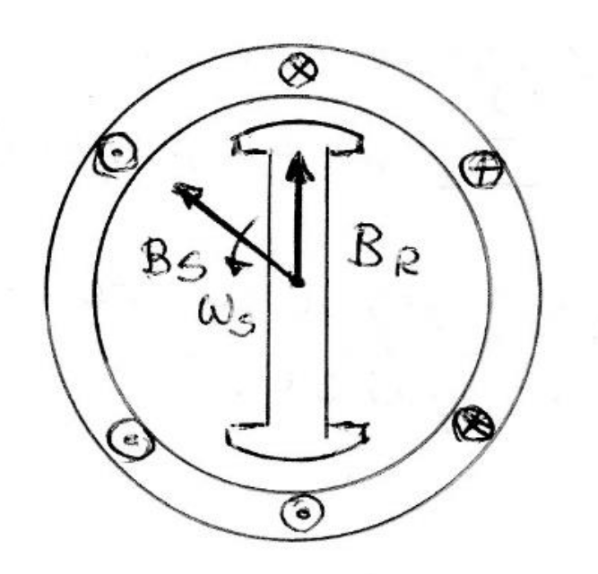

* La corriente de Campo $I_F$ produce el Campo $B_R$ en estado estacionario.
* Si se aplica un conjunto de corrientes trifásicas en los devanados del inducido del estator, se produce un Campo Magnético Rotante uniforme $B_S$.

Hay entonces dos campos magnéticos presentes en la máquina:

1.  **El campo magnético producido por el estator:** En el caso del motor, gira en adelanto con respecto al del Rotor, traccionando al mismo y realizando un trabajo.
2.  **El campo del rotor:** Trata de alinearse con el campo del estator. El par que se crea es el responsable del desplazamiento del Rotor para la alineación.

Mientras mayor sea el ángulo de desfasaje $\delta$ entre los Campos, mayor será el par en el rotor de la máquina, siempre que no se supere el ángulo máximo que produce deslizamientos.

> **Nota:** Dado que el motor síncrono es físicamente igual al generador, todas las ecuaciones básicas de este se utilizarán también para el motor.
 
---

### II. Circuito Equivalente

Un motor síncrono es igual en todos los aspectos a un generador síncrono, excepto en que la dirección del Flujo de Potencia es opuesta, al igual que se invierte la dirección del Flujo de Corriente $I_A$ en el estator.

Por lo tanto, el circuito equivalente del motor será exactamente igual al del generador, excepto en que la dirección de $I_A$ está invertida. Como las tres fases son iguales, representamos el circuito equivalente para una fase.

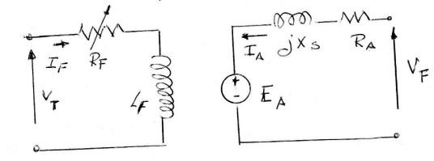

* **Circuito de Campo (Izquierda):** Muestra la alimentación de campo ($V_T$), la resistencia de campo ($R_F$) y la inductancia ($L_F$) con la corriente de campo $I_F$.
* **Circuito de Armadura (Derecha):** Muestra el voltaje de fase ($V_F$) inyectando corriente $I_A$ hacia la máquina, pasando por la resistencia de armadura ($R_A$) y la reactancia síncrona ($jX_S$) hacia la tensión inducida ($E_A$).

**Ecuación de Voltaje**

Debido al cambio en la dirección de $I_A$, la ecuación de Voltaje de Kirchhoff en la malla es:

$$V_F = E_A + j X_S I_A + R_A I_A$$

Donde:
* $E_A$ es la FCEM (Fuerza Contraelectromotriz) generada en una fase del estator por el flujo producido por la corriente de excitación del Rotor.

---
**Analisis en un Generador (conectado a un Bus Infinito)**

Para comenzar a entender la operación de un motor síncrono, partiremos del análisis de un generador conectado a un bus infinito.

* En el generador, un motor primario actúa sobre el eje provocando la rotación del rotor.
* El par aplicado $T_{ap}$, proveniente del motor primario, sigue la dirección del movimiento porque este es el causante del giro del generador.

En la figura  se puede ver un diagrama fasorial de un generador síncrono que opera con un Factor de Potencia (FP) en retraso y su diagrama de Campos Magnéticos correspondiente.

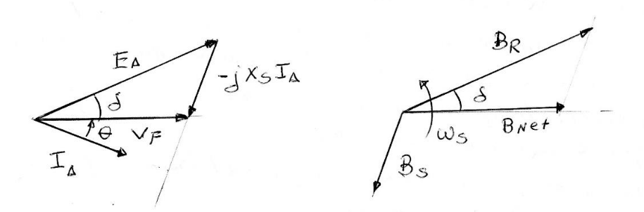

La ecuación de voltaje correspondiente es:
$$V_F = E_A - j X_S I_A - R_A I_A$$

Si en la ecuación precedente despreciamos la caída de tensión en la resistencia $R_A$ del inducido, se tienen las siguientes relaciones mostradas en los diagramas:

1.  **$B_R$** produce **$E_A$**
2.  **$B_{net}$** produce **$V_F$**
3.  **$B_S$** produce **$E_{est} = -j X_S I_A$** (que retrasa $90^\circ$ respecto a $I_A$)

> **Nota:** La rotación de ambos diagramas tiene el sentido contrario a las manecillas del reloj.
 
 **Par Inducido en un Generador**

El par inducido en el generador lo podemos calcular a partir del diagrama de Campo Magnético mediante la siguiente expresión:

$$T_{ind} = k \cdot B_R \times B_{net} = k \cdot B_R \cdot B_{net} \cdot \sin \delta$$

Este par tiene el sentido de las manecillas del reloj; es decir, tiene un sentido opuesto a la rotación. Es un par resistente que se opone al par motor externo $T_{ap}$ producido por el motor primario.

**Transición de Generador a Motor**

Supongamos ahora que el motor primario súbitamente pierde potencia y comienza a frenarse el rotor, haciendo que este se retrase con respecto al Campo Magnético creado por el estator.

1.  Conforme el rotor pierde velocidad, $B_R$ se retrasa y queda detrás de $B_{net}$, cambiando súbitamente la operación de la máquina.
2.  Cuando $B_R$ está detrás de $B_{net}$, se invierte la dirección del par inducido.
3.  Este par ahora tiene un sentido contrario al de las manecillas del reloj (dirección del movimiento).
4.  La máquina funciona ahora como **Motor**.

Ahora la máquina recibe energía del Bus Infinito que alimenta al estator. El ángulo del par $\delta$ en incremento provoca un par creciente en la dirección de rotación hasta que se iguale al par aplicado por la Carga.

En este momento, la máquina opera en estado estacionario y a velocidad síncrona.

### Análisis Fasorial y Comparación (Generador vs. Motor)

El diagrama fasorial y el diagrama de Campo de la máquina operando como motor se pueden ver en la figura. Como en el motor $I_A$ cambia el sentido de circulación:
$$B_S \rightarrow j X_S I_A \quad (\text{adelanta } 90^\circ \text{ con respecto de } I_A)$$

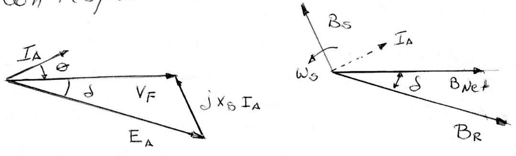

La razón de que la cantidad $j X_S I_A$ apunte de $V_F$ a $E_A$ en el generador y apunte de $E_A$ a $V_F$ en el motor, es la inversión de la dirección de referencia de $I_A$ en el Circuito Equivalente.

**Diferencias básicas entre operación como Motor y Generador**

La diferencia básica entre la operación como motor y la operación como generador se puede observar tanto en el diagrama Fasorial como en el diagrama de Campo Magnético:

1.  **En un Generador:**
    * $E_A$ está en adelanto respecto a $V_F$.
    * $B_R$ está en adelanto respecto a $B_{net}$.
    * El par inducido se opone a la dirección del movimiento.

2.  **En un Motor:**
    * $E_A$ está detrás de $V_F$.
    * $B_R$ está detrás de $B_{net}$.
    * El par inducido $T_{ind}$ tiene la dirección del movimiento.

---
 

###  Operación del Motor Síncrono en Estado Estacionario

Exploraremos la conducta del motor frente a diferentes estados de Carga, Corriente de Campo y su comportamiento en la Conexión del $\cos \phi$.

**Curva Característica Par - Velocidad**

Los motores suministran potencias a cargas que son básicamente a velocidad constante; esto implica que el voltaje en los terminales y la frecuencia de las tensiones que alimentan deberán ser constantes sin importar la potencia consumida por el motor.

La velocidad de rotación del motor está asociada a la frecuencia eléctrica de las tensiones aplicadas, por lo tanto, la velocidad del motor será constante frente a las variaciones de Carga.

**Regulación de Velocidad**

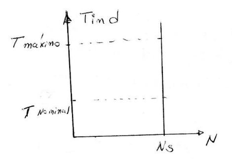

En la figura adjunta, se muestra la característica Par - Velocidad, donde se observa que la velocidad no cambia desde vacío a plena carga, por lo que la regulación de velocidad ($S_R$) es de 0%.

$$S_R = \frac{N_S - N_{pc}}{N_{pc}} \times 100\%$$

Donde:

* $N_S$: Velocidad de sincronismo.
* $N_{pc}$: Velocidad de plena carga.

La ecuación del par inducido es:

$$T_{ind} = k \cdot B_R \cdot B_{net} \cdot \sin \delta = k (B_R \times B_{net})$$

---

### VII. Análisis de Potencia y Par

**Potencia Eléctrica Consumida**

La potencia eléctrica consumida por el motor se expresa de la siguiente manera:

* **En función de los valores de Línea:**
    $$P = \sqrt{3} \cdot V_L \cdot I_L \cdot \cos \theta$$
* **En función de los valores de Fase:**
    $$P = 3 \cdot V_F \cdot I_A \cdot \cos \theta$$

> **Nota del apunte:** Se asume para la equivalencia que la intensidad de fase es igual a la de armadura ($I_{Fase} = I_A$).

**Aproximación despreciando la resistencia**

Si despreciamos la resistencia del inducido $R_A$ frente a la reactancia síncrona $X_S$ (porque $X_S \gg R_A$), podemos deducir una ecuación muy útil para aproximar la potencia de salida.

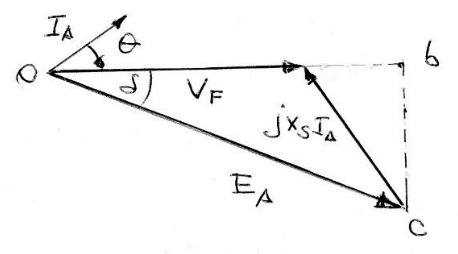

Del diagrama fasorial, se observa que el segmento $bc$:
$$bc = E_A \cdot \sin \delta = X_S \cdot I_A \cdot \cos \theta$$

De donde despejamos:
$$I_A \cdot \cos \theta = \frac{E_A \cdot \sin \delta}{X_S}$$

Sustituyendo esto en la expresión de la Potencia ($P = 3 V_F I_A \cos \theta$):

$$P = \frac{3 \cdot V_F \cdot E_A \cdot \sin \delta}{X_S}$$

**Dependencia de la Potencia**
Como $E_A = k \cdot \Phi \cdot \omega_s$ y el flujo $\Phi$ es proporcional a la corriente de campo $I_F$ ($\Phi = k \cdot I_F$), la potencia depende entonces de:
1.  La tensión de fase $V_F$.
2.  La corriente de campo $I_F$.
3.  El seno del ángulo de par ($\sin \delta$).
4.  Inversamente proporcional a la reactancia síncrona $X_S$.

---

### VIII. Ecuación del Par Inducido

Como el par inducido es $T_{ind} = \frac{P}{\omega}$, reemplazando el valor de la potencia en la expresión de la cupla obtenemos:

$$T_{ind} = \frac{3 \cdot V_F \cdot E_A \cdot \sin \delta}{\omega \cdot X_S}$$

**Análisis del Par Máximo y Estabilidad**

* Se ve que el **par máximo** se presenta para un ángulo de par $\delta = 90^\circ$.
* Sin embargo, los pares normales a plena carga son mucho menores que éste; el par máximo es del orden de **3 veces** el par a plena carga.
* Si se excede el par máximo, se puede producir una pérdida de sincronización, fenómeno conocido como **deslizamiento de Polos**.

La expresión para el par máximo es:
$$T_{max} = k \cdot B_R \cdot B_{net} = \frac{3 \cdot V_F \cdot E_A}{\omega \cdot X_S}$$

En esta ecuación se ve que cuanto mayor es la corriente de campo $I_F$, mayor es $E_A$ y más grande es el par motor.

---

### IX. Flujo de Potencia en la Máquina

En el diagrama siguiente se muestra el flujo de potencia en la máquina, desde la entrada eléctrica hasta la salida mecánica.

**Esquema de pérdidas y conversión:**

1.  **Potencia de Entrada ($P_{ent}$):**
    $$P_{ent} = \sqrt{3} V_L I_L \cos \theta = 3 V_F I_A \cos \theta$$
    *(Energía eléctrica suministrada al estator)*

    $\downarrow$ *[Se restan]*
    * **Pérdidas de Cobre ($P_{Cu}$):**
        * En el estator: $3 R_A I_A^2$
        * En el rotor: $R_F I_F^2$

2.  **Potencia Convertida ($P_{conv}$):**
    $$P_{conv} = T_{ind} \cdot \omega$$
    *(Potencia electromagnética interna)*

    $\downarrow$ *[Se restan]*
    * **Pérdidas en el Núcleo:** (Por Histéresis y corrientes de Foucault).
    * **Pérdidas Mecánicas:** (Por fricción y ventilación).
    * **Pérdidas Adicionales.**

3.  **Potencia de Salida ($P_{sal}$):**
    $$P_{sal} = T_{carga} \cdot \omega$$
    *(Potencia mecánica útil en el eje)*
 
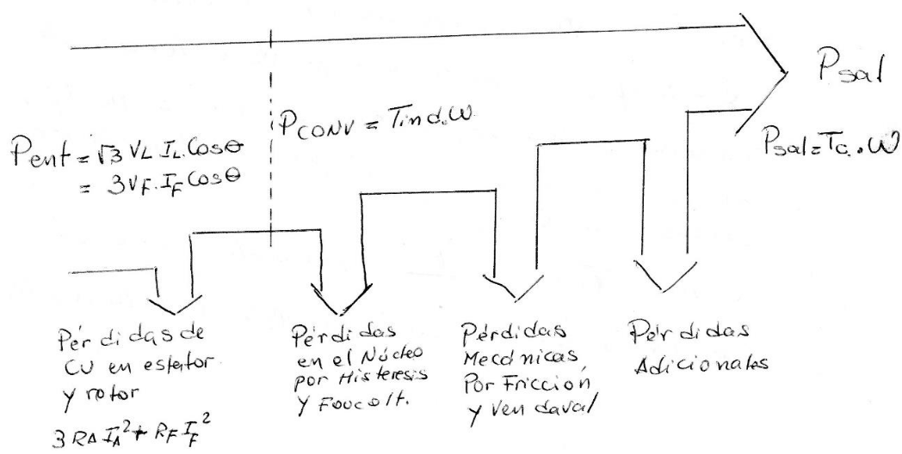
 
 ---

 ### X. Efecto del Cambio de Carga en los Motores

Para encontrar la respuesta, examinemos un motor que opera inicialmente con un factor de potencia ($\cos \phi$) en adelanto, como muestra la figura.

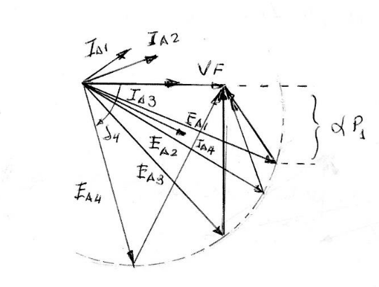

**Secuencia de sucesos al aumentar la carga:**

1.  Si la Carga se incrementa, el rotor pierde velocidad.
2.  Esto produce un incremento del ángulo de par $\delta$.
3.  Al aumentar $\delta$, se incrementa el par inducido, el cual acelera al rotor hasta alcanzar la velocidad de sincronismo, pero con un ángulo $\delta$ mayor que el inicial.

**Restricciones durante el cambio de Carga**

Examinemos las condiciones físicas:
* La tensión inducida es $E_A = k \cdot \phi \cdot \omega$.
* Depende de la Corriente de Campo $I_F$ y de la velocidad $\omega_s$.
* Como $\omega_s$ es constante y si no se altera el circuito de Campo, **$E_A$ debe ser constante** mientras se modifica la carga.

**Respuesta de la máquina:**
Con el aumento de carga, la máquina responde con un incremento en las distancias proporcionales a la potencia ($\propto P$), porque se incrementa el ángulo $\delta$, pero $E_A$ se mantiene constante en magnitud.

De la ecuación de potencia:
$$P = \frac{3 \cdot V_F \cdot E_A \cdot \sin \delta}{X_S} \quad \Rightarrow \quad E_A \cdot \sin \delta = \frac{P \cdot X_S}{3 V_F} \propto P$$

También sabemos que:
$$E_A \cdot \sin \delta \approx I_A \cdot \cos \theta \cdot X_S$$

**Conclusión del Diagrama Fasorial:**
Conforme varía la carga, el fasor $E_A$ se desplaza sobre un círculo hacia abajo (aumentando el ángulo $\delta$), lo que obliga a incrementar la cantidad vectorial $j X_S I_A$.
Por lo tanto, **se incrementa la corriente $I_A$** y cambia el ángulo de fase $\theta$, pasando el factor de potencia de estar **en adelanto a estar en retraso** respecto a $I_A$.

---

### XI. Efectos de los Cambios en la Corriente de Campo ($I_F$)

Para el análisis partimos de un motor que opera con un factor de potencia en retraso, y veamos qué sucede cuando se incrementa la Corriente de Campo $I_F$.

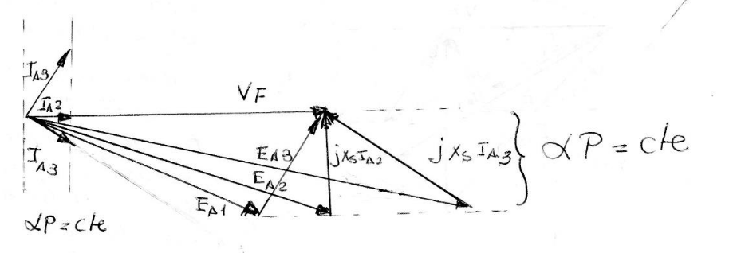

**Análisis de Potencia Constante**

Un incremento en la Corriente de Campo $I_F$ provoca un incremento en la magnitud de $E_A$, pero **no afecta la potencia suministrada** (la carga mecánica es la misma). Por lo tanto, las distancias proyectadas deben permanecer constantes:

* $E_A \sin \delta = \text{cte}$
* $I_A \cos \theta = \text{cte}$

Cuando se incremente $I_F$, el fasor $E_A$ debe incrementarse, pero solo deslizándose a través de la **línea de Potencia Constante**.

**Evolución de la Corriente de Armadura ($I_A$)**

Conforme se incrementa $E_A$:
1.  **Disminución Inicial:** $I_A$ primero disminuye en su módulo y pasa de estar en retraso a estar en fase con respecto a la tensión de fase $V_F$ (Carga puramente resistiva, FP = 1).
2.  **Aumento Posterior:** Si se sigue incrementando la Corriente de Campo $I_F$, la corriente en el inducido $I_A$ se vuelve a incrementar, pero ahora se adelanta con respecto a la tensión de fase $V_F$.

**Comportamiento Reactivo:**
* Inicialmente (subexcitado): Representa una carga resistiva-inductiva (consume potencia reactiva $+Q$).
* Finalmente (sobreexcitado): El motor se comporta como una carga resistiva-capacitiva, consumiendo potencia reactiva $-Q$ o, lo que es lo mismo, **suministrando potencia reactiva $Q$ al Sistema**.

### XII. Curvas V del Motor Síncrono

En la figura se muestra una representación gráfica de la variación de la corriente de armadura $I_A$ frente a variaciones de la corriente de campo $I_F$, que se denomina **Curva V** por la similitud que tiene con la letra.

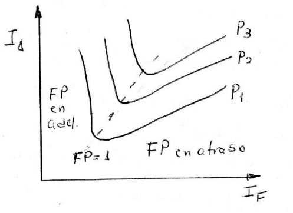

Se puede obtener una familia de Curvas V que corresponden a diferentes niveles de Potencia real ($P_1, P_2, P_3$).

**Características de la Curva V:**

1.  **Corriente Mínima ($FP=1$):** Para cada curva, la corriente mínima de inducido $I_A$ se presenta para un Factor de Potencia unitario ($FP=1$), cuando solo se suministra al motor Potencia Activa $P$.
2.  **Zona Subexcitada ($I_F$ baja):** Para corrientes de campo $I_F$ menores a la correspondiente a ese punto mínimo, $I_A$ está en retraso y la máquina **consume $Q$**.
3.  **Zona Sobreexcitada ($I_F$ alta):** Para corrientes de campo $I_F$ mayores que el valor que determina el mínimo $I_A$, la corriente en el inducido $I_A$ adelanta y la máquina **suministra $Q$** al sistema, actuando como un capacitor.

> **Conclusión:** Si se controla la corriente de campo $I_F$, se puede controlar la potencia reactiva suministrada o consumida por el sistema.

**Criterio de Proyección del Fasor $E_A$ sobre $V_F$**

Cuando proyectamos el fasor $E_A$ sobre $V_F$:

* **Motor Subexcitado:**
    $$E_A \cos \delta < V_F$$
    El motor tiene una corriente en retraso y **consume $Q$**.

* **Motor Sobreexcitado:**
    $$E_A \cos \delta > V_F$$
    La corriente adelanta y el motor **suministra $Q$** a la red. Esto ocurre debido a que $I_F$ es grande.

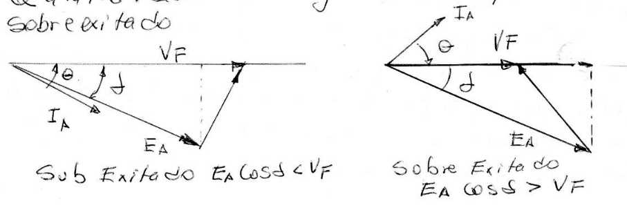

---
