# Motor de Inducción Monofásico

## 1. Descripción General y Construcción
Básicamente, este motor está formado por un rotor en jaula de ardilla, análogo al de los motores trifásicos, y un estator en el que se dispone un devanado alimentado con CA monofásica.

Normalmente se construyen con potencias inferiores a 1 CV, por ello reciben el nombre de **motores fraccionarios**. El campo de aplicación se limita a instalaciones domésticas: lavarropas, ventiladores, tocadiscos, etc.

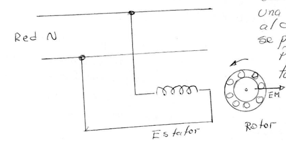

## 2. Principio de Funcionamiento

### El Campo Pulsante
Cuando se excita con una corriente alterna al devanado del estator, se produce una **FMM** (Fuerza Magnetomotriz) que genera un flujo instantáneo:

$$\varphi = \Phi_m \cos(\omega t)$$

Como se observa, este flujo será **pulsante en su módulo y conserva su posición en el espacio**, es decir, produce un campo alternativo en el tiempo de eje fijo.

### Inducción y Par de Arranque
Este campo induce corrientes en el rotor (como si fuera un transformador) en las dos mitades del arrollamiento del rotor. Estas corrientes crean pares opuestos entre sí, dando como resultado un **par nulo sobre el rotor cuando este está en reposo**.
> **Nota:** Es por esto que esta máquina no puede arrancar por sí misma.

### Teoría de Ferraris (Descomposición de Campos)
Por las ecuaciones de Euler, el flujo se puede expresar:

$$\varphi = \frac{\Phi_m}{2} e^{j\omega t} + \frac{\Phi_m}{2} e^{-j\omega t}$$

Vemos que un campo alternativo en el tiempo de eje fijo puede descomponerse en **dos campos giratorios** de magnitud constante e igual a la mitad del valor máximo primitivo, y que giran en el espacio a velocidades angulares constantes, iguales y de sentidos opuestos.

---

Para explicar el funcionamiento del motor, podemos asimilar un motor monofásico a **dos estatores trifásicos conectados según direcciones opuestas** con sus rotores acoplados mecánicamente al mismo eje.

Es posible estudiar el comportamiento del rotor superponiendo los efectos que cada uno de los campos produce sobre el rotor operando independientemente del otro:

1.  **Campo Directo:** El campo que gira en el mismo sentido que el rotor. Diremos que está excitado por un sistema de corrientes de **secuencia de fase directa**.
2.  **Campo Inverso:** El que gira en el sentido opuesto al rotor (sentido inverso). Debe ser excitado por un sistema de corrientes de **secuencia de fase inversa** para que dé lugar a un par de frenado.

### Característica Par-Deslizamiento
Cada campo giratorio dará lugar a una característica *Par - Deslizamiento* análoga a la de los motores trifásicos.

### Campo Directo
Consideremos un solo campo rotante, por ejemplo el directo, actuando sobre el rotor. La máquina se comportará como un motor trifásico y su característica **Cupla - Deslizamiento** será la siguiente:

* **Para $S=0$ (Cuando $N = n_s$):** No habrá Cupla.
* **Para $S=1$ (Rotor frenado):** La Cupla es la de arranque ($T_{arr}$).
* **Si $S=2$:** La velocidad tiene sentido contrario al campo.

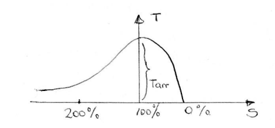

### Campo Inverso
Para el campo rotante inverso se realiza el mismo análisis, y si lo suponemos actuando solo, la cupla tendrá signo invertido.

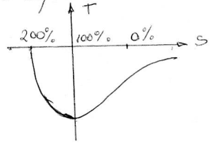

El deslizamiento se sigue considerando directo, por lo cual al campo inverso le corresponde su punto $S=0$ coincidente con $S=2$.

### Cálculo de Deslizamientos ($S_d$ y $S_i$)
Si el motor gira en el sentido directo a velocidad $N$, el deslizamiento de este campo ($S_d$) tendrá un valor:

$$S_d = S = \frac{N_s - N}{N_s}$$

Mientras que el correspondiente al campo inverso ($S_i$) será:

$$S_i = \frac{-N_s - (+N)}{-N_s} = \frac{-N_s - N}{-N_s}$$

Operando matemáticamente:
$$= \frac{-N_s - N - N_s + N_s}{-N_s} = \frac{-2N_s + (N_s - N)}{-N_s}$$
$$= \frac{-2N_s}{-N_s} + \frac{N_s - N}{-N_s} = 2 - S$$

Por lo tanto:
$$S_i = 2 - S$$

---

## Superposición de Efectos (Par Resultante)

Como ambos campos actúan conjuntamente, los efectos mecánicos se suman, por lo cual el par de la máquina será la suma de los pares actuantes.

Las características $T = f(s)$ para cada uno de los sistemas giratorios y su resultante se muestran en la figura.

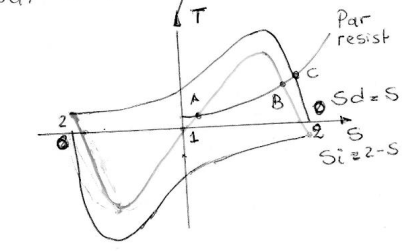

* Se observa que el **Campo directo** produce un par positivo.
* Mientras que el **Campo inverso** crea un par negativo.

 
En el arranque, tenemos que $S_d = S_i = 1$. En consecuencia, se tiene un **par nulo** y el motor no puede despegar.

Sin embargo, si por algún procedimiento se pone en rotación en algún sentido, se produce un par no nulo que tiende a acelerar al rotor hasta conseguir una condición de equilibrio estable. 

---

Si por un medio mecánico externo se moviera el rotor de manera que se sobrepase el **punto A**, el momento motor será superior al par resistente, y la máquina se acelerará hasta obtener el régimen estable en el **punto B**.

La velocidad que se obtiene es inferior a la que se alcanza con un motor trifásico (como en el punto C).

### Observaciones de la Curva $T = f(s)$
Del análisis de la curva se observa:

* **a)** Estos motores **no arrancan por sí solos**, sino que se utiliza un sistema eléctrico auxiliar, ya que la cupla es nula para $S=100\%$ cuando el rotor está detenido.

* **b)** Se comporta indistintamente girando a uno u otro sentido, si se lo saca del punto de equilibrio inestable.

* **c)** La cupla se anula **antes del sincronismo**, razón por la cual la velocidad de régimen es algo inferior que en las máquinas polifásicas de igual número de polos.

* **d)** Si lo llevamos al sincronismo, aparece una cupla que se opone.

---

## Teoría del Doble Campo Giratorio y Circuito Equivalente
De acuerdo con la teoría del doble campo giratorio, se puede considerar que el motor monofásico es equivalente a **dos motores trifásicos iguales** cuyos rotores están situados en el mismo árbol y cuyos estatores están conectados en serie, de modo tal que los campos magnéticos creados por ellos (directo e inverso) giran en el espacio en sentidos contrarios. Hecho que se logra intercambiando el conexionado de dos de los devanados del estator del motor 2.

Cuando el motor está detenido, este se comporta como un transformador monofásico al que se le ha cortocircuitado el secundario ($S=1$).

> **Nota:** Se debe aclarar que en el circuito que obtendremos opera solo el devanado principal, es decir, la máquina está en régimen (no se tiene en cuenta el devanado de arranque).

En la figura siguiente puede verse el circuito equivalente:

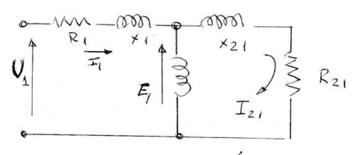

* **$E_1$:** Representa la fem inducida en el devanado del estator debido al campo alternativo existente en el entrehierro.

Cuando la máquina está en reposo, las amplitudes de los flujos resultantes **Directos e Inversos** a través del entrehierro son iguales a la mitad de la amplitud del campo pulsante. Por lo tanto, en el circuito equivalente, la fem $E_1$ se divide en 2 partes iguales que representan los efectos de los campos directos ($E_{1F}$) e inverso ($E_{1B}$) conectados en serie.

Donde $E_{1F}$ y $E_{1B}$ son las fems inducidas en el estator debidas a cada campo.

---

El circuito muestra la división de impedancias:
* Rama del Rotor parado: $\frac{R_{21}}{2}$
* Rama del Rotor en movimiento:
    * Para el campo directo: $\frac{R_{21}/2}{S}$
    * Para el campo inverso: $\frac{R_{21}/2}{2-S}$

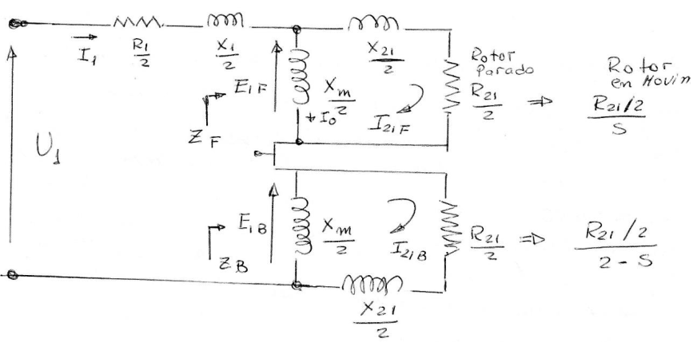

Comparando ambos circuitos resulta:
$$E_1 = E_{1F} + E_{1B}$$ 

### Análisis de Deslizamientos
* **Si el rotor está detenido:** Los deslizamientos de la máquina respecto a cada campo giratorio serán iguales a la unidad. En esta situación:
    $$E_{1F} = E_{1B} = \frac{E_1}{2}$$

* **Cuando el rotor gira a la velocidad $N$:** Respecto al campo directo, los deslizamientos correspondientes son:
    $$S_F = S \quad \text{y} \quad S_B = 2 - S$$

Entonces la **resistencia efectiva del rotor cambia con la cantidad de movimiento relativa** entre los campos magnéticos del rotor y del estator, tomando valores diferentes para cada campo.

En la parte derecha de la figura precedente se muestran los valores que toman estas resistencias. En esta situación, las impedancias $Z_F$ y $Z_B$ son desiguales. De hecho, $Z_F \gg Z_B$, por lo que el efecto sobre el motor es que el **campo directo predomina sobre el inverso**, lo que provoca un par electromagnético neto.

---

...[la potencia] que se disipa en los resistores $0,5 \frac{R_{21}}{S}$ y $0,5 \frac{R_{21}}{2-S}$.

La parte más complicada para realizar el cálculo es la de determinar las corrientes que fluyen por ambas resistencias.

Afortunadamente, se puede simplificar el cálculo porque la única resistencia que compone a $Z_F$ es $0,5 \frac{R_{21}}{S}$ (parte resistiva de la impedancia equivalente). Por lo tanto, podemos decir:

$$P_{AGF} = I_1^2 (0,5 R_F)$$

Lo mismo ocurre para $Z_B$:
$$P_{AGB} = I_1^2 (0,5 R_B)$$

La ventaja de estas ecuaciones radica en que solo se requiere calcular $I_1$.
Entonces, la potencia en el entrehierro total es:
$$P_{AGT} = P_{AGF} - P_{AGB}$$

### Par Inducido y Pérdidas
El par inducido puede calcularse:
$$T_{ind} = T_F - T_B = \frac{1}{\omega_s} (P_{AGF} - P_{AGB})$$

La potencia convertida ($P_{conv}$):
$$P_{conv} = T_{ind} \cdot \omega = T_{ind} (1-S) \omega_s = (1-S) P_{AGT}$$

Las pérdidas en el cobre del rotor ($P_{CUR}$):
$$P_{CUR} = S P_{AGF} + (2-S) P_{AGB}$$

---
 
Esto ocurre porque cuando gira el motor, la amplitud del Campo Rotante Directo se incrementa en tanto que el Inverso disminuye.

Utilizando este circuito equivalente podemos calcular la corriente que absorbe el motor de la red.

$$I_1 = \frac{U_1}{Z_{total}}$$

La expresión completa, desarrollando las impedancias en paralelo, resulta compleja. Sin embargo, agrupando términos definimos las impedancias de campo directo ($Z_F$) y campo inverso ($Z_B$):

$$I_1 = \frac{U_1}{R_1 + jX_1 + 0,5 Z_F + 0,5 Z_B}$$

**Donde:**

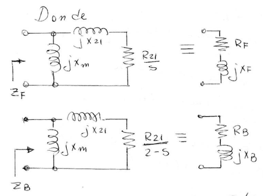

* **Impedancia de Campo Directo ($Z_F$):** Es el paralelo de la rama de magnetización y la rama del rotor (afectada por $S$).
    $$Z_F = R_F + jX_F = \frac{(R_{21}/S + jX_{21}) (jX_m)}{(R_{21}/S + jX_{21} + jX_m)}$$

* **Impedancia de Campo Inverso ($Z_B$):** Es el paralelo de la rama de magnetización y la rama del rotor (afectada por $2-S$).
    $$Z_B = R_B + jX_B = \frac{(R_{21}/(2-S) + jX_{21}) (jX_m)}{(R_{21}/(2-S) + jX_{21} + jX_m)}$$

Con este arreglo podemos calcular más fácilmente $I_1$ porque no se requiere calcular las corrientes que circulan por las ramas del rotor ($R_{21}/S$ y $R_{21}/(2-S)$).

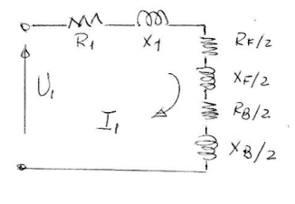
---

## Arranque del Motor Monofásico

Se ha visto que el motor no tiene par de arranque y por lo tanto no puede iniciar la marcha por sí mismo.
Se advierte en la gráfica de la cupla que si se acciona el rotor y se lo impulsa en algún sentido, la máquina desarrolla un par interno que acelera el rotor hasta conseguir la velocidad de régimen.

Afortunadamente, se puede conseguir el arranque por procedimientos eléctricos.

### 1.  Método de la Fase Partida (Principio del Motor Bifásico)
De los varios métodos ideados, solo dos han adquirido importancia industrial, y ambos responden a la misma idea: **Conseguir un campo magnético rotante en el momento de arranque.**

Para ello se utiliza un segundo bobinado (Auxiliar) estatórico desfasado en el espacio $90^\circ$ y alimentado con corriente $90^\circ$ con respecto al bobinado principal o de trabajo.

Con esto se convierte en un **motor bifásico** en el que el campo determina sobre el rotor un par suficiente para provocar el arranque del motor.

#### Análisis Vectorial del Arranque
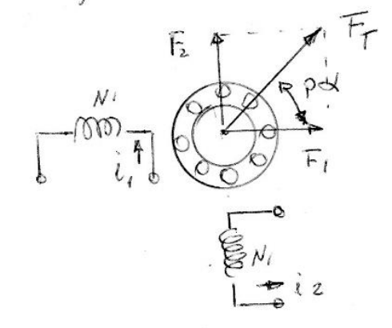

Si analizamos el caso de la figura con dos bobinas a $90^\circ$:

* Corriente en bobina 1: $i_1 = \sqrt{2} I \cos(\omega t)$
* Corriente en bobina 2: $i_2 = \sqrt{2} I \cos(\omega t - 90^\circ) = \sqrt{2} I \sin(\omega t)$

Se producirán en los ejes de las bobinas FMMs (Fuerzas Magnetomotrices):
$$F_1 = N_1 i_1 = F_m \cos(\omega t)$$
$$F_2 = N_2 i_2 = F_m \sin(\omega t)$$

La composición vectorial de ambas será:
$$F_T = \sqrt{F_1^2 + F_2^2} = F_m$$

La posición del vector resultante ($p\alpha$):
$$\tan(p\alpha) = \frac{F_2}{F_1} = \tan(\omega t) \implies p\alpha = \omega t$$

La velocidad de giro será:
$$\frac{d\alpha}{dt} = \frac{\omega}{p}$$

Esto corresponde a una FMM resultante de amplitud constante $F_m$ y que gira a la velocidad de sincronismo ($\omega/p$). Si se intercambian las alimentaciones de los bobinados, gira en sentido contrario.

--- 

Si las corrientes que alimentan los bobinados tienen amplitudes diferentes o si los bobinados tienen diferente número de espiras, se sigue obteniendo una FMM giratoria pero su amplitud varía con la posición del fasor de FMM y el lugar geométrico del afijo es una **elipse**.

Por otra parte, si las corrientes de los devanados tienen un desfasaje distinto de $90^\circ$ eléctricos, el lugar geométrico de la FMM sigue siendo una elipse.

> **Nota:** Esta última combinación es la que generalmente se emplea debido a la dificultad que se presenta para conseguir un desfasaje de $90^\circ$ eléctricos en las corrientes a partir de una red monofásica como lo requiere el teorema de Ferraris.

La diferencia entre los métodos de arranque está en el medio utilizado para obtener el **decalado** (desfasaje) de las corrientes a partir de la tensión alterna monofásica disponible.

---

### 2. Motor de Espira en Cortocircuito o Bobina de Sombra de Polo
 
Este sistema es el más elemental y económico, pero tiene el inconveniente de que el **Par de arranque es extremadamente pequeño**, aunque suficiente para acelerar la máquina en vacío.

Por esta razón se lo utiliza para arrastrar cargas pequeñas, como ocurre en el caso de ventiladores de uso doméstico.

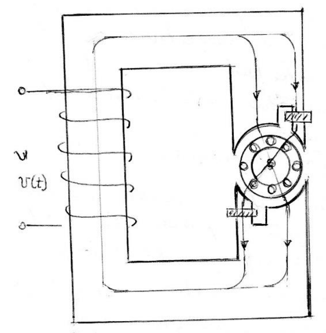

#### Estator
El estator está formado por una corona de chapas magnéticas aisladas entre sí y polos salientes divididos en dos partes: una de ellas rodeada por una **espira en cortocircuito**.

El bobinado monofásico puede estar formado por:
* Dos devanados arrollados sobre los polos.
* O por un solo devanado sobre la columna central del circuito magnético.

#### Rotor
El rotor está formado por un cilindro de chapa aislados entre sí y un devanado en **Jaula de ardilla**.

#### Disposición Geométrica
La bobina auxiliar está con su eje magnético desplazado con respecto al principal entre **30° a 60°** y toda la bobina abarca **1/3 del paso polar** del arrollamiento.

> **Analogía:** Cada espira puede considerarse como el secundario de un transformador en cortocircuito y el primario está constituido por el devanado principal.

---

#### Principio de Funcionamiento

Esta disposición permite que el polo ficticio abrace un flujo $\phi_P'$ que es una porción del flujo principal $\phi_P$.

1.  La variación de $\phi_P'$ induce en el bobinado auxiliar una fem $E_a$ que estará $90^\circ$ retrasada.
2.  Esta genera una corriente $I_a$ retrasada con respecto a la misma, determinado por la impedancia del bobinado auxiliar.
3.  Esta corriente origina un flujo auxiliar $\phi_A$ tal que sumado a $\phi_P'$ origina el flujo $\phi_L$.

$$\phi_L = \phi_A + \phi_P'$$

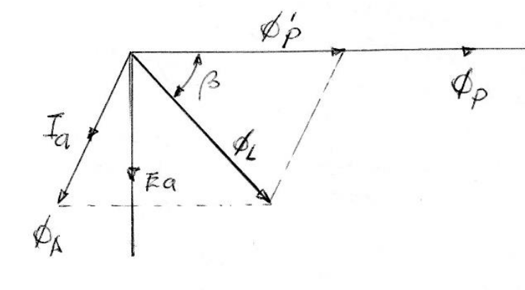

Este flujo no coincide con el principal porque, por la construcción de esta bobina que difiere mucho de la principal, se tiene resistencia e inductancia distintas.

### Resultado: Campo Rotante Elíptico
Por lo tanto, poseemos dos flujos desplazados en el espacio y en el tiempo:
* $\beta$ grados en el tiempo.
* $\gamma$ grados en el espacio.

Esta es la condición necesaria para crear un **campo rotante (de naturaleza elíptica)**.

#### Consideraciones de Diseño y Operación

* **Diseño de la bobina:** Esta bobina se diseña cuidadosamente para no exagerar la corriente que circule por la misma, ya que la conexión es permanente y hace decaer el rendimiento de la máquina.
* **Sentido de giro:** Como el sentido de giro depende de la posición de la bobina auxiliar, **no es posible cambiar el sentido de giro** una vez construida la máquina.
* **Rendimiento:** El par y el rendimiento de este tipo de motor (Conocido como motor Ferraris) es muy reducido.
* **Aplicación:** Por lo anterior, su empleo se limita a las más pequeñas potencias requeridas: ventiladores de sobremesa, motores de tocadiscos, etc.

---
###  3. Motor de Fase Partida (Resistencia)
#### Construcción de los Devanados
Este motor está constituido por dos devanados que se sitúan en el estator desfasados **90° eléctricos en el espacio**.

1.  **Devanado Principal:** Cubre 2/3 de las ranuras y tiene **alta reactancia ($X_p$) y baja resistencia ($R_p$)**.
2.  **Devanado Auxiliar:** Cubre el resto del estator y tiene **alta resistencia ($R_a$) y baja reactancia ($X_a$)**. Este se conecta en serie con un **interruptor centrífugo** situado en el eje del motor.

#### Secuencia de Arranque
Ambos bobinados se conectan directamente a la red.
* Como el bobinado auxiliar **no se diseña para servicio continuo**, una vez que el motor arranca, el interruptor centrífugo lo saca de servicio al alcanzar una velocidad del orden del **70% de la velocidad de régimen**.
* El motor queda funcionando como monofásico (solo con el devanado principal).

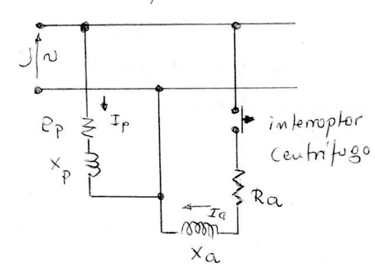

#### Análisis de Corrientes y Desfasaje
Debido a la distinta relación $\frac{X}{R}$ de los devanados, las corrientes que circulan presentan un desfasaje:

* $I_p$: Corriente que circula por el bobinado principal.
* $I_a$: Corriente que circula por el devanado auxiliar.

Presentan una diferencia de fase en el tiempo de **30° que puede alcanzar como máximo 45°**. Por lo que el sistema se comporta como un **motor bifásico desequilibrado** con campo giratorio elíptico en lugar de ser circular, porque los módulos de $I_a$ e $I_p$ no son iguales y no forman 90° entre sí.

*(diagrama fasorial donde se ve $V$, $I_a$ casi en fase con $V$ debido a su alta resistencia, e $I_p$ muy retrasada debido a su alta inductancia).*

 ---

En la figura se muestra la Curva Par-Velocidad en la que se indica el instante en el que actúa el interruptor centrífugo y se desconecta el devanado auxiliar.

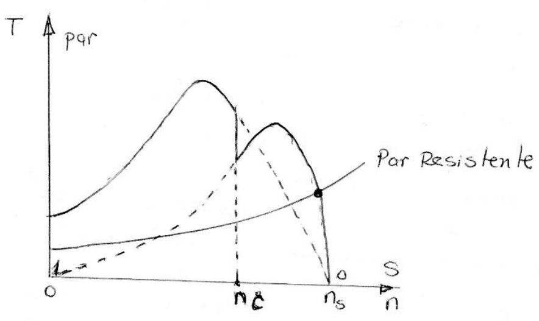

* Obsérvese que la curva velocidad cuando actúan los dos devanados es similar a la de un motor trifásico y produce un **par de arranque**.
* Mientras que la curva correspondiente cuando funciona solo el devanado principal tiene un **par de arranque nulo**.
* Punto de corte ($n_c$): Momento donde actúa el interruptor (aprox 70-80% de $n_s$).

#### Aplicaciones y Rangos
Este tipo de motores se utiliza en ventiladores, lavadoras, bombas centrífugas y se construyen típicamente en las siguientes potencias y velocidades:

* **Potencia:** Desde 1/8 a 1/2 CV.
* **Velocidades:** De 3000, 1500 y 1000 RPM (correspondientes a 2, 4 y 6 polos a 50Hz).
--- 

### 4. Motor con Arranque por Capacitor

#### Principio de Funcionamiento
En este tipo de motor, el devanado auxiliar lleva en serie un condensador. El uso de este capacitor en el arranque puede hacer que la corriente del devanado auxiliar ($I_a$) adelante a la del principal ($I_p$), consiguiéndose desfases entre las corrientes que alimentan las bobinas que se acercan casi a los **90°**.

#### Análisis Fasorial
En la figura se muestra el diagrama fasorial de las corrientes, en el que se toma como referencia la tensión de red ($U$).
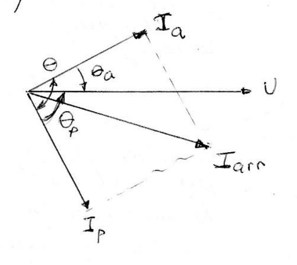

* **Corriente Principal ($I_p$):** Se retrasa con respecto a la tensión debido a su carácter inductivo.
* **Corriente Auxiliar ($I_a$):** Se adelanta respecto a la tensión debido a su carácter capacitivo.
* **Ángulo ($\theta$):** El ángulo de desfasaje total entre ambas corrientes ($\theta_a + \theta_p$) se aproxima a los 90°.

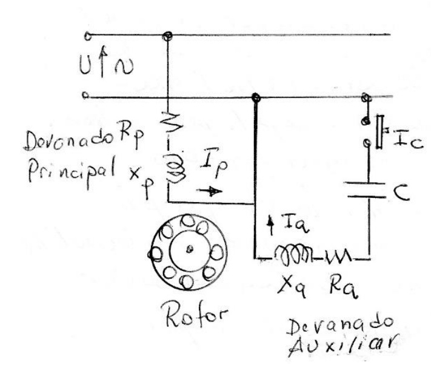
*(Referencia al esquema del circuito mostrando el devanado principal, auxiliar, el capacitor C y el interruptor centrifugo $I_c$)*.

#### Componentes y Construcción
Para conseguir que el ángulo $\theta$ se aproxime a los 90°, es necesario una **capacidad elevada**, mayores a los **$80 \mu F$**.

Los condensadores empleados son del tipo **electrolítico** y permanecen conectados únicamente durante el período de arranque.

#### Características de Operación
En estas condiciones se obtiene un campo giratorio **casi circular**. Si los módulos de las corrientes en el arranque fueran iguales, el campo circular sería perfecto.

#### Ventajas respecto al Motor de Fase Partida
El agregado del condensador al circuito de arranque trae aparejado:
1.  **Par de arranque elevado:** Entre **3 a 5 veces el nominal**.
2.  **Corriente de arranque moderada:** Sin excesivo aumento de la corriente.
3.  **Simplicidad mecánica:** El motor es más sencillo y económico.
3.  **Comparativa:** De hecho, si se lo compara con el motor de fase partida, el par es superior y la corriente disminuye en el momento de arranque, como se evidencia en el diagrama fasorial.

*(La curva Par-Velocidad mostrando el alto torque de arranque y el punto $n_c$ donde se abre el interruptor centrífugo)*.

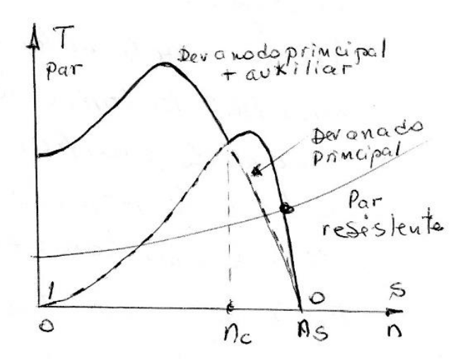

---

### 5. Variante: Motor con Conexión Mixta (Dos Capacitores)
A veces, con el objeto de mejorar las características del par y el **FdP (Factor de Potencia)** de la máquina, se emplea una conexión mixta.

### Configuración
Conectando en régimen continuo:
1.  **Condensador de marcha:** Un condensador de papel impregnado en aceite en serie con el devanado auxiliar.
2.  **Condensador de arranque:** Otro condensador electrolítico en paralelo con el condensador de papel, pero a través del interruptor centrífugo. Es decir, que solo actúa en el arranque.

### Ejemplo Práctico
A título de ejemplo, un motor de 1/2 CV lleva:
* Un condensador electrolítico de **$250 \mu F$** para el arranque.
* Un condensador de papel impregnado de aceite de **$115 \mu F$** para el régimen normal.

 